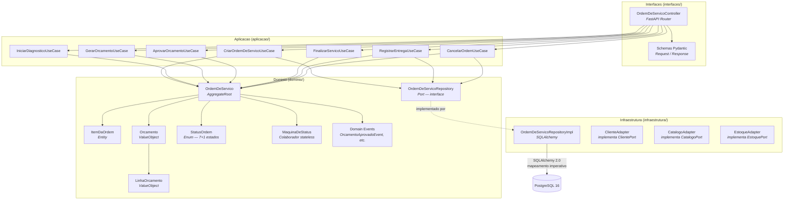
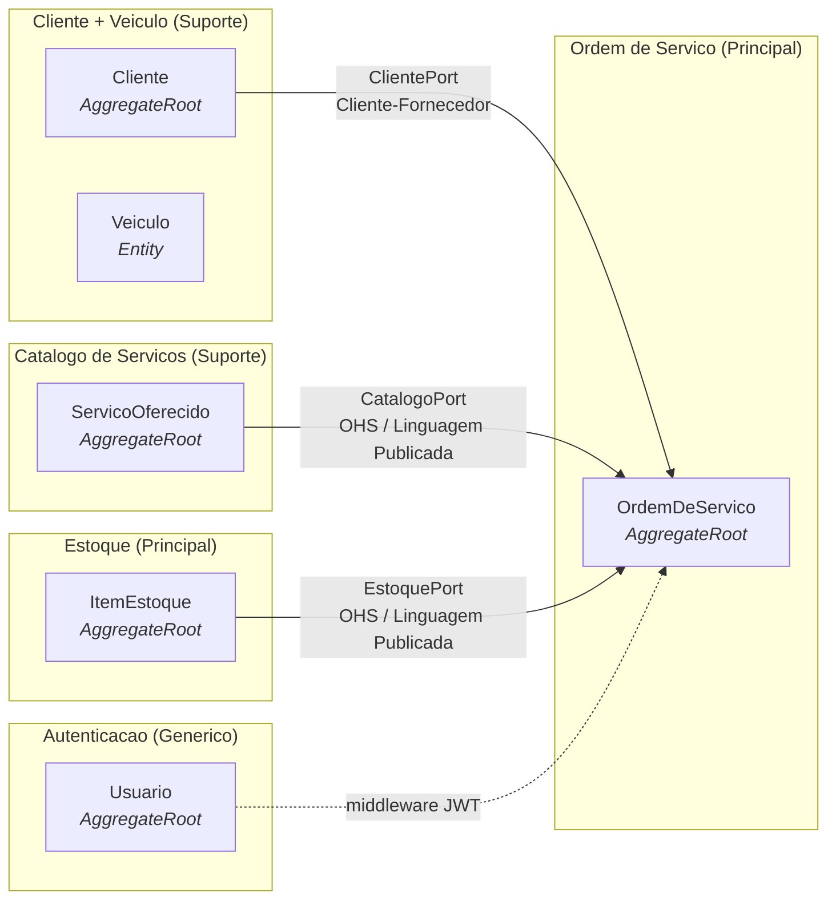

# C4 — Diagrama de Componentes (Level 3)

> [↑ Raiz do projeto](../../../README.md) · [↑ Arquitetura](../README.md)

> **Versão**: 1.0 — Fase 1 MVP.

Detalha os componentes internos do bounded context principal (Ordem de Serviço) dentro da Aplicação FastAPI. Os demais bounded contexts são mostrados em nível resumido. Baseado no modelo C4 de Simon Brown (Software Architecture — Aula 2).

## Diagrama — Contexto Ordem de Serviço (Detalhado)

## Bounded Contexts — Visão Resumida

Os demais bounded contexts são mostrados sem detalhar seus componentes internos. Level 3 separado por BC pode ser produzido na fase de implementação.

## Portas e Adaptadores

### Portas do contexto Ordem de Serviço (consumidor)

| Porta | Definida em | Métodos | Adaptador |
|---|---|---|---|
| `ClientePort` | `aplicacao/` de OS | `cliente_existe()`, `veiculo_pertence_ao_cliente()`, `obter_veiculo_por_placa_e_documento()` | `ClienteAdapter` em `infraestrutura/` de OS |
| `CatalogoPort` | `aplicacao/` de OS | `obter_servico()` | `CatalogoAdapter` em `infraestrutura/` de OS |
| `EstoquePort` | `aplicacao/` de OS | `reservar()`, `liberar()` | `EstoqueAdapter` em `infraestrutura/` de OS |

### Porta reversa (consumida por Cliente e Estoque)

| Porta | Definida em | Métodos | Adaptador |
|---|---|---|---|
| `OrdemDeServicoPort` | `aplicacao/` de Cliente | `existe_os_ativa_para_cliente()`, `existe_os_para_veiculo()` | `OSAdapter` em `infraestrutura/` de Cliente |
| `OrdemDeServicoPort` | `aplicacao/` de Estoque | `existe_os_ativa_com_item_estoque()` | `OSAdapter` em `infraestrutura/` de Estoque |

No diagrama resumido, `OrdemDeServicoPort` é mostrada como uma única porta. Na implementação, cada contexto consumidor (Cliente, Estoque) define sua própria interface com apenas os métodos que necessita — ver [mapa-contextos.md](../mapa-contextos.md).

## Rastreabilidade

- Bounded contexts: [mapa-contextos.md](../mapa-contextos.md)
- Agregados e entidades: [modelo-dominio.md](../modelo-dominio.md)
- Nomenclatura híbrida: [ADR-009](../adr/009-decisao-de-idioma.md)
- Organização dos contextos: [ADR-007](../adr/007-organizacao-contextos-delimitados.md)
- Arquitetura Onion: [ADR-003](../adr/003-arquitetura-ddd-onion.md)

---

> [↑ Raiz do projeto](../../../README.md) · [↑ Arquitetura](../README.md)
