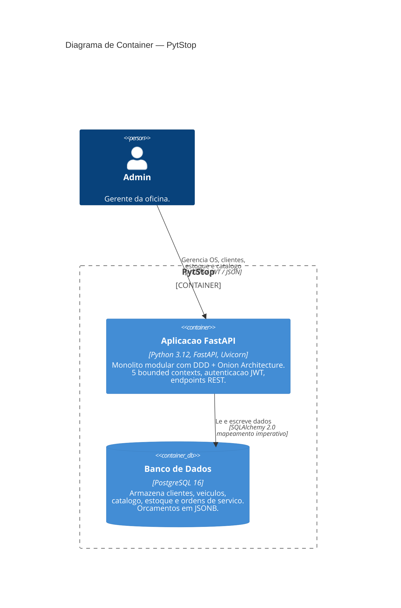
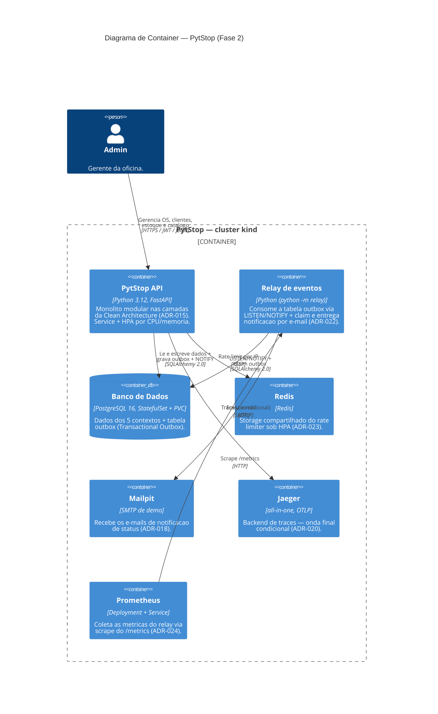

# C4 — Diagrama de Container (Level 2)

> [↑ Raiz do projeto](../../../README.md) · [↑ Arquitetura](../README.md)

> **Versão**: 1.0 — Fase 1 MVP.

Mostra os containers que compõem o PytStop e como se comunicam. Baseado no modelo C4 de Simon Brown (Software Architecture — Aula 2).

> **Nota — escopo deste diagrama**: o diagrama "Container — Fase 1 (MVP)" abaixo retrata o monolito da fase 1; o diagrama "Container — Fase 2" reflete a topologia atual (relay de eventos, Redis, Mailpit, Jaeger e HPA em cluster Kubernetes). Os detalhes de deploy estão na [RFC-002 §3](../rfc/fase2/rfc-002-infraestrutura-e-deploy-fase-2.md).

## Diagrama — Fase 1 (MVP)

## Diagrama — Fase 2

Topologia de deploy em cluster Kubernetes (kind), espelhando a [RFC-002 §3](../rfc/fase2/rfc-002-infraestrutura-e-deploy-fase-2.md). Mantém a mesma API (monolito modular, agora nas camadas da Clean Architecture — [ADR-015](../adr/fase2/015-arquitetura-alvo-fase-2.md)) e introduz containers de apoio: relay de eventos da Transactional Outbox ([ADR-022](../adr/fase2/022-transactional-outbox-relay.md)), Redis para o rate limiter compartilhado ([ADR-023](../adr/fase2/023-rate-limiter-storage-compartilhado.md)), Mailpit para notificação por e-mail ([ADR-018](../adr/fase2/018-notificacao-email.md)), Jaeger condicional para traces ([ADR-020](../adr/fase2/020-observabilidade-opentelemetry.md)) e Prometheus para as métricas do relay ([ADR-024](../adr/fase2/024-metricas-prometheus.md)).

## Containers

| Container | Tecnologia | Responsabilidade |
|---|---|---|
| Aplicacao FastAPI | Python 3.12, FastAPI, Uvicorn | Monolito modular. Expõe endpoints REST, aplica autenticação JWT, orquestra os 5 bounded contexts via Onion Architecture. |
| Banco de Dados | PostgreSQL 16 | Persistência de todos os contextos. Orçamentos em JSONB; bloqueio pessimista via `SELECT FOR UPDATE NOWAIT`. |

## Swagger UI

O Swagger UI é gerado automaticamente pelo FastAPI e configurado por ambiente:

- **Producao**: desabilitado (RNF-007)
- **Desenvolvimento/staging**: habilitado com autenticacao JWT ([ADR-004](../adr/004-autenticacao-jwt.md))

## Comunicacao

Na fase 1 (MVP), toda comunicação era síncrona — sem filas nem message brokers. A fase 2 introduziu a **Transactional Outbox** para entrega assíncrona de eventos de integração via relay, sem broker externo. Ver [ADR-022](../adr/fase2/022-transactional-outbox-relay.md) e o diagrama "Container — Fase 2" acima.

## Rastreabilidade

- Arquitetura Onion: [ADR-003](../adr/003-arquitetura-ddd-onion.md)
- Autenticacao JWT: [ADR-004](../adr/004-autenticacao-jwt.md)
- Mapeamento imperativo: [ADR-006](../adr/006-mapeamento-imperativo-sqlalchemy.md)
- Bloqueio pessimista estoque: [ADR-008](../adr/008-bloqueio-pessimista-estoque.md)
- Orçamento JSONB: [RFC-001 §5](../rfc/rfc-001-design-do-sistema.md)
- Stack tecnológica: [RFC-001](../rfc/rfc-001-design-do-sistema.md)

---

> [↑ Raiz do projeto](../../../README.md) · [↑ Arquitetura](../README.md)
