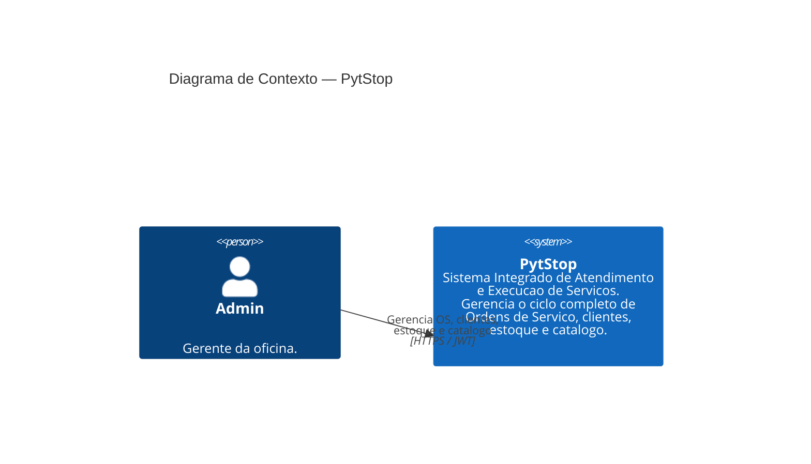

# C4 — Diagrama de Contexto (Level 1)

> [↑ Raiz do projeto](../../../README.md) · [↑ Arquitetura](../README.md)

> **Versão**: 1.0 — Fase 1 MVP.

Visão de mais alto nível do sistema, mostrando o PytStop e seus relacionamentos com atores e sistemas externos. Baseado no modelo C4 de Simon Brown (Software Architecture — Aula 2).

## Diagrama

## Atores

| Ator | Papel (`Papel` enum) | Descrição |
|---|---|---|
| **Admin** | `Papel.Admin` | Gerente da oficina. Ator principal do MVP e da demo. |

O enum `Papel` define três papéis — `Admin`, `Atendente` e `Mecanico` (`src/autenticacao/dominio/papel.py`) — com RBAC aplicado por um mapa de permissões em `src/autenticacao/interfaces/middleware.py` (`Admin` herda os demais), coberto pela matriz RBAC dos testes. O diagrama de contexto mantém um único ator representativo (`Admin`) por clareza; os três papéis constam no [glossário](../../requisitos/glossario.md).

## Sistemas Externos

Nenhum sistema externo no MVP. O Tech Challenge define um sistema autocontido com autenticacao propria via JWT ([ADR-004](../adr/004-autenticacao-jwt.md)) e banco de dados local.

## Rastreabilidade

- Nome do sistema: conforme [PRD](../../requisitos/prd.md) e [RFC-001](../rfc/rfc-001-design-do-sistema.md)
- Papel Admin: conforme [glossario](../../requisitos/glossario.md) (contexto Autenticacao)
- Decisao arquitetural: [ADR-003](../adr/003-arquitetura-ddd-onion.md)

---

> [↑ Raiz do projeto](../../../README.md) · [↑ Arquitetura](../README.md)
