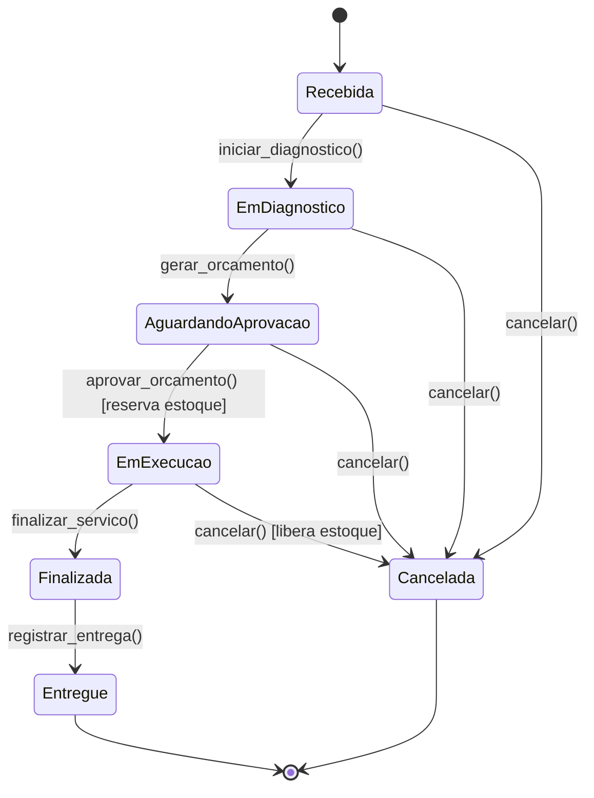
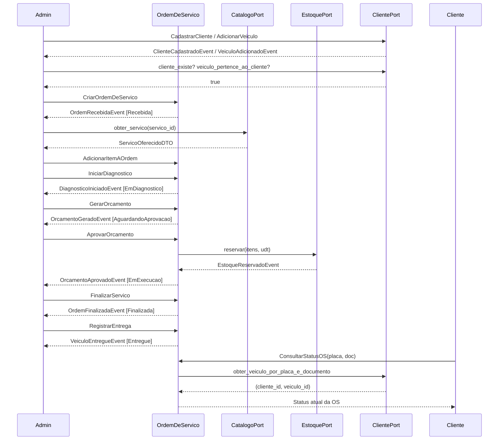

# Event Storming — Fluxo 1: Ciclo de Vida da Ordem de Serviço

> [↑ Raiz do projeto](../../../README.md) · [↑ Event Storming](README.md)

> **Versão**: 1.0 — Fase 1 MVP.

Fluxo principal do sistema: desde o recebimento do veículo até a entrega ao cliente, incluindo operações CRUD administrativas de clientes, veículos e serviços.

## Convenção de Cores

| Cor | Elemento | Descrição |
|---|---|---|
| 🟠 Laranja | Evento de Domínio | Fato que aconteceu no passado |
| 🔵 Azul | Comando | Intenção de ação disparada por um ator |
| 🟡 Amarelo claro | Ator | Pessoa ou papel que dispara um comando |
| 🟡 Amarelo | Agregado | Entidade raiz que processa o comando |
| 🟢 Verde | Read Model | Projeção de dados consultada antes de um comando |
| 🟣 Lilás | Política | Regra reativa — ao observar um evento, dispara outro comando |
| 🔴 Vermelho | Hotspot | Decisão pendente ou ponto de atenção |
| 🩷 Rosa | Sistema Externo | Sistema fora da fronteira do domínio |

## Atores

- **Admin**: Operador do sistema (recepcionista/gerente). Autenticado via JWT.
- **Mecânico**: Técnico que executa diagnóstico e serviços. Autenticado via JWT.
- **Cliente**: Consulta status da OS via API pública (sem autenticação, por placa + documento).

## Diagrama Mermaid — Máquina de Estados

## Walkthrough Narrativo

### 1. Cadastro de Cliente e Veículo (Pré-requisito)

| Elemento | Detalhe |
|---|---|
| 🔵 Comando | `CadastrarCliente(nome, documento, contato)` |
| 🟡 Agregado | `Cliente` |
| 🟠 Evento | `ClienteCadastradoEvent(cliente_id, tipo_documento)` |
| 🔵 Comando | `AdicionarVeiculo(cliente_id, placa, marca, modelo, ano)` |
| 🟡 Agregado | `Cliente` |
| 🟠 Evento | `VeiculoAdicionadoEvent(cliente_id, veiculo_id, placa)` |
| 🔴 Hotspot | Placa deve ser única entre todos os clientes. CPF/CNPJ deve ser único. |

**Contexto**: Admin cadastra o cliente identificando-o por CPF ou CNPJ. Veículos são adicionados ao agregado Cliente — não têm ciclo de vida independente. A validação algorítmica do documento (CPF/CNPJ) acontece na construção do objeto de valor.

### 2. Criação da Ordem de Serviço

| Elemento | Detalhe |
|---|---|
| 🔵 Comando | `CriarOrdemDeServico(cliente_id, veiculo_id)` |
| 🟡 Agregado | `OrdemDeServico` |
| 🟠 Evento | `OrdemRecebidaEvent(ordem_id, cliente_id, veiculo_id)` |
| 🟣 Política | Verificar se o cliente existe e se o veículo pertence a ele via `ClientePort` antes de criar a OS. |

**Contexto**: Admin cria a OS associando um cliente e um veículo desse cliente. A OS nasce no status **Recebida** com zero itens — itens são adicionados depois. A verificação cross-contexto usa `ClientePort.cliente_existe()` e `ClientePort.veiculo_pertence_ao_cliente()`.

### 3. Adição de Itens à OS

| Elemento | Detalhe |
|---|---|
| 🔵 Comando | `AdicionarItemAOrdem(ordem_id, servico_catalogo_id, item_estoque_id?, quantidade)` |
| 🟡 Agregado | `OrdemDeServico` |
| 🟠 Evento | `ItemAdicionadoAOrdemEvent(ordem_id, item_id, servico_catalogo_id)` |
| 🟣 Política | Só aceito nos status Recebida ou EmDiagnostico. Consultar `CatalogoPort.obter_servico()` para obter preço. |

**Contexto**: Admin ou mecânico adiciona serviços e peças à OS. Cada `ItemDaOrdem` referencia um `ServicoOferecido` do catálogo (obrigatório) e opcionalmente um `ItemEstoque`. O preço unitário vem do catálogo no momento da adição.

### 4. Início do Diagnóstico

| Elemento | Detalhe |
|---|---|
| 🔵 Comando | `IniciarDiagnostico(ordem_id)` |
| 🟡 Agregado | `OrdemDeServico` → delega a `MaquinaDeStatus` |
| 🟠 Evento | `DiagnosticoIniciadoEvent(ordem_id)` |

**Contexto**: Mecânico inicia a avaliação do veículo. A `MaquinaDeStatus` valida que o status atual é Recebida e transiciona para EmDiagnostico. Itens podem continuar sendo adicionados durante o diagnóstico.

### 5. Geração do Orçamento

| Elemento | Detalhe |
|---|---|
| 🔵 Comando | `GerarOrcamento(ordem_id)` |
| 🟡 Agregado | `OrdemDeServico` → delega a `MaquinaDeStatus` |
| 🟠 Evento | `OrcamentoGeradoEvent(ordem_id, total: Dinheiro, qtd_itens: int)` |
| 🟣 Política | OS deve ter pelo menos um item. Orçamento é objeto de valor imutável calculado a partir dos itens. |
| 🟢 Read Model | Detalhe do orçamento com linhas, quantidades e valores para apresentação ao cliente. |

**Contexto**: O sistema calcula o orçamento somando os itens da OS. O `Orcamento` (objeto de valor) é criado com `LinhaOrcamento[]` e `total: Dinheiro`. Armazenado como JSONB. O status transiciona de EmDiagnostico para AguardandoAprovacao.

### 6. Aprovação do Orçamento (e Reserva de Estoque)

| Elemento | Detalhe |
|---|---|
| 🔵 Comando | `AprovarOrcamento(ordem_id)` |
| 🟡 Agregado | `OrdemDeServico` → delega a `MaquinaDeStatus` |
| 🟠 Evento | `OrcamentoAprovadoEvent(ordem_id, total_aprovado: Dinheiro)` |
| 🟣 Política | Reservar estoque via `EstoquePort.reservar()` na mesma transação. Tudo-ou-nada. |
| 🟡 Agregado | `ItemEstoque` (contexto Estoque) |
| 🟠 Evento | `EstoqueReservadoEvent(item_id, ordem_id, quantidade)` |
| 🔴 Hotspot | Bloqueio pessimista (`SELECT FOR UPDATE NOWAIT`). Locks em ordem crescente de `item_id` para prevenir deadlocks. |

**Contexto**: Momento central do fluxo. O cliente aprova o orçamento (ação registrada pelo Admin). Na mesma transação: (1) o status da OS muda para EmExecucao, (2) o estoque é reservado para todos os itens que referenciam `ItemEstoque`. A `UnitOfWork` é compartilhada entre os dois agregados para garantir atomicidade. Se qualquer item não tiver estoque suficiente, a transação inteira é revertida.

### 7. Cancelamento (Caminho Alternativo)

| Elemento | Detalhe |
|---|---|
| 🔵 Comando | `CancelarOrdem(ordem_id, motivo)` |
| 🟡 Agregado | `OrdemDeServico` → delega a `MaquinaDeStatus` |
| 🟠 Evento | `OrdemCanceladaEvent(ordem_id, status_origem: StatusOrdem, motivo: str)` |
| 🟣 Política | Se cancelada em EmExecucao: liberar estoque reservado via `EstoquePort.liberar()`. |
| 🟡 Agregado | `ItemEstoque` (se havia reserva) |
| 🟠 Evento | `EstoqueLiberadoEvent(item_id, ordem_id, quantidade)` (se havia reserva) |

**Contexto**: Cancelamento possível a partir de Recebida, EmDiagnostico, AguardandoAprovacao ou EmExecucao. Efeitos colaterais dependem do status de origem:
- **Recebida / EmDiagnostico**: sem efeitos colaterais.
- **AguardandoAprovacao**: sem estoque a liberar (reserva só acontece na aprovação).
- **EmExecucao**: liberar todo o estoque reservado para esta OS.
- **Finalizada → Cancelada**: transição bloqueada. Após conclusão, o caminho é entrega.

### 8. Finalização do Serviço

| Elemento | Detalhe |
|---|---|
| 🔵 Comando | `FinalizarServico(ordem_id)` |
| 🟡 Agregado | `OrdemDeServico` → delega a `MaquinaDeStatus` |
| 🟠 Evento | `OrdemFinalizadaEvent(ordem_id)` |
| 🟢 Read Model | Resumo da OS para notificação ao cliente. |

**Contexto**: Mecânico informa que todos os serviços foram concluídos. O status muda de EmExecucao para Finalizada. O veículo está pronto para retirada.

### 9. Entrega do Veículo

| Elemento | Detalhe |
|---|---|
| 🔵 Comando | `RegistrarEntrega(ordem_id)` |
| 🟡 Agregado | `OrdemDeServico` → delega a `MaquinaDeStatus` |
| 🟠 Evento | `VeiculoEntregueEvent(ordem_id, veiculo_id, cliente_id)` |

**Contexto**: Admin registra que o cliente retirou o veículo. Estado terminal: a OS não pode mais mudar de status.

### 10. Consulta Pública de Acompanhamento

| Elemento | Detalhe |
|---|---|
| 🔵 Comando | `ConsultarStatusOS(placa, documento)` |
| 🟢 Read Model | Status atual da OS, serviços incluídos. |
| 🟣 Política | Sem autenticação JWT. Identificação por placa + CPF/CNPJ via `ClientePort.obter_veiculo_por_placa_e_documento()`. |

**Contexto**: Cliente consulta o andamento da OS pela API pública usando placa do veículo e documento (CPF/CNPJ). Não requer login — a combinação placa + documento funciona como identificação.

## Diagrama Mermaid — Fluxo de Eventos

## Relação com Outros Documentos

- [Fluxo 2 — Gestão de Estoque](fluxo-2-gestao-estoque.md) — Detalhamento da reserva/liberação de estoque referenciada nos passos 6 e 7
- [Workshop de Event Storming](workshop-event-storming.md) — Sessão que originou este fluxo
- [Glossário — Linguagem Ubíqua](../../requisitos/glossario.md) — Termos de domínio mapeados para código
- [Mapa de Contextos](../mapa-contextos.md) — Padrões de integração entre os 5 BCs

> [↑ Raiz do projeto](../../../README.md) · [↑ Event Storming](README.md)
