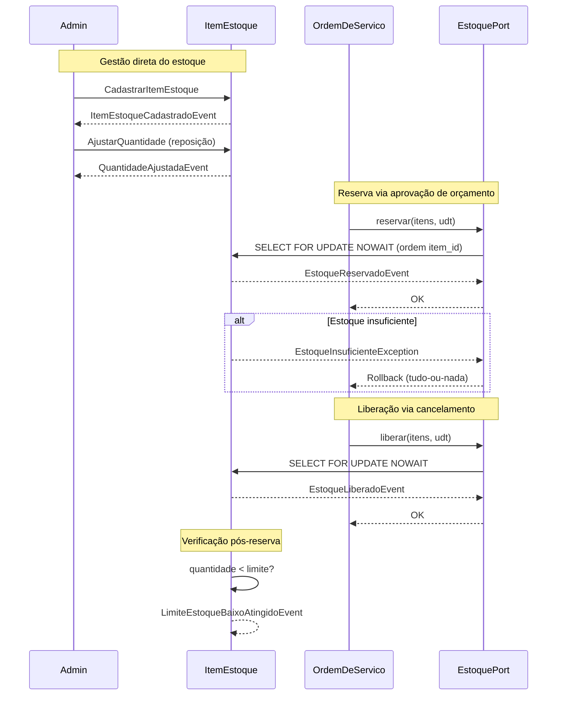
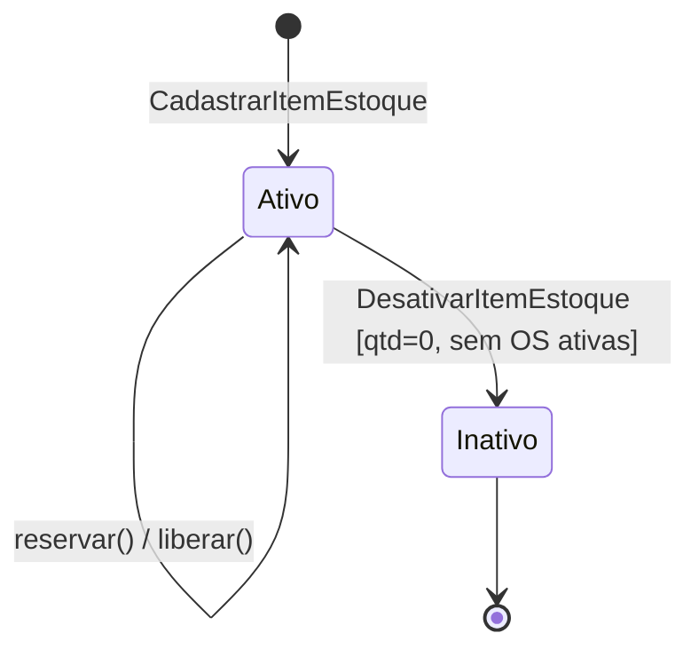

# Event Storming — Fluxo 2: Gestão de Peças e Insumos

> [↑ Raiz do projeto](../../../README.md) · [↑ Event Storming](README.md)

> **Versão**: 1.0 — Fase 1 MVP.

Fluxo de gerenciamento do estoque da oficina: cadastro de itens, controle de quantidade, reserva durante aprovação de orçamento e liberação em caso de cancelamento.

## Convenção de Cores

| Cor | Elemento | Descrição |
|---|---|---|
| 🟠 Laranja | Evento de Domínio | Fato que aconteceu no passado |
| 🔵 Azul | Comando | Intenção de ação disparada por um ator |
| 🟡 Amarelo claro | Ator | Pessoa ou papel que dispara um comando |
| 🟡 Amarelo | Agregado | Entidade raiz que processa o comando |
| 🟢 Verde | Read Model | Projeção de dados consultada antes de um comando |
| 🟣 Lilás | Política | Regra reativa — ao observar um evento, dispara outro comando |
| 🔴 Vermelho | Hotspot | Decisão pendente ou ponto de atenção |
| 🩷 Rosa | Sistema Externo | Sistema fora da fronteira do domínio |

## Atores

- **Admin**: Gerencia o cadastro de peças e insumos, ajusta quantidades. Autenticado via JWT.
- **Sistema (OS)**: O contexto Ordem de Serviço aciona reserva/liberação de estoque via `EstoquePort`.

## Walkthrough Narrativo

### 1. Cadastro de Item de Estoque

| Elemento | Detalhe |
|---|---|
| 🔵 Comando | `CadastrarItemEstoque(nome, descricao, quantidade_inicial, preco_unitario)` |
| 🟡 Agregado | `ItemEstoque` |
| 🟠 Evento | `ItemEstoqueCadastradoEvent(item_id, nome, quantidade_inicial)` |
| 🟣 Política | Quantidade deve ser > 0. Preço unitário como `Dinheiro` (BRL, 2 casas). |

**Contexto**: Admin cadastra peças e insumos disponíveis na oficina. Cada `ItemEstoque` é um agregado raiz com identidade própria e controle de quantidade. A quantidade inicial deve ser positiva.

### 2. Ajuste de Quantidade (Reposição)

| Elemento | Detalhe |
|---|---|
| 🔵 Comando | `AjustarQuantidade(item_id, nova_quantidade)` |
| 🟡 Agregado | `ItemEstoque` |
| 🟠 Evento | `QuantidadeAjustadaEvent(item_id, quantidade_anterior, quantidade_nova)` |
| 🟣 Política | Nova quantidade deve ser >= 0. Ajuste para 0 permitido para preparar desativação. |

**Contexto**: Admin repõe estoque ou corrige quantidades após inventário. O ajuste substitui a quantidade atual pela nova quantidade informada.

### 3. Reserva de Estoque (Acionada pela OS)

| Elemento | Detalhe |
|---|---|
| 🔵 Comando | `ReservarEstoque(itens: [(item_id, quantidade)], udt)` |
| 🟡 Agregado | `ItemEstoque` (um por item) |
| 🟠 Evento | `EstoqueReservadoEvent(item_id, ordem_id, quantidade)` |
| 🟣 Política | Bloqueio pessimista: `SELECT FOR UPDATE NOWAIT`. Locks em ordem crescente de `item_id`. Tudo-ou-nada na mesma transação. |
| 🔴 Hotspot | Se qualquer item tiver estoque insuficiente, toda a reserva é revertida. `EstoqueInsuficienteException` propagada ao contexto OS. |

**Contexto**: Acionada pelo contexto Ordem de Serviço no momento da aprovação do orçamento, via `EstoquePort.reservar()`. A `UnitOfWork` é compartilhada para garantir atomicidade com a transição de status da OS. Os locks são adquiridos em ordem crescente de `item_id` para prevenir deadlocks entre transações concorrentes.

### 4. Liberação de Estoque (Cancelamento da OS)

| Elemento | Detalhe |
|---|---|
| 🔵 Comando | `LiberarEstoque(itens: [(item_id, quantidade)], udt)` |
| 🟡 Agregado | `ItemEstoque` (um por item) |
| 🟠 Evento | `EstoqueLiberadoEvent(item_id, ordem_id, quantidade)` |
| 🟣 Política | Só acionada quando a OS é cancelada a partir de EmExecucao. |

**Contexto**: Quando uma OS em execução é cancelada, o estoque reservado é devolvido. A operação também usa `SELECT FOR UPDATE NOWAIT` e a mesma `UnitOfWork` da transição de cancelamento da OS.

### 5. Alerta de Estoque Baixo

| Elemento | Detalhe |
|---|---|
| 🔵 Comando | — (disparado automaticamente após reserva) |
| 🟡 Agregado | `ItemEstoque` |
| 🟠 Evento | `LimiteEstoqueBaixoAtingidoEvent(item_id, quantidade_atual, limite)` |
| 🟢 Read Model | Dashboard de itens com estoque baixo. |
| 🔴 Hotspot | Definição do limite de alerta (configurável por item ou global). |

**Contexto**: Após cada reserva, o agregado verifica se a quantidade restante está abaixo de um limite configurável. Se estiver, emite evento de alerta. No MVP, o evento é logado — futuramente pode alimentar notificações.

### 6. Listagem e Consulta de Estoque

| Elemento | Detalhe |
|---|---|
| 🔵 Comando | `ListarItensEstoque(filtros, paginacao)` |
| 🟢 Read Model | Lista paginada de itens com nome, quantidade disponível e preço unitário. |
| 🔵 Comando | `ConsultarItemEstoque(item_id)` |
| 🟢 Read Model | Detalhe do item com nome, quantidade disponível e preço unitário. |

**Contexto**: Admin consulta o estoque para verificar disponibilidade e planejar reposição. A paginação segue o padrão offset-based (default 20, max 100).

### 7. Desativação de Item

| Elemento | Detalhe |
|---|---|
| 🔵 Comando | `DesativarItemEstoque(item_id)` |
| 🟡 Agregado | `ItemEstoque` |
| 🟠 Evento | `ItemEstoqueDesativadoEvent(item_id)` |
| 🟣 Política | Rejeitado se quantidade > 0 ou se referenciado por OS ativas. Soft delete (flag `ativo = False`). |

**Contexto**: Item de estoque só pode ser desativado quando não tem quantidade restante e não é referenciado por nenhuma OS ativa (Recebida → EmExecucao).

## Diagrama Mermaid — Fluxo de Estoque

## Diagrama Mermaid — Ciclo de Vida do ItemEstoque

## Relação com Outros Documentos

- [Fluxo 1 — Ciclo de Vida da OS](fluxo-1-ciclo-os.md) — Fluxo que aciona reserva (passo 6) e liberação (passo 7) de estoque
- [Workshop de Event Storming](workshop-event-storming.md) — Sessão que originou este fluxo
- [Glossário — Linguagem Ubíqua](../../requisitos/glossario.md) — Termos de domínio mapeados para código
- [Mapa de Contextos](../mapa-contextos.md) — Padrões de integração entre os 5 BCs

> [↑ Raiz do projeto](../../../README.md) · [↑ Event Storming](README.md)
