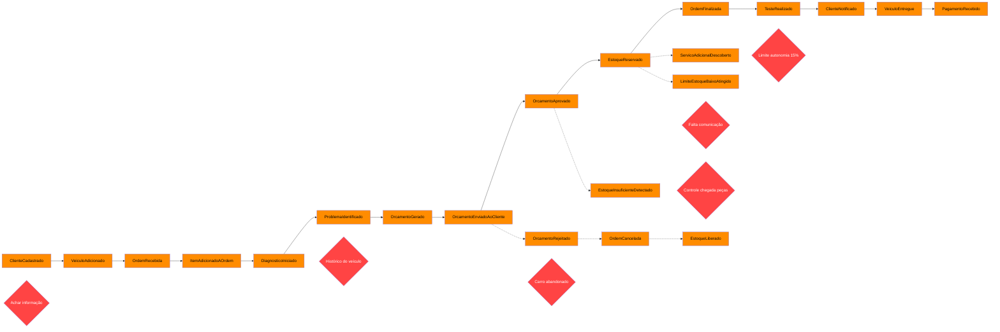
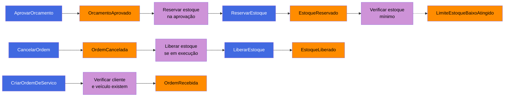
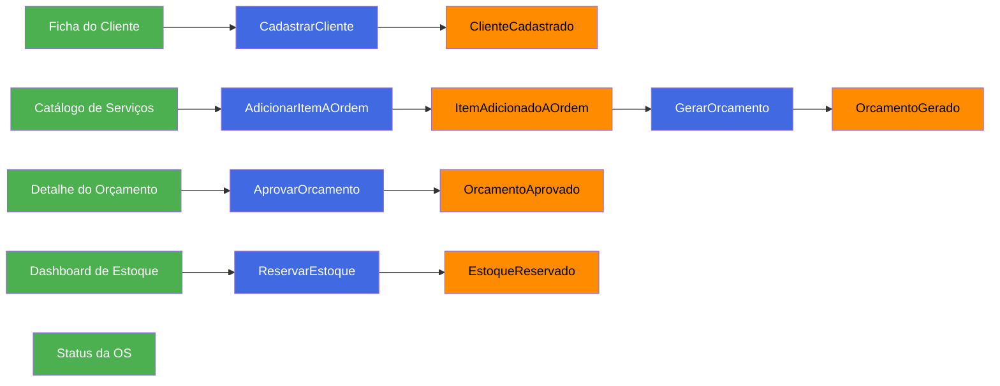
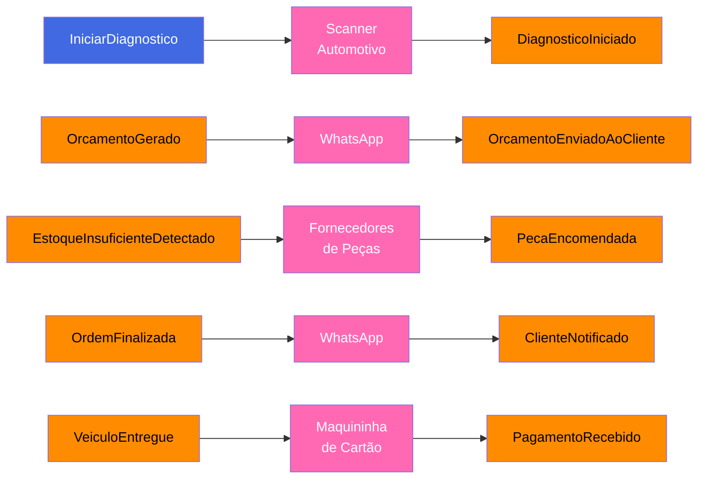
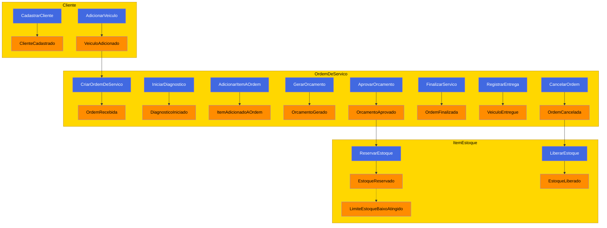
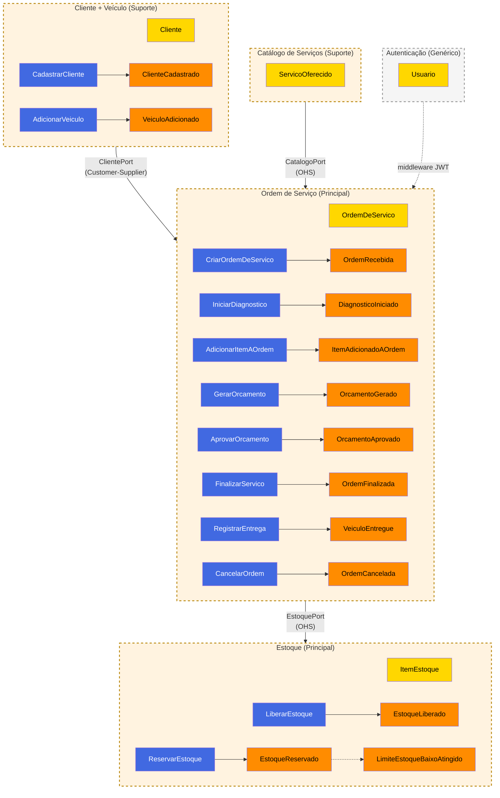

# Workshop de Event Storming — Oficina Mecânica

> [↑ Raiz do projeto](../../../README.md) · [↑ Event Storming](README.md)

> **Versão**: 1.0 — Fase 1 MVP.

> Workshop simulado com especialistas fictícios representando papéis típicos de uma oficina
> mecânica de médio porte. Gerado com assistência de IA (Claude) e revisado pela equipe PytStop.
> [Perfis completos](../domain-storytelling/especialistas-de-dominio.md).

---

## Participantes

| Papel | Participante | Contribuição principal |
|---|---|---|
| Facilitador | Dev (desenvolvedor do sistema) | Conduz a sessão, faz perguntas, organiza o quadro |
| Dono / Mecânico-Chefe | Seu Carlos | Visão geral do fluxo, regras de negócio não escritas, cancelamentos |
| Consultora Técnica / Recepcionista | Dona Marta | Recepção, cadastro, comunicação com cliente, status |
| Mecânico Especialista | Reginaldo | Diagnóstico, execução técnica, testes |
| Orçamentista / Comprador | Leandro | Orçamento, peças, estoque, fornecedores |
| Cliente Fiel | Fábio | Perspectiva do cliente, aprovação, acompanhamento |

## Metodologia

Workshop estruturado em 10 passos progressivos, seguindo o método de Alberto Brandolini (Aula 06 — Event Storming). Cada passo adiciona uma camada de elementos ao modelo, partindo de eventos soltos até chegar a contextos delimitados.

> **Convenção de nomes**: os eventos neste workshop omitem o sufixo `Event` usado no código (ex: `OrcamentoAprovado` aqui = `OrcamentoAprovadoEvent` no código).

### Convenção de Cores

| Cor | Elemento | Descrição |
|---|---|---|
| 🟠 Laranja | Evento de Domínio | Fato que aconteceu no passado, nomeado no particípio |
| 🔵 Azul | Comando | Intenção de ação disparada por um ator ou política |
| 🟡 Amarelo claro | Ator | Pessoa ou papel que dispara um comando |
| 🟡 Amarelo | Agregado | Entidade raiz que recebe o comando e emite o evento |
| 🟢 Verde | Read Model | Projeção de dados consultada antes de um comando |
| 🟣 Lilás | Política | Regra reativa — ao observar um evento, dispara outro comando |
| 🔴 Vermelho | Hotspot | Ponto de atenção, decisão pendente ou incerteza |
| 🩷 Rosa | Sistema Externo | Sistema fora da fronteira do domínio |

---

## Passo 1: Brainstorming de Eventos

**Facilitador**: "Vamos começar. Quero que cada um de vocês pense em coisas que **acontecem** na oficina — fatos, acontecimentos. Escrevam no passado: 'tal coisa aconteceu'. Não se preocupem com ordem, só soltem as ideias."

Seu Carlos foi o primeiro a se manifestar: "Bom, o básico: o carro chega, a gente olha, faz orçamento, e se o cliente aprovar, faz o serviço e entrega." Dona Marta complementou: "Antes de tudo, eu cadastro o cliente e anoto a placa." Reginaldo levantou: "Depois que eu começo o diagnóstico, às vezes descubro coisa extra que não estava no plano." Leandro acrescentou: "E quando o orçamento é aprovado, eu preciso separar as peças. Às vezes não tem e preciso encomendar." Fábio trouxe a visão do cliente: "Para mim, o que importa é quando eu recebo o orçamento, quando eu aprovo, e quando me avisam que está pronto."

Seu Carlos ainda lembrou: "Tem ordem que é cancelada também. E tem carro que o dono some." Leandro completou: "E quando o estoque está no limite, eu preciso saber para não ficar sem peça."

| # | 🟠 Evento | Sugerido por |
|---|---|---|
| 1 | ClienteCadastrado | Dona Marta |
| 2 | VeiculoAdicionado | Dona Marta |
| 3 | OrdemRecebida | Seu Carlos |
| 4 | ItemAdicionadoAOrdem | Reginaldo |
| 5 | DiagnosticoIniciado | Reginaldo |
| 6 | ProblemaIdentificado | Reginaldo |
| 7 | OrcamentoGerado | Leandro |
| 8 | OrcamentoEnviadoAoCliente | Dona Marta |
| 9 | OrcamentoAprovado | Fábio |
| 10 | OrcamentoRejeitado | Fábio |
| 11 | EstoqueReservado | Leandro |
| 12 | EstoqueInsuficienteDetectado | Leandro |
| 13 | PecaEncomendada | Leandro |
| 14 | ServicoAdicionalDescoberto | Reginaldo |
| 15 | OrdemFinalizada | Reginaldo |
| 16 | TesteRealizado | Reginaldo |
| 17 | VeiculoEntregue | Dona Marta |
| 18 | PagamentoRecebido | Dona Marta |
| 19 | OrdemCancelada | Seu Carlos |
| 20 | EstoqueLiberado | Leandro |
| 21 | LimiteEstoqueBaixoAtingido | Leandro |
| 22 | ClienteNotificado | Fábio |

```mermaid
flowchart LR
    E1[ClienteCadastrado]
    E2[VeiculoAdicionado]
    E3[OrdemRecebida]
    E4[ItemAdicionadoAOrdem]
    E5[DiagnosticoIniciado]
    E6[ProblemaIdentificado]
    E7[OrcamentoGerado]
    E8[OrcamentoEnviadoAoCliente]
    E9[OrcamentoAprovado]
    E10[OrcamentoRejeitado]
    E11[EstoqueReservado]
    E12[EstoqueInsuficienteDetectado]
    E13[PecaEncomendada]
    E14[ServicoAdicionalDescoberto]
    E15[OrdemFinalizada]
    E16[TesteRealizado]
    E17[VeiculoEntregue]
    E18[PagamentoRecebido]
    E19[OrdemCancelada]
    E20[EstoqueLiberado]
    E21[LimiteEstoqueBaixoAtingido]
    E22[ClienteNotificado]

    style E1 fill:#FF8C00,color:#000
    style E2 fill:#FF8C00,color:#000
    style E3 fill:#FF8C00,color:#000
    style E4 fill:#FF8C00,color:#000
    style E5 fill:#FF8C00,color:#000
    style E6 fill:#FF8C00,color:#000
    style E7 fill:#FF8C00,color:#000
    style E8 fill:#FF8C00,color:#000
    style E9 fill:#FF8C00,color:#000
    style E10 fill:#FF8C00,color:#000
    style E11 fill:#FF8C00,color:#000
    style E12 fill:#FF8C00,color:#000
    style E13 fill:#FF8C00,color:#000
    style E14 fill:#FF8C00,color:#000
    style E15 fill:#FF8C00,color:#000
    style E16 fill:#FF8C00,color:#000
    style E17 fill:#FF8C00,color:#000
    style E18 fill:#FF8C00,color:#000
    style E19 fill:#FF8C00,color:#000
    style E20 fill:#FF8C00,color:#000
    style E21 fill:#FF8C00,color:#000
    style E22 fill:#FF8C00,color:#000
```



---

## Passo 2: Linha do Tempo

**Facilitador**: "Ótimo, temos 22 eventos. Agora vamos organizar na linha do tempo. Qual é o caminho feliz — quando tudo dá certo?"

Dona Marta começou: "O cliente chega, eu cadastro, registro o veículo, abro a OS." Seu Carlos continuou: "Aí o mecânico faz o diagnóstico, identifica o que precisa." Leandro encaixou: "Eu gero o orçamento, a Marta manda para o cliente." Fábio completou: "Eu recebo, aprovo." Leandro prosseguiu: "Aí eu reservo o estoque." Reginaldo fechou: "Eu executo, testo, e aviso que está pronto. A Marta entrega."

O facilitador organizou os caminhos alternativos: rejeição do orçamento, cancelamento em diversos estágios, estoque insuficiente e serviço adicional descoberto durante a execução.

```mermaid
flowchart LR
    E1[ClienteCadastrado] --> E2[VeiculoAdicionado]
    E2 --> E3[OrdemRecebida]
    E3 --> E4[ItemAdicionadoAOrdem]
    E4 --> E5[DiagnosticoIniciado]
    E5 --> E6[ProblemaIdentificado]
    E6 --> E7[OrcamentoGerado]
    E7 --> E8[OrcamentoEnviadoAoCliente]
    E8 --> E9[OrcamentoAprovado]
    E9 --> E11[EstoqueReservado]
    E11 --> E15[OrdemFinalizada]
    E15 --> E16[TesteRealizado]
    E16 --> E22a[ClienteNotificado]
    E22a --> E17[VeiculoEntregue]
    E17 --> E18[PagamentoRecebido]

    E8 -.-> E10[OrcamentoRejeitado]
    E10 -.-> E19a[OrdemCancelada]

    E9 -.-> E12[EstoqueInsuficienteDetectado]
    E12 -.-> E13[PecaEncomendada]

    E11 -.-> E14[ServicoAdicionalDescoberto]

    E11 -.-> E21[LimiteEstoqueBaixoAtingido]

    E19a -.-> E20[EstoqueLiberado]

    style E1 fill:#FF8C00,color:#000
    style E2 fill:#FF8C00,color:#000
    style E3 fill:#FF8C00,color:#000
    style E4 fill:#FF8C00,color:#000
    style E5 fill:#FF8C00,color:#000
    style E6 fill:#FF8C00,color:#000
    style E7 fill:#FF8C00,color:#000
    style E8 fill:#FF8C00,color:#000
    style E9 fill:#FF8C00,color:#000
    style E10 fill:#FF8C00,color:#000
    style E11 fill:#FF8C00,color:#000
    style E12 fill:#FF8C00,color:#000
    style E13 fill:#FF8C00,color:#000
    style E14 fill:#FF8C00,color:#000
    style E15 fill:#FF8C00,color:#000
    style E16 fill:#FF8C00,color:#000
    style E17 fill:#FF8C00,color:#000
    style E18 fill:#FF8C00,color:#000
    style E19a fill:#FF8C00,color:#000
    style E20 fill:#FF8C00,color:#000
    style E21 fill:#FF8C00,color:#000
    style E22a fill:#FF8C00,color:#000
```



---

## Passo 3: Pontos de Atenção (Hotspots)

**Facilitador**: "Agora quero ouvir o que preocupa vocês. Onde estão os problemas, as dúvidas, os gargalos?"

Seu Carlos disparou primeiro: "Carro abandonado. O cliente some e o carro fica aqui ocupando espaço. Depois de trinta dias eu penso em cobrar estadia, mas nunca cobrei." Dona Marta complementou: "Achar informação. O cliente liga perguntando do carro e eu preciso largar tudo para ir olhar no quadro. Perco quinze minutos para responder uma pergunta simples." Reginaldo trouxe: "Histórico do carro. Quando o cara volta, eu queria saber o que já foi feito. Sem histórico, começo do zero toda vez." Leandro admitiu: "Às vezes esqueço de marcar que a peça chegou e fico ligando para o fornecedor perguntando de uma peça que já está aqui." Fábio foi direto: "Três dias sem saber de nada. Aprovo o orçamento e ninguém me avisa que está esperando peça."

| # | 🔴 Hotspot | Levantado por | Entre quais eventos |
|---|---|---|---|
| H1 | Carro abandonado — cliente não responde após orçamento (timeout indefinido) | Seu Carlos | OrcamentoEnviadoAoCliente → ? |
| H2 | Achar informação — consulta de status lenta e manual | Dona Marta | Qualquer ponto do fluxo |
| H3 | Histórico do veículo inexistente entre OS diferentes | Reginaldo | DiagnosticoIniciado |
| H4 | Controle de chegada de peças falho (esquece de marcar) | Leandro | PecaEncomendada → EstoqueReservado |
| H5 | Falta de comunicação proativa ao cliente | Fábio | OrcamentoAprovado → OrdemFinalizada |
| H6 | Limite de autonomia para serviços adicionais (~15%) não formalizado | Seu Carlos | ServicoAdicionalDescoberto |



---

## Passo 4: Eventos Pivotais

**Facilitador**: "Olhando a linha do tempo, quais eventos marcam uma mudança de fase? Onde o contexto muda?"

Seu Carlos apontou: "Quando a OS é aberta, o carro sai da recepção e vai para o diagnóstico. Isso é uma virada." Leandro completou: "A aprovação do orçamento é o momento-chave. Ali o cliente se comprometeu, eu reservo peças, começa a execução de verdade." Reginaldo fechou: "E quando eu finalizo o serviço, acabou a parte técnica. Daí para frente é só entrega e cobrança."

| 🟠 Evento Pivotal | Transição de fase | Justificativa |
|---|---|---|
| **OrdemRecebida** | Recepção → Diagnóstico | Inicia análise técnica; responsabilidade muda da recepcionista para o mecânico |
| **OrcamentoAprovado** | Orçamento → Execução | Dispara reserva de estoque; compromisso financeiro do cliente; ponto sem retorno fácil |
| **OrdemFinalizada** | Execução → Entrega | Serviço concluído; responsabilidade volta para a recepcionista; veículo pronto para retirada |

Estes pivots alinham-se com as transições de estado da OS documentadas em [fluxo-1-ciclo-os.md](fluxo-1-ciclo-os.md).


---

## Passo 5: Comandos

**Facilitador**: "Cada evento aconteceu porque alguém fez alguma coisa. Quais são as ações — os comandos — e quem os executa?"

Dona Marta começou: "Eu cadastro o cliente, registro o veículo, crio a OS. E quando o carro fica pronto, eu registro a entrega." Reginaldo listou: "Eu inicio o diagnóstico, adiciono itens à OS quando descubro o que precisa, e finalizo o serviço." Leandro acrescentou: "Eu gero o orçamento. E quando aprovam, eu reservo o estoque." Fábio disse: "Eu aprovo ou rejeito o orçamento." Seu Carlos completou: "E eu cancelo a OS quando precisa."

| # | 🔵 Comando | Ator | 🟠 Evento resultante |
|---|---|---|---|
| C1 | CadastrarCliente | Admin (Dona Marta) | ClienteCadastrado |
| C2 | AdicionarVeiculo | Admin (Dona Marta) | VeiculoAdicionado |
| C3 | CriarOrdemDeServico | Admin (Dona Marta) | OrdemRecebida |
| C4 | AdicionarItemAOrdem | Admin / Mecânico | ItemAdicionadoAOrdem |
| C5 | IniciarDiagnostico | Mecânico (Reginaldo) | DiagnosticoIniciado |
| C6 | GerarOrcamento | Admin (Leandro) | OrcamentoGerado |
| C7 | AprovarOrcamento | Admin (registro da decisão do Fábio) | OrcamentoAprovado |
| C8 | CancelarOrdem | Admin (Seu Carlos) | OrdemCancelada |
| C9 | FinalizarServico | Mecânico (Reginaldo) | OrdemFinalizada |
| C10 | RegistrarEntrega | Admin (Dona Marta) | VeiculoEntregue |
| C11 | ReservarEstoque | Sistema (via aprovação) | EstoqueReservado |
| C12 | LiberarEstoque | Sistema (via cancelamento) | EstoqueLiberado |

```mermaid
flowchart LR
    C1[CadastrarCliente] --> E1[ClienteCadastrado]
    C2[AdicionarVeiculo] --> E2[VeiculoAdicionado]
    E1 --> C2
    E2 --> C3[CriarOrdemDeServico]
    C3 --> E3[OrdemRecebida]

    E3 --> C5[IniciarDiagnostico]
    C5 --> E5[DiagnosticoIniciado]
    E5 --> C4[AdicionarItemAOrdem]
    C4 --> E4[ItemAdicionadoAOrdem]

    E4 --> C6[GerarOrcamento]
    C6 --> E7[OrcamentoGerado]
    E7 --> E8[OrcamentoEnviadoAoCliente]
    E8 --> C7[AprovarOrcamento]
    C7 --> E9[OrcamentoAprovado]

    E9 --> C11[ReservarEstoque]
    C11 --> E11[EstoqueReservado]

    E11 --> C9[FinalizarServico]
    C9 --> E15[OrdemFinalizada]
    E15 --> C10[RegistrarEntrega]
    C10 --> E17[VeiculoEntregue]

    E8 -.-> C8[CancelarOrdem]
    C8 -.-> E19a[OrdemCancelada]
    E19a -.-> C12[LiberarEstoque]
    C12 -.-> E20[EstoqueLiberado]

    AT1([Admin])
    AT2([Mecânico])
    AT3([Sistema])

    AT1 -.-> C1
    AT1 -.-> C3
    AT1 -.-> C7
    AT1 -.-> C10
    AT2 -.-> C5
    AT2 -.-> C9
    AT3 -.-> C11

    style E1 fill:#FF8C00,color:#000
    style E2 fill:#FF8C00,color:#000
    style E3 fill:#FF8C00,color:#000
    style E4 fill:#FF8C00,color:#000
    style E5 fill:#FF8C00,color:#000
    style E7 fill:#FF8C00,color:#000
    style E8 fill:#FF8C00,color:#000
    style E9 fill:#FF8C00,color:#000
    style E11 fill:#FF8C00,color:#000
    style E15 fill:#FF8C00,color:#000
    style E17 fill:#FF8C00,color:#000
    style E19a fill:#FF8C00,color:#000
    style E20 fill:#FF8C00,color:#000
    style C1 fill:#4169E1,color:#fff
    style C2 fill:#4169E1,color:#fff
    style C3 fill:#4169E1,color:#fff
    style C4 fill:#4169E1,color:#fff
    style C5 fill:#4169E1,color:#fff
    style C6 fill:#4169E1,color:#fff
    style C7 fill:#4169E1,color:#fff
    style C8 fill:#4169E1,color:#fff
    style C9 fill:#4169E1,color:#fff
    style C10 fill:#4169E1,color:#fff
    style C11 fill:#4169E1,color:#fff
    style C12 fill:#4169E1,color:#fff
    style AT1 fill:#FFF59D,color:#000
    style AT2 fill:#FFF59D,color:#000
    style AT3 fill:#FFF59D,color:#000
```



---

## Passo 6: Políticas

**Facilitador**: "Alguns comandos não são disparados por pessoas — são regras do sistema. Quando um evento acontece, qual regra entra em ação automaticamente?"

Seu Carlos trouxe a primeira: "Quando o serviço adicional é até quinze por cento do orçamento original, o mecânico pode fazer sem perguntar. Isso é uma regra automática de autonomia." Leandro identificou: "Quando o orçamento é aprovado, a reserva de estoque é automática. Não sou eu que vou lá reservar manualmente — o sistema faz." Dona Marta lembrou: "E na criação da OS, o sistema precisa verificar se o cliente e o veículo existem antes de criar."

| # | 🟣 Política | Evento gatilho | 🔵 Comando disparado |
|---|---|---|---|
| P1 | Reservar estoque na aprovação | OrcamentoAprovado | ReservarEstoque |
| P2 | Liberar estoque no cancelamento (se em execução) | OrdemCancelada | LiberarEstoque |
| P3 | Verificar cliente e vínculo do veículo na criação da OS | CriarOrdemDeServico | Validação via ClientePort |
| P4 | Verificar estoque mínimo após reserva | EstoqueReservado | VerificarEstoqueMinimo → emite LimiteEstoqueBaixoAtingido |
| P5 | Regra de autonomia ~15% para adicionais | ServicoAdicionalDescoberto | Aprovar ou solicitar novo orçamento |



---

## Passo 7: Modelos de Leitura

**Facilitador**: "Antes de executar um comando, vocês consultam alguma informação? Uma tela, um relatório, uma lista?"

Dona Marta respondeu primeiro: "Quando o cliente chega, eu consulto a ficha dele — nome, telefone, veículos. E quando alguém liga perguntando, eu preciso ver o status da OS rapidinho." Leandro listou: "Eu preciso do catálogo de serviços para montar o orçamento, com preços atualizados. E preciso ver o dashboard de estoque para saber o que tem e o que está no limite." Fábio acrescentou: "Quando eu recebo o orçamento, quero ver o detalhe — o que vai ser feito, quanto custa cada coisa, o total."

| # | 🟢 Read Model | Consultado antes de | Informado por |
|---|---|---|---|
| M1 | Ficha do Cliente | CadastrarCliente (verificar se já existe) | Dona Marta |
| M2 | Status da OS | ConsultarStatusOS | Dona Marta |
| M3 | Catálogo de Serviços | AdicionarItemAOrdem / GerarOrcamento | Leandro |
| M4 | Dashboard de Estoque | ReservarEstoque / reposição | Leandro |
| M5 | Detalhe do Orçamento | AprovarOrcamento / RejeitarOrcamento | Fábio |



---

## Passo 8: Sistemas Externos

**Facilitador**: "Quais sistemas de fora da oficina vocês interagem? Coisas que não são do sistema que estamos construindo."

Dona Marta listou: "WhatsApp, com certeza. É por onde eu mando orçamento, recebo aprovação, aviso que o carro está pronto. E a maquininha de cartão para cobrar." Reginaldo acrescentou: "O scanner automotivo — é um equipamento externo que lê os códigos de erro do computador do carro." Leandro complementou: "Os sites e catálogos dos fornecedores de peças, para cotar e encomendar."

| # | 🩷 Sistema Externo | Interage com | Informado por |
|---|---|---|---|
| S1 | WhatsApp | OrcamentoEnviadoAoCliente, ClienteNotificado | Dona Marta |
| S2 | Maquininha de Cartão | PagamentoRecebido | Dona Marta |
| S3 | Scanner Automotivo | DiagnosticoIniciado | Reginaldo |
| S4 | Fornecedores de Peças | PecaEncomendada | Leandro |



---

## Passo 9: Agregados

**Facilitador**: "Vamos agrupar comandos e eventos pelo objeto principal que eles afetam. Qual é a 'coisa' central de cada grupo?"

Seu Carlos apontou: "A Ordem de Serviço é o coração. Quase tudo gira em torno dela — diagnóstico, orçamento, execução, entrega." Dona Marta separou: "Mas o cliente e o veículo são coisas à parte. Eu cadastro o cliente uma vez e ele volta várias vezes com veículos diferentes." Leandro diferenciou: "O estoque é independente. A peça existe na prateleira antes de qualquer OS. E o catálogo de serviços também — o serviço 'troca de óleo' existe mesmo quando não tem nenhum carro para trocar." Reginaldo concordou: "Faz sentido. A OS usa peças do estoque e serviços do catálogo, mas eles vivem separados."

| 🟡 Agregado | Comandos | Eventos | Contexto |
|---|---|---|---|
| **OrdemDeServico** | CriarOrdemDeServico, AdicionarItemAOrdem, IniciarDiagnostico, GerarOrcamento, AprovarOrcamento, FinalizarServico, RegistrarEntrega, CancelarOrdem | OrdemRecebida, ItemAdicionadoAOrdem, DiagnosticoIniciado, OrcamentoGerado, OrcamentoAprovado, OrdemFinalizada, VeiculoEntregue, OrdemCancelada | Ordem de Serviço |
| **Cliente** | CadastrarCliente, AdicionarVeiculo | ClienteCadastrado, VeiculoAdicionado | Cliente + Veículo |
| **ItemEstoque** | ReservarEstoque, LiberarEstoque, AjustarQuantidade | EstoqueReservado, EstoqueLiberado, LimiteEstoqueBaixoAtingido | Estoque |
| **ServicoOferecido** | CadastrarServico | ServicoCadastrado | Catálogo de Serviços |



---

## Passo 10: Contextos Delimitados

**Facilitador**: "Por fim, quais agregados têm conexão forte entre si? Quais podem viver independentes?"

Seu Carlos sintetizou: "O cliente é uma coisa. A ordem de serviço é outra. O estoque é outra. E o catálogo de serviços é outra." Leandro concordou: "Exato. Eu gerencio o estoque independente das OS. Quando a OS precisa de peça, ela pede para o estoque, mas o estoque não precisa saber dos detalhes da OS." Dona Marta complementou: "E o cadastro de clientes não muda porque uma OS foi criada ou cancelada." Reginaldo observou: "O login do sistema — quem pode acessar, mecânico ou admin — é totalmente separado de tudo isso."

O facilitador desenhou as fronteiras:

| Contexto Delimitado | Classificação | Agregados | Padrão de integração |
|---|---|---|---|
| **Ordem de Serviço** | Principal | OrdemDeServico | Consome dados de Cliente, Catálogo e Estoque |
| **Cliente + Veículo** | Suporte | Cliente (contém Veiculo como entidade filha) | Fornece dados para OS — Customer-Supplier (fornecedor-consumidor) |
| **Catálogo de Serviços** | Suporte | ServicoOferecido | Expõe serviços via Open Host Service (OHS) / Published Language |
| **Estoque** | Principal | ItemEstoque | Expõe reserva/liberação via OHS / Published Language |
| **Autenticação** | Genérico | Usuario | Middleware transversal (JWT) |



---

## Resultado do Workshop

O Event Storming progressivo produziu a seguinte estrutura do domínio:

- 22 eventos de domínio identificados no brainstorming, dos quais 14 foram promovidos ao modelo formal
- 12 comandos mapeados com seus atores
- 6 hotspots e 3 eventos pivotais
- 5 políticas, 5 read models, 4 sistemas externos
- 4 agregados distribuídos em 5 contextos delimitados

Eventos brainstormados e não promovidos ao modelo formal:

| Evento | Motivo |
|---|---|
| `ProblemaIdentificado` | Absorvido pelo fluxo de diagnóstico (implícito em `DiagnosticoIniciado`) |
| `OrcamentoEnviadoAoCliente` | Ação de sistema externo (WhatsApp) |
| `OrcamentoRejeitado` | Modelado como `CancelarOrdem` a partir do status `AguardandoAprovacao` |
| `PecaEncomendada` | Interação com fornecedores — sistema externo |
| `ServicoAdicionalDescoberto` | Escopo futuro — hotspot H6 marca como não formalizado |
| `TesteRealizado` | Absorvido pela transição `OrdemFinalizada` (teste é pré-requisito) |
| `PagamentoRecebido` | Fora do escopo do MVP — a oficina usa dinheiro, Pix e maquininha |
| `ClienteNotificado` | Ação de sistema externo (WhatsApp) |

## Referências de Mercado

Casos reais de Event Storming em domínios análogos a oficinas mecânicas, usados como referência para validar o padrão identificado neste workshop:

| Domínio | Analogia com oficina | Fonte |
|---|---|---|
| Restaurante (Triple D) | Ciclo pedido-a-entrega análogo ao ciclo OS-a-entrega na oficina | [Event Storming a Restaurant](https://www.tripled.io/09/04/2019/event-storming-a-restaurant/) |
| Transporte Refrigerado (IBM KContainer) | Ciclo de vida da ordem de envio (Created → Updated → Completed) = ciclo de vida da OS | [IBM Event Storming Analysis](https://ibm-cloud-architecture.github.io/refarch-kc/implementation/event-storming-analysis/) |
| Locadora de Campervans (DZone) | Veículo: disponível → alugado → devolvido → manutenção = recebido → em serviço → pronto → entregue | [DZone: Demystifying Event Storming](https://dzone.com/articles/demystifying-event-storming-a-comprehensive-guide) |
| E-commerce Fulfillment | OrderPlaced → PaymentAuthorized → InventoryReserved → Packed → Shipped = OS criada → Aprovada → Estoque reservado → Executada → Entregue | [Introduction to Event Storming](https://emmanuelvalverderamos.substack.com/p/introduction-to-event-storming) |
| Biblioteca (ddd-by-examples) | Arquiteturas diferentes por BC (CRUD para catálogo, hexagonal para empréstimos) = padrão adotado neste projeto | [GitHub: ddd-by-examples/library](https://github.com/ddd-by-examples/library) |
| Coffee Shop (AWS) | 3 microsserviços (pedido, preparo, estoque) = OS, execução, estoque | [AWS Cloud Native Microservices](https://github.com/aws-samples/designing-cloud-native-microservices-on-aws) |

**Padrão recorrente em negócios de serviço** observado nos casos acima:

```
Solicitação → Recepção → Diagnóstico/Avaliação → Proposta/Orçamento →
Aprovação → Execução → Verificação → Entrega → Pagamento
```

## Relação com Outros Documentos

- [Domain Storytelling — Especialistas de Domínio](../domain-storytelling/especialistas-de-dominio.md) — Entrevistas com os 5 especialistas
- [Domain Storytelling — Diagramas](../domain-storytelling/) — Diagramas pictográficos derivados das mesmas entrevistas
- [Glossário — Linguagem Ubíqua](../../requisitos/glossario.md) — Termos de domínio mapeados para código
- [Mapa de Contextos](../mapa-contextos.md) — Padrões de integração entre os 5 BCs
- [Modelo de Domínio](../modelo-dominio.md) — Diagramas de classes por agregado

> [↑ Raiz do projeto](../../../README.md) · [↑ Event Storming](README.md)
