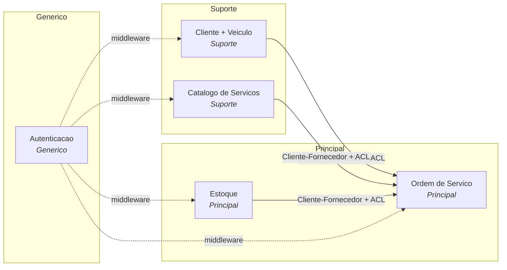
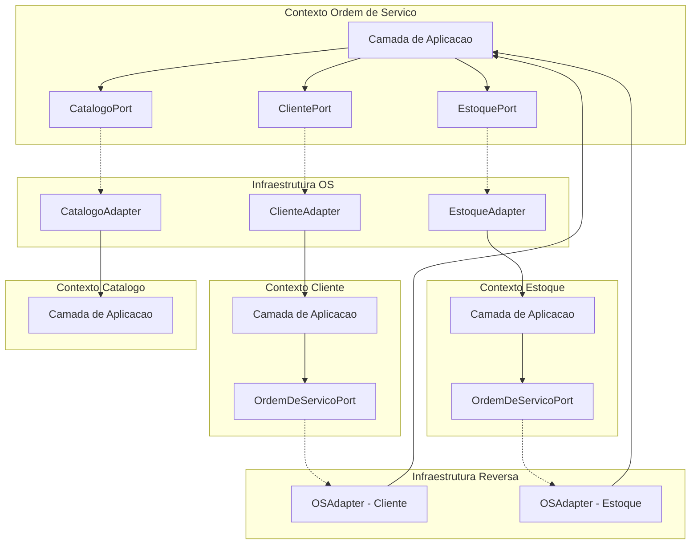
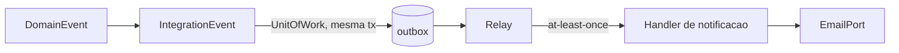

# Mapa de Contextos

> [↑ Raiz do projeto](../../README.md) · [↑ Arquitetura](README.md)

> **Versão**: 1.1 — Fase 2. Corrige assinaturas de portas (`ClientePort`, `EstoquePort`), o agregado Cliente/Veículo e adiciona o caminho assíncrono (outbox + relay).

5 contextos delimitados com padrões de integração DDD. Decisão de organização: [ADR-007](adr/007-organizacao-contextos-delimitados.md).

## Diagrama

> Direção das setas: fornecedor → consumidor (upstream → downstream).

## Contextos Delimitados

| Contexto | Classificação | Agregados | Responsabilidade |
|---|---|---|---|
| **Ordem de Serviço** | Principal | `OrdemDeServico` | Ciclo de vida da OS (7+1 status), geração de orçamento, orquestração cross-contexto |
| **Cliente + Veículo** | Suporte | `Cliente` (raiz; `Veiculo` é entidade filha) | Cadastro e validação de clientes (CPF/CNPJ) e seus veículos |
| **Catálogo de Serviços** | Suporte | `ServicoOferecido` | Tipos de serviço disponíveis com preços |
| **Estoque** | Principal | `ItemEstoque` | Peças e insumos com reserva pessimista e controle de quantidade |
| **Autenticação** | Genérico | `Usuario` | JWT, credenciais, RBAC. Substituível por Auth0/Keycloak. |

## Padrões de Integração

### Cliente-Fornecedor (Customer-Supplier)

**Fornecedor**: Cliente + Veículo
**Consumidor**: Ordem de Serviço

O contexto Cliente fornece dados para a criação de OS e para notificações. A porta `ClientePort` (definida pelo consumidor) expõe:
- `cliente_existe(cliente_id) -> bool`
- `veiculo_pertence_ao_cliente(cliente_id, veiculo_id) -> bool`
- `obter_contato(cliente_id) -> ClienteContatoDTO | None` — resolve o destinatário do e-mail (RF-024)
- `obter_clientes_em_lote(cliente_ids) -> dict[UUID, ClienteResumoDTO]` — enriquece projeções sem N+1
- `obter_veiculos_em_lote(veiculo_ids) -> dict[UUID, VeiculoResumoDTO]` — idem, para placas

Operações de leitura — não recebem `UnitOfWork`. A consulta pública por placa+documento (acompanhamento sem login) não passa por esta porta — ver o trade-off em [Consulta Reversa](#consulta-reversa-downstream--upstream).

### Cliente-Fornecedor com ACL do lado do consumidor

**Fornecedores**: Catálogo de Serviços, Estoque
**Consumidor**: Ordem de Serviço

A integração **não** é um Open Host Service publicado pelo fornecedor: quem
define o contrato é o **consumidor**. As portas (Protocols) e os DTOs vivem em
`src/ordem_servico/aplicacao/ports.py` (definidos pela Ordem de Serviço) e os
adaptadores que as realizam vivem na infraestrutura do **próprio** consumidor
(`src/ordem_servico/infraestrutura/adapters.py`) — padrão **Anti-Corruption
Layer** (ACL): o adapter traduz o modelo do contexto vizinho para os DTOs de
`ports.py`, sem vazar o agregado alheio para dentro da Ordem de Serviço.

Catálogo é consumido via `CatalogoPort`:
- `obter_servico(servico_id) -> ServicoOferecidoDTO | None`
- `obter_servicos_em_lote(servico_ids) -> dict[UUID, ServicoOferecidoDTO]` — enriquece projeções sem N+1

Estoque é consumido via `EstoquePort` (reserva/liberação/consulta):
- `reservar(item_estoque_id, quantidade) -> None`
- `liberar(item_estoque_id, quantidade) -> None`
- `obter_item(item_estoque_id) -> ItemEstoqueDTO | None` — preço da peça consumida
- `obter_itens_em_lote(item_estoque_ids) -> dict[UUID, ItemEstoqueDTO]` — enriquece projeções sem N+1

Os adaptadores são construídos com a sessão da requisição (session-scoped): a atomicidade vem da transação compartilhada, não de um `UnitOfWork` passado por parâmetro.

Os DTOs imutáveis desse módulo de portas (`ServicoOferecidoDTO`, `ItemEstoqueDTO`, `ClienteResumoDTO`, `ClienteContatoDTO`, `VeiculoResumoDTO`) formam a fronteira da ACL — tipos que desacoplam os contextos e impedem o modelo vizinho de atravessar.

### Consulta Reversa (Downstream → Upstream)

Os contextos Cliente e Estoque precisam consultar vínculos com OS antes de permitir exclusão/desativação (RN-009, RN-011). Como a direção principal de dependência é OS → fornecedores, uma porta reversa é necessária.

A porta `OrdemDeServicoPort` é definida pelos contextos consumidores (Cliente, Estoque) na sua camada de aplicação:
- `existe_os_ativa_para_cliente(cliente_id) -> bool` — usada por Cliente (RN-009)
- `existe_os_para_veiculo(veiculo_id) -> bool` — usada por Cliente (exclusão de veículo preserva histórico/FK)
- `existe_os_ativa_com_item_estoque(item_estoque_id) -> bool` — usada por Estoque (RN-011)

Operações de leitura — não recebem `UnitOfWork`. O adaptador vive na infraestrutura do contexto consumidor e consulta as **tabelas** de OS diretamente (`ordens_de_servico_table`/`itens_da_ordem_table`, via `select(exists()...)` em `adapters.py`), não o repositório de OS — é uma consulta de existência somente-leitura que não hidrata o agregado.

> **Trade-off**: essa porta reversa cria uma dependência cíclica no nível de infraestrutura (adapters). No monolito MVP, isso é aceitável — os contextos de domínio permanecem desacoplados. Em evolução para microsserviços, essa consulta seria substituída por eventos de domínio ou eventual consistency.
>
> Exceção pragmática da mesma natureza: a consulta pública de acompanhamento (`OrdemDeServicoRepository.obter_por_placa_e_documento`) é implementada na infraestrutura de OS como join somente-leitura nas tabelas `clientes` e `veiculos` do contexto vizinho — não atravessa o domínio de Cliente+Veículo nem passa pela `ClientePort`.

### Middleware (Cross-Cutting)

Autenticação é infraestrutura transversal via `Depends()` do FastAPI. Não é comunicação entre contextos de domínio — é enforcement de segurança na camada de interfaces.

## Comunicação

A comunicação **síncrona** entre contextos é in-process via portas e adaptadores. Adaptadores vivem na camada de infraestrutura. O wiring de DI fica em `<contexto>/interfaces/dependencies.py` (as factories `obter_*` de cada contexto, único ponto que importa implementações concretas); o `src/main.py` apenas monta os routers de cada contexto (`include_router`), não faz o wiring. O caminho assíncrono (notificações) é durável e cruza processos — seção a seguir.

## Integração Assíncrona (Fase 2)

A notificação ao cliente na mudança de status da OS (RF-024) sai do ciclo request/response por um caminho durável:

1. O agregado emite `DomainEvent`; os fatos que cruzam contextos são `IntegrationEvent` (especialização durável).
2. A `UnitOfWork` grava os `IntegrationEvent`s na tabela `outbox` **na mesma transação** do estado de negócio (Transactional Outbox — elimina o dual-write).
3. Um processo *relay* dedicado lê a outbox e entrega aos handlers — semântica at-least-once, com idempotência garantida pela tabela `processed_events` (única por `outbox_id` + handler).
4. O handler de notificação resolve o destinatário via `ClientePort.obter_contato` e envia pelo `EmailPort` — porta de saída para SMTP, realizada por adaptador na infraestrutura de OS.

Detalhes: [ADR-022](adr/fase2/022-transactional-outbox-relay.md) e [eventos de domínio](eventos-de-dominio.md).

## Código Compartilhado

`compartilhado/dominio/` contém:
- Classes base: `Entity`, `AggregateRoot`, `ValueObject`, `DomainEvent`
- Objeto de valor `Dinheiro` (usado por vários contextos)
- Hierarquia de exceções: `DomainException` e subclasses

Não é um Shared Kernel — é código utilitário sem regras de negócio específicas de um contexto.

> [↑ Raiz do projeto](../../README.md) · [↑ Arquitetura](README.md)
