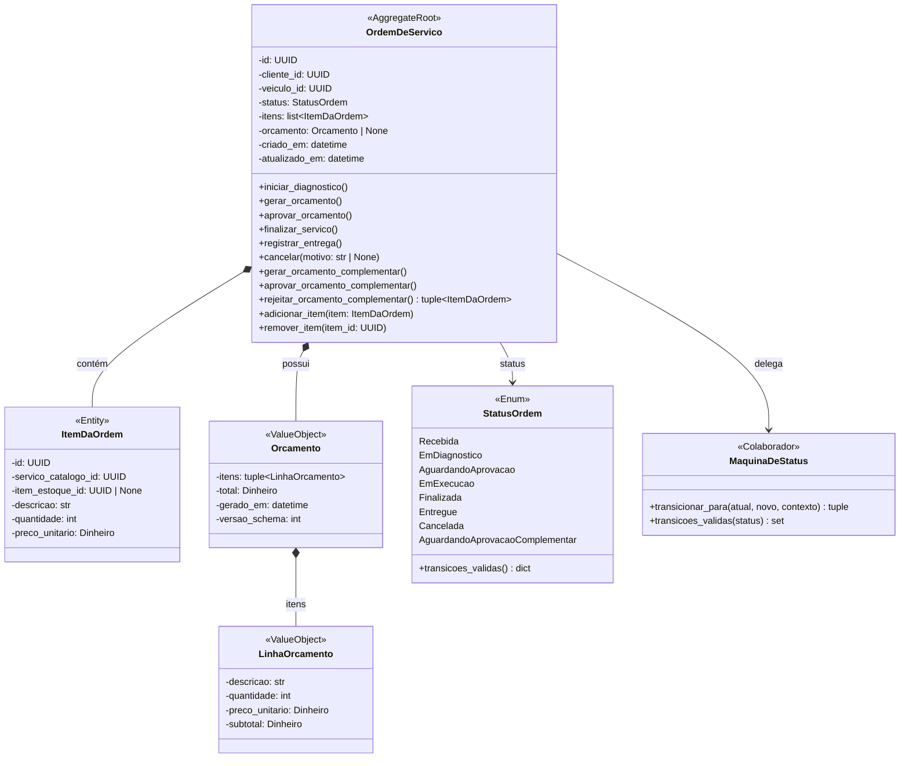
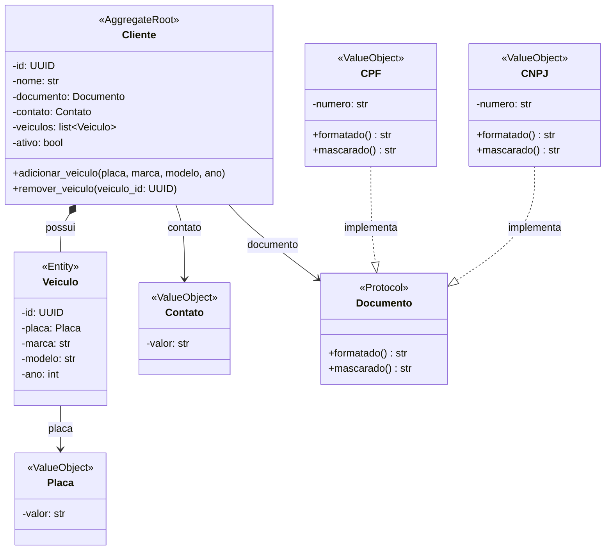
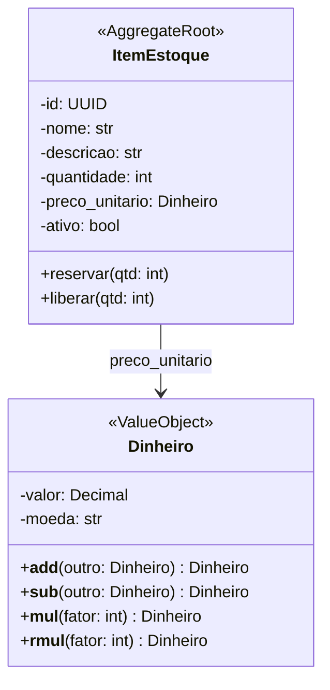
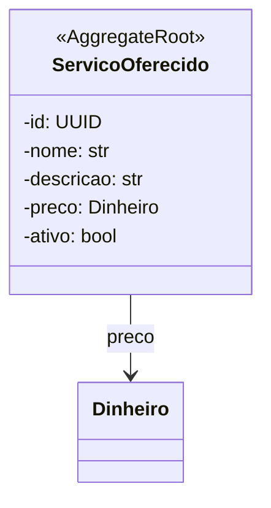
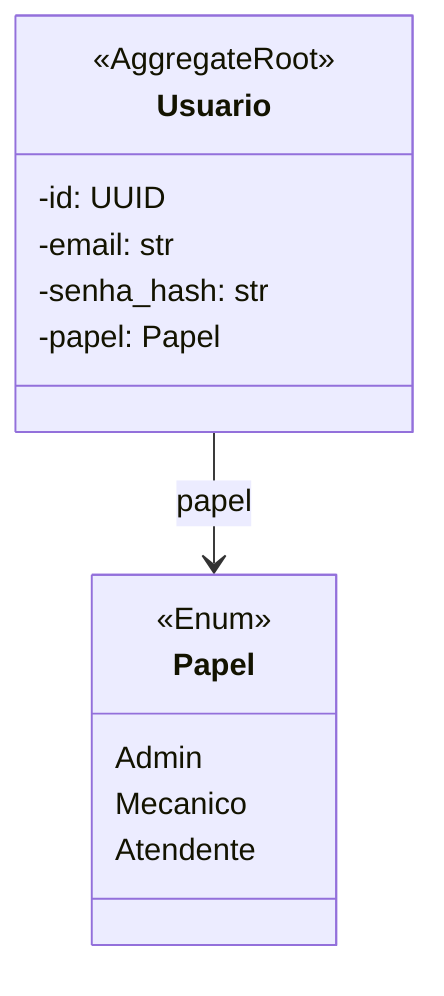
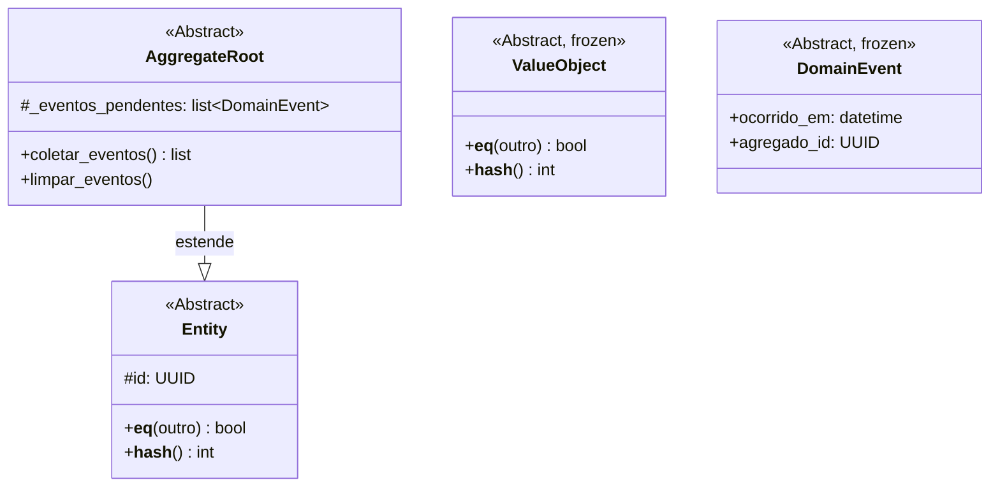

# Modelo de Domínio

> [↑ Raiz do projeto](../../README.md) · [↑ Arquitetura](README.md)

> **Versão**: 1.0 — Fase 1 MVP.

Diagramas de classes por agregado.

## Agregado: OrdemDeServico (Principal)

## Agregado: Cliente (Suporte)

## Agregado: ItemEstoque (Principal)

## Agregado: ServicoOferecido (Suporte)

## Agregado: Usuario (Genérico)

## Classes Base (Compartilhado)

## Referências entre Agregados

Agregados referenciam-se exclusivamente por ID (UUID), nunca por referência direta:

| Agregado Origem | Campo | Agregado Destino |
|---|---|---|
| `OrdemDeServico` | `cliente_id: UUID` | `Cliente` |
| `OrdemDeServico` | `veiculo_id: UUID` | `Veiculo` (via Cliente) |
| `ItemDaOrdem` | `servico_catalogo_id: UUID` | `ServicoOferecido` |
| `ItemDaOrdem` | `item_estoque_id: UUID \| None` | `ItemEstoque` |

A comunicação cross-agregado acontece via portas na camada de aplicação (`EstoquePort`, `CatalogoPort`, `ClientePort`), nunca por referência direta entre entidades de domínio.

> [↑ Raiz do projeto](../../README.md) · [↑ Arquitetura](README.md)
