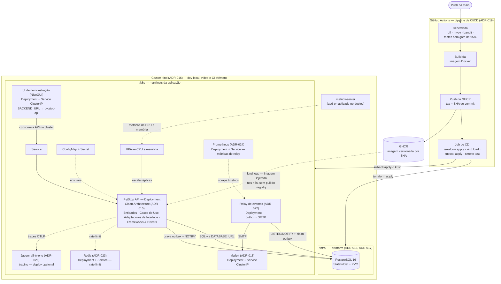

# RFC-002 — Infraestrutura e Deploy da Fase 2

> [↑ Raiz do projeto](../../../../README.md) · [↑ Arquitetura](../../README.md)

**Data**: 2026-06-10
**Equipe**: PytStop (João Amaral, Allan Aurélio, Carlos Silva, Guilherme Sousa, Nicolas Gerbi)

> **Status**: Aceita

## Conformidade com Template RFC (Software Architecture — Aula 4)

Como na [RFC-001](../rfc-001-design-do-sistema.md), o documento é estruturado por tópico técnico. A tabela abaixo mapeia cada seção obrigatória do template do curso para o conteúdo correspondente nesta RFC.

| Seção do Template | Cobertura nesta RFC |
|---|---|
| **Título** | RFC-002 — Infraestrutura e Deploy da Fase 2 |
| **Data** | 2026-06-10 |
| **Status** | Aceita |
| **Resumo** | Deploy do monolito da fase 1 em cluster kind provisionado por Terraform, com PostgreSQL como StatefulSet, CI/CD com deploy real a cada push na main, HPA por CPU/memória, notificação por e-mail com Mailpit e observabilidade mínima condicional com Jaeger. Ver seção 1. |
| **Problema** | A fase 1 roda apenas em docker-compose local; a fase 2 exige Kubernetes, IaC, pipeline com deploy e evolução funcional da API. Ver [gap analysis](../../../requisitos/fase2/gap-analysis-fase-2.md). |
| **Proposta Técnica** | Seções 2 (Topologia), 3 (Diagrama), 4 (CI/CD), 5 (HPA), 6 (Configuração e secrets), 7 (Migrações), 8 (Evolução da API). |
| **Impacto Esperado** | RF-020–RF-024, RN-018–RN-020 e RNF-017–RNF-024 endereçados com custo zero de infraestrutura, deploy reprodutível do zero a cada push na main e demo de escalabilidade gravável localmente. |
| **Alternativas Consideradas** | Detalhadas decisão a decisão nos [ADR-015](../../adr/fase2/015-arquitetura-alvo-fase-2.md) a [ADR-020](../../adr/fase2/020-observabilidade-opentelemetry.md). Resumo na seção 9. |
| **Pontos em Aberto** | Valores de HPA e de requests/limits (baseline proposto na seção 5, calibragem no plano); interpretação do RF-024 a confirmar com a banca; transição de recusa do RF-022 a ratificar em ADR (seção 8). |

---

## 1. Resumo e objetivos

Esta RFC consolida as decisões de infraestrutura e deploy da fase 2 — [ADR-015](../../adr/fase2/015-arquitetura-alvo-fase-2.md) a [ADR-020](../../adr/fase2/020-observabilidade-opentelemetry.md) — num desenho integrado único. Os ADRs permanecem a fonte de verdade de cada decisão e das alternativas rejeitadas; este documento mostra como as peças se encaixam: o que vive onde, em que ordem o deploy acontece e o que a demo do vídeo precisa demonstrar.

Objetivos, amarrados aos requisitos do [gap analysis](../../../requisitos/fase2/gap-analysis-fase-2.md):

- **Deploy em Kubernetes** com manifests completos — Deployment, Service, ConfigMap, Secret e HPA (RNF-020) — num cluster kind único para desenvolvimento, vídeo e CI ([ADR-016](../../adr/fase2/016-plataforma-kubernetes.md));
- **Provisionamento por IaC**: um `terraform apply` cria cluster e banco (RNF-021 — [ADR-017](../../adr/fase2/017-provisionamento-banco.md));
- **CD real**: push na main produz imagem versionada por SHA e implanta o sistema do zero em cluster efêmero no runner, com smoke test (RNF-022 — [ADR-019](../../adr/fase2/019-pipeline-cicd-deploy.md));
- **Escalabilidade automática** por CPU e memória, com probes e resources como pré-requisitos (RNF-020/RNF-023) e comportamento correto com N réplicas (RNF-024);
- **Notificação de status por e-mail** demonstrável no vídeo, sem segredo pessoal (RF-024 — [ADR-018](../../adr/fase2/018-notificacao-email.md));
- **Observabilidade** — traces na Jaeger UI como onda final condicional, somente após os obrigatórios verdes ([ADR-020](../../adr/fase2/020-observabilidade-opentelemetry.md)); e **métricas** do relay no Prometheus ([ADR-024](../../adr/fase2/024-metricas-prometheus.md)), que reabriu a ADR-020 na parte de métricas (TD-022);
- **Refatoração Clean Architecture sem rewrite** como pano de fundo: a aplicação implantada é o mesmo monolito modular, com as camadas renomeadas e a borda subdividida (RNF-017 — [ADR-015](../../adr/fase2/015-arquitetura-alvo-fase-2.md)).

Não são objetivos desta RFC: o design fino da evolução funcional da API (resumido na seção 8, detalhado no [gap analysis §3](../../../requisitos/fase2/gap-analysis-fase-2.md)); operação de produção real (durabilidade, alta disponibilidade, entregabilidade de e-mail — limitações aceitas e registradas na seção 9); e valores finais de tuning, que ficam deferidos ao plano da fase de implementação.

## 2. Topologia de infraestrutura

### Cluster: um kind, três papéis

O kind (Kubernetes in Docker) é a plataforma única da fase 2 ([ADR-016](../../adr/fase2/016-plataforma-kubernetes.md)). O mesmo código Terraform provisiona o cluster em três contextos de uso:

| Papel | Onde roda | Ciclo de vida |
|---|---|---|
| Desenvolvimento | máquina do desenvolvedor | persiste entre sessões de trabalho |
| Demo do vídeo | máquina do desenvolvedor | vivo durante a gravação (HPA, persistência, e-mail e, se a onda condicional rodar, traces) |
| CI/CD | runner do GitHub Actions | efêmero — nasce no job de deploy e morre com ele |

O cluster é declarado como recurso Terraform em `/infra`, usando o provider comunitário `tehcyx/kind` com versão fixada em `required_providers`. O metrics-server — pré-requisito do HPA (RNF-023) — não vem por padrão no kind e é instalado explicitamente como passo do provisionamento, com o ajuste de TLS do kubelet que cluster local exige; o mecanismo exato da instalação fica deferido ao plano da fase de implementação.

### Banco de dados: StatefulSet no cluster

O PostgreSQL 16 ([ADR-002](../../adr/002-banco-postgresql.md)) vive dentro do cluster como **StatefulSet de réplica única com PVC** (`ReadWriteOnce`, StorageClass padrão do kind), acompanhado de Service e Secret de credenciais ([ADR-017](../../adr/fase2/017-provisionamento-banco.md)). Os recursos são declarados pelo provider `kubernetes` do Terraform em `/infra`, configurado a partir do kubeconfig que o recurso do cluster exporta — tudo no mesmo `terraform apply`. A imagem é a mesma `postgres:16` do `docker-compose.yml`, com as mesmas variáveis `POSTGRES_*` movidas para Secret. A demo de persistência do vídeo é direta: `kubectl delete pod` do banco e nova consulta com os dados intactos.

### Workloads de aplicação e apoio (em `/k8s`)

- **PytStop API**: Deployment do monolito modular da fase 1, agora nas camadas da Clean Architecture ([ADR-015](../../adr/fase2/015-arquitetura-alvo-fase-2.md) — Entidades, Casos de Uso, Adaptadores de Interface, Frameworks & Drivers); Service na frente dos pods; ConfigMap e Secret com a configuração (seção 6); HPA por CPU e memória (seção 5).
- **Mailpit** ([ADR-018](../../adr/fase2/018-notificacao-email.md)): servidor SMTP de demo como Deployment + Service ClusterIP; a UI web é acessada por port-forward (ou NodePort) na gravação do vídeo. No docker-compose, entra como serviço `mailpit` (SMTP interno na 1025, UI na 8025).
- **Jaeger all-in-one** ([ADR-020](../../adr/fase2/020-observabilidade-opentelemetry.md)): backend de traces com receiver OTLP, no mesmo padrão Deployment + Service + port-forward — **onda final condicional**, executada somente com os obrigatórios verdes. A exportação é OTLP direta do SDK para o Jaeger, sem Collector — divergência da recomendação de produção aceita e registrada no ADR; sem o endpoint OTLP configurado, a instrumentação fica inerte e nada disso entra no caminho crítico.
- **Relay de eventos** ([ADR-022](../../adr/fase2/022-transactional-outbox-relay.md)): Deployment próprio (`python -m relay`, `replicas: 1`) que consome a tabela `outbox` no PostgreSQL via LISTEN/NOTIFY + claim-then-deliver e entrega a notificação por e-mail via SMTP ao Mailpit. A `UnitOfWork` grava o `IntegrationEvent` na mesma transação da mudança de OS, eliminando o dual-write (RF-024/RF-018); não há dispatcher síncrono — a entrega por evento é 100% outbox + relay.
- **Redis** ([ADR-023](../../adr/fase2/023-rate-limiter-storage-compartilhado.md)): Deployment + Service ClusterIP, store compartilhado do rate limiter slowapi via `RATE_LIMIT_STORAGE_URI`/`storage_uri` — limite por IP correto e global sob HPA, sem persistência nem senha (serviço de demo). Ausente a env, o storage cai para `memory://`; queda do Redis em runtime degrada graciosamente para per-réplica.
- **Prometheus** ([ADR-024](../../adr/fase2/024-metricas-prometheus.md)): Deployment + Service (porta 9090) que faz *scrape* do endpoint `/metrics` do relay (porta 9100, Service `pytstop-relay-metrics`), trazendo o **pilar de métricas** que a observabilidade da fase ([ADR-020](../../adr/fase2/020-observabilidade-opentelemetry.md)) deixara de fora. O relay é instrumentado com um `MeterProvider` do OTel + `PrometheusMetricReader` expondo profundidade da outbox, idade do pendente mais antigo, tamanho da DLQ e contadores de entrega/falha/retry — opt-in por `RELAY_METRICS_ENABLED` (ausente, a instrumentação fica inerte). Sem persistência nem HA (serviço de demo), UI por port-forward; supersede parcialmente a ADR-020 na parte de métricas (os traces seguem inalterados). Resolve **TD-022**.

Fora do cluster: o `docker-compose.yml` continua sendo o caminho de desenvolvimento local rápido (RNF-019), com paridade de imagem e variáveis. A `ui/` (NiceGUI, imagem própria `ui/Dockerfile`) passou a ter manifests no cluster pós-entrega (issue #186): `k8s/ui-{deployment,service,configmap}.yaml`, com `BACKEND_URL` apontando para o Service interno `pytstop-api:8000` — a demo inteira (UI + APIs) roda no kind. A UI é stateless, 1 réplica, sem HPA (não é requisito do desafio); sobe no grupo de apoio do deploy (não depende da migração).

### Fronteira `/infra` × `/k8s`

A divisão espelha o próprio challenge, que separa "deploy do banco de dados" da "aplicação dos manifestos YAML" ([ADR-017](../../adr/fase2/017-provisionamento-banco.md)):

| | `/infra` (Terraform) | `/k8s` (manifests YAML) |
|---|---|---|
| Conteúdo | cluster kind, metrics-server, PostgreSQL (StatefulSet, Service, PVC, Secret de credenciais) | aplicação (Deployment, Service, ConfigMap, Secret, HPA), Mailpit, Jaeger condicional, Relay de eventos, Redis, Prometheus |
| Quem aplica | `terraform apply` | `kubectl apply -f k8s/` — pelo pipeline e pelos alvos make locais |
| Natureza | infraestrutura-base, muda raramente | artefatos de implantação, mudam com a aplicação |
| Requisito | RNF-021 | RNF-020, RNF-022 |

## 3. Diagrama de arquitetura

O diagrama integra os três planos do desenho — pipeline de deploy, infraestrutura provisionada e workloads no cluster — e é o diagrama de referência para o README de entrega da fase 2.

Notas de leitura:

- A caixa da aplicação resume as quatro camadas da Clean Architecture numa única unidade de deploy — o detalhe interno (5 contextos delimitados, regra de dependência, mapeamento de camadas) está na [RFC-001](../rfc-001-design-do-sistema.md) e no [ADR-015](../../adr/fase2/015-arquitetura-alvo-fase-2.md).
- Linhas cheias são o caminho principal de requisições e controle; linhas pontilhadas são fluxos auxiliares (injeção de imagem e de configuração, leitura de métricas, telemetria condicional).
- O Jaeger só entra no cluster quando a onda condicional do [ADR-020](../../adr/fase2/020-observabilidade-opentelemetry.md) for executada; o manifest entra no mesmo `kubectl apply` do job de CD.

## 4. Fluxo de deploy (CI/CD)

O pipeline estende os workflows herdados da fase 1 — nada é recriado ([ADR-019](../../adr/fase2/019-pipeline-cicd-deploy.md)):

| Estágio | Origem | Conteúdo | Situação na fase 2 |
|---|---|---|---|
| Build da aplicação | `ci.yml` (herdado) | verificação do lockfile (`uv lock --check`) + `uv sync` | mantido |
| Qualidade e segurança | `ci.yml` (herdado) | ruff (lint + format), mypy, bandit ([ADR-011](../../adr/011-pipeline-seguranca-analise-estatica.md)) | mantido |
| Testes | `ci.yml` (herdado) | unitários + integração com PostgreSQL como service container, gate de cobertura de 95% (`.coveragerc`) | mantido |
| E2E | `full-test-ci.yml` (herdado) | stack completa via compose + plano concorrente do `full-test/` | mantido; promoção a smoke test do cluster é evolução decidida no plano |
| Build + push da imagem | **novo** | imagem Docker publicada no GHCR com **tag imutável por SHA do commit**, autenticada pelo `GITHUB_TOKEN` do job | [ADR-019](../../adr/fase2/019-pipeline-cicd-deploy.md) |
| Deploy + smoke test | **novo** | `terraform apply` (`/infra`: cluster + banco) → `kind load` da imagem → `kubectl apply -f k8s/` → smoke test; o cluster morre com o job | [ADR-019](../../adr/fase2/019-pipeline-cicd-deploy.md) |

**O que bloqueia o quê**: os jobs novos declaram dependência dos estágios de build e teste via `needs` — falha em qualquer estágio anterior bloqueia o deploy, como exige o aceite do RNF-022. Como `needs` só encadeia jobs do mesmo workflow, a acomodação dos jobs nos arquivos fica deferida ao plano da fase de implementação.

**Gatilhos**:

| Gatilho | O que executa |
|---|---|
| `pull_request` | somente a CI herdada — gate de merge |
| `push` na main | ciclo completo: CI + build/push da imagem + deploy com smoke test |
| `workflow_dispatch` | reexecução do deploy sob demanda — em particular para a gravação do vídeo |

O nightly do `full-test-ci.yml` permanece como herdado.

**Como a imagem chega ao cluster**: por `kind load` da imagem recém-construída — não por pull do GHCR. O repositório é privado (exigência FIAP); o pull exigiria `imagePullSecret` no cluster e, no fluxo local equivalente, um PAT pessoal — exatamente o tipo de segredo que o desenho elimina. O `kind load` injeta nos nós a mesma imagem (mesmo SHA) recém-publicada, mantendo CI e deploy local idênticos ([ADR-019](../../adr/fase2/019-pipeline-cicd-deploy.md)).

**Rollback**: não existe rollback in-place no CI — cada execução parte de cluster limpo. Voltar uma versão é **re-executar o pipeline no SHA anterior**: re-run da execução daquele commit no GitHub Actions (que permanece pinada ao SHA original) ou revert na main, reconstruindo e implantando exatamente o artefato daquele SHA — possível porque as tags são imutáveis por SHA. No cluster local de demonstração, o equivalente é reapontar o Deployment para a tag do SHA anterior e reaplicar os manifests.

**Paridade local × CI**: o mesmo fluxo (mesmo Terraform, mesmos manifests, mesmos comandos) roda localmente via alvos make — depurar o pipeline não depende do runner. No vídeo, o deploy é gravado no fluxo local e a execução do CI/CD é mostrada na interface do GitHub Actions ([ADR-019](../../adr/fase2/019-pipeline-cicd-deploy.md)).

## 5. Autoscaling (HPA)

O HPA por CPU e memória é exigência direta do challenge (RNF-020), e o RNF-023 fixa os pré-requisitos:

- **Probes**: liveness e readiness apontando para a rota de saúde real `GET /api/v1/saude` (`src/compartilhado/interfaces/router_publico.py:45-48`) — endpoint deliberadamente fora do middleware de autenticação, pois o kubelet não envia token. Períodos e thresholds ficam deferidos ao plano.
- **Resources**: requests e limits de CPU/memória no Deployment — pré-requisito funcional do HPA, que calcula a porcentagem de utilização sobre o *request*. Os valores iniciais saem de medição de carga local com o `full-test/` (RNF-023), no plano.
- **metrics-server**: instalado no provisionamento do cluster (seção 2 — [ADR-016](../../adr/fase2/016-plataforma-kubernetes.md)).

Parâmetros do HPA — **proposta baseline, a calibrar no plano da fase de implementação** com a medição de carga acima:

| Parâmetro | Proposta baseline | Justificativa |
|---|---|---|
| `minReplicas` | 1 | piso do HPA; a migração não exige mais réplica única (seção 7 — Job dedicado de migração) |
| `maxReplicas` | 5 | teto alcançável na demo sem saturar a máquina local que hospeda o kind |
| Alvo de CPU | 70% de utilização média | margem antes da saturação; segue o fluxo de validação ensinado (criar Deployment → criar HPA → carga → `kubectl get hpa`) |
| Alvo de memória | 80% de utilização média | segunda linha de defesa: processos CPython raramente devolvem memória ao sistema, então o sinal serve mais para detectar saturação do que para scale-down |

**Cenário de demo do vídeo** (RNF-020: "HPA escala sob carga"): com o cluster local no ar, (1) `kubectl get hpa -w` em tela; (2) o harness `full-test/` — promovido a gerador de carga ([gap analysis §4](../../../requisitos/fase2/gap-analysis-fase-2.md)) — dispara o plano concorrente multiusuário; (3) as réplicas sobem de 1 em direção ao teto conforme a utilização cruza o alvo; (4) cessada a carga, o scale-down é observado. É o fluxo da disciplina, reforçado com teste de carga ([ADR-016](../../adr/fase2/016-plataforma-kubernetes.md)).

**Statelessness (RNF-024)** — o que o HPA pressupõe para N réplicas funcionarem:

- JWT já é stateless, com denylist de revogação compartilhada no PostgreSQL — nada a fazer;
- `ENCRYPTION_KEY` precisa vir de Secret única e estável (seção 6): chave efêmera gerada por pod quebraria a leitura cruzada de PII entre réplicas;
- o rate limiter slowapi passou a usar **storage compartilhado (Redis)** — a escolha entre storage compartilhado e limitação documentada foi **resolvida via [ADR-023](../../adr/fase2/023-rate-limiter-storage-compartilhado.md)** (storage compartilhado, com fallback gracioso para `memory://` se o Redis cair): o limite por IP fica correto e global sob HPA, em vez de divergir entre réplicas;
- o pool de conexões do SQLAlchemy deve ser dimensionado contra o `max_connections` do PostgreSQL no pior caso do HPA (máximo de réplicas × conexões por pod) — valores no plano.

## 6. Configuração e secrets

Mapa das variáveis de ambiente atuais (`docker-compose.yml` + `.env.dev.example`) para o cluster. A regra de classificação: configuração não sensível em **ConfigMap**, todo segredo em **Secret** — nunca embutir credencial em código ou manifest ([ADR-018](../../adr/fase2/018-notificacao-email.md)).

| Variável | Destino no cluster | Observação |
|---|---|---|
| `ENVIRONMENT` | ConfigMap | controla docs/redoc e defaults do app |
| `CORS_ORIGINS` | ConfigMap | |
| `JWT_EXPIRATION_MINUTES` | ConfigMap | TTL do token — o segredo é outra variável |
| `RUN_MIGRATIONS_ON_STARTUP` | ConfigMap | `true` no cluster ([ADR-019](../../adr/fase2/019-pipeline-cicd-deploy.md); seção 7) |
| `RUN_SEED_ON_STARTUP` | ConfigMap | seed best-effort do admin inicial (seção 7) |
| `JWT_SECRET` | **Secret** | >= 32 bytes, validado no startup em produção (issue #74; a guarda também rejeita segredos demo) |
| `ENCRYPTION_KEY` | **Secret** | chave Fernet da PII em repouso; precisa ser estável entre réplicas e restarts (seção 5) |
| `DATABASE_URL` | **Secret** | embute credenciais; aponta para o Service do banco no cluster |
| `POSTGRES_DB` / `POSTGRES_USER` / `POSTGRES_PASSWORD` | **Secret** (em `/infra`) | credenciais do StatefulSet, declaradas pelo Terraform ([ADR-017](../../adr/fase2/017-provisionamento-banco.md)) |
| `ADMIN_EMAIL` / `ADMIN_PASSWORD` | **Secret** | consumidas apenas quando o seed do admin está habilitado |

Variáveis novas da fase 2:

| Variável | Destino no cluster | Observação |
|---|---|---|
| `SMTP_HOST` + porta e remetente SMTP | ConfigMap | apontam para o Service do Mailpit ([ADR-018](../../adr/fase2/018-notificacao-email.md)); nomes finais das demais variáveis no plano |
| Credenciais SMTP (opcionais) | **Secret** | o Mailpit não as exige; previstas para troca por relay real sem mudança de código |
| Token do endpoint externo de orçamento | **Secret** | autenticação própria do RF-022, fora do RBAC interno (seção 8) |
| Endpoint OTLP | ConfigMap | onda condicional ([ADR-020](../../adr/fase2/020-observabilidade-opentelemetry.md)); ausente, a instrumentação fica inerte |

Sem destino no cluster: `APP_PORT`/`DB_PORT`/`UI_PORT` (mapeamento de portas do host, específico do compose), `UVICORN_PORT` (execução local fora de container — no container a porta 8000 é fixada pelo `entrypoint.sh`), `BACKEND_URL` (consumido por `ui/` e seed de demo, dev-only) e `GIT_SHA`/`GIT_DATE` (build args — viram `PYTSTOP_GIT_SHA` e label OCI dentro da imagem).

**Regra de ouro**: nenhum valor sensível em manifest commitado. Os Secrets recebem valores no momento do apply — no CI, valores de demonstração injetados pelo próprio job (o padrão que o `ci.yml` já pratica com as variáveis de teste); no cluster local, valores fornecidos pelo desenvolvedor. O mecanismo exato de injeção fica deferido ao plano da fase de implementação.

## 7. Migrações no deploy

O mecanismo no cluster é um **Job dedicado, aplicado pós-`kubectl apply` e antes do rollout** (TD-015; [ADR-019](../../adr/fase2/019-pipeline-cicd-deploy.md)). O `entrypoint.sh` ainda executa `alembic upgrade head` no boot quando `RUN_MIGRATIONS_ON_STARTUP=true` — caminho que o `full-test-ci.yml` exercita no compose, onde o container é único —, mas **no cluster a variável entra como `false`** pelo ConfigMap, e o boot dos pods da API não toca o schema.

Sequência no deploy: o `terraform apply` deixa o banco no ar; o `kubectl apply -f k8s/` cria os manifests (o Job vive em `k8s/jobs/`, fora desse apply não-recursivo, de propósito); o pipeline então aplica o Job `pytstop-migrate` ([`k8s/jobs/migration-job.yaml`](../../../../k8s/jobs/migration-job.yaml)) com a tag imutável do SHA (substituída por `sed`) e aguarda `kubectl wait --for=condition=complete` — o `alembic upgrade head` roda **uma única vez**, num pod só, e só com o schema em head o `set image`/rollout segue. Quando o HPA escala, os pods novos sobem sobre schema já migrado, sem disputar a migração.

**Corrida resolvida**: a janela de corrida entre migrações concorrentes (duas ou mais réplicas partindo simultaneamente com migração pendente) deixou de existir — a migração é serializada no Job antes de qualquer réplica da API subir. O `replicas: 1` do Deployment passa a ser apenas o piso do HPA, não mais uma mitigação de corrida.

Seed: o mesmo Job cria o admin inicial em modo best-effort (`python scripts/seed_admin.py || ...` — falha não reprova o Job), com credenciais via Secret (seção 6); no cluster `RUN_SEED_ON_STARTUP=false`, então o boot dos pods não semeia. A política de seed de dados de demonstração no cluster (migrations no pipeline vs imagem seedada) fica deferida ao plano ([ADR-017](../../adr/fase2/017-provisionamento-banco.md)).

## 8. Evolução da API

A fase de implementação cobre, além da infraestrutura, os gaps funcionais do challenge. O resumo abaixo dá a visão completa do escopo; o design detalhado de cada item está no [gap analysis §3](../../../requisitos/fase2/gap-analysis-fase-2.md) e não é redecidido aqui.

**RF-020 — Abertura de OS com dados completos.** A criação da OS passa a aceitar serviços e peças no próprio payload, compondo criação e itens na mesma transação (mesma UnitOfWork) e retornando a identificação única; payload sem itens continua válido, preservando a compatibilidade com a fase 1.

**RF-021 — Consulta de status no vocabulário do challenge.** Os dois canais de consulta existentes (autenticado por id e público por placa + documento) permanecem; os 6 rótulos do challenge entram como mapeamento de apresentação, sem renomear os valores persistidos do enum de 8 estados — decisão que zera o risco de migração de dados ([gap analysis §2](../../../requisitos/fase2/gap-analysis-fase-2.md)).

**RF-022 — Aprovação/recusa externa de orçamento.** Novo endpoint para notificações externas de aprovação ou recusa, autenticado por token próprio guardado em Secret (seção 6), fora do RBAC interno. A recusa do orçamento inicial não existe hoje e exige nova transição na `MaquinaDeStatus` — o destino da recusa será ratificado em ADR próprio, junto com o destino dos estados extras na listagem (RN-020).

**RF-023 — Listagem ordenada por prioridade de status.** A listagem padrão passa a ordenar por Em execução > Aguardando aprovação > Em diagnóstico > Recebida, mais antigas primeiro com desempate determinístico por id (RN-018), excluindo logicamente `FINALIZADA` e `ENTREGUE` por filtro de consulta — nenhum delete físico, nenhuma coluna nova (RN-019). Proposta para os estados extras: `AGUARDANDO_APROVACAO_COMPLEMENTAR` ordena com a prioridade de `AGUARDANDO_APROVACAO` e `CANCELADA` é excluída como estado encerrado (RN-020).

**RF-024 — Notificação de atualização de status por e-mail.** Transições de status relevantes (no mínimo orçamento disponível e OS finalizada/entregue) disparam e-mail ao cliente pela `EmailPort` declarada em `aplicacao/`, realizada pelo adapter SMTP em `infraestrutura/` ([ADR-018](../../adr/fase2/018-notificacao-email.md)); os eventos de domínio que o agregado já emite são a matéria-prima do disparo, e falha de envio não bloqueia a transição. A interpretação do enunciado — notificar por e-mail, não alterar status respondendo e-mail — será confirmada com a banca ([gap analysis §3](../../../requisitos/fase2/gap-analysis-fase-2.md)).

## 9. Riscos e alternativas

O risco 3 do [gap analysis §5](../../../requisitos/fase2/gap-analysis-fase-2.md) (custo recorrente de cloud) foi eliminado pela escolha do kind, de custo zero ([ADR-016](../../adr/fase2/016-plataforma-kubernetes.md)). Os demais riscos herdados e os introduzidos pelas decisões:

| # | Risco | Origem | Mitigação |
|---|---|---|---|
| 1 | Prazo: infra (K8s + Terraform + CI/CD + e-mail) somada à refatoração Clean é o maior risco da fase | gap §5 (risco 4) | sequenciar infra incremental (deploy manual → pipeline); onda OTel condicional e cortável por inteiro ([ADR-020](../../adr/fase2/020-observabilidade-opentelemetry.md)); cortar opcionais cedo — ex.: o rate limiter rodou como limite por-réplica documentado e ganhou storage compartilhado (Redis) numa onda posterior (RNF-024, [ADR-023](../../adr/fase2/023-rate-limiter-storage-compartilhado.md)) |
| 2 | Corrida de migração com múltiplas réplicas partindo com migração pendente | [ADR-019](../../adr/fase2/019-pipeline-cicd-deploy.md) | **Resolvido** (TD-015, PR #64): migração no Job dedicado `pytstop-migrate` antes do rollout, com `kubectl wait --for=condition=complete` (seção 7) — schema serializado em head antes de qualquer réplica subir; `RUN_MIGRATIONS_ON_STARTUP=false` no cluster |
| 3 | Provider Terraform do kind é comunitário (`tehcyx/kind`) | [ADR-016](../../adr/fase2/016-plataforma-kubernetes.md) | versão fixada em `required_providers`; superfície mínima (cluster + kubeconfig); manifests e HPA portáveis se o provider for trocado |
| 4 | Encadeamento de providers num só apply: o provider `kubernetes` lê o kubeconfig gerado pelo recurso do cluster | [ADR-017](../../adr/fase2/017-provisionamento-banco.md) | se travar, separar cluster e banco em módulos/applies sequenciais documentados no README de `/infra` |
| 5 | Demo de HPA poluída pelo rate limiter in-memory por réplica (429 inconsistentes sob carga distribuída) | gap §5 (risco 5); RNF-024 | **Resolvido**: rate limiter com storage compartilhado (Redis) via `storage_uri` ([ADR-023](../../adr/fase2/023-rate-limiter-storage-compartilhado.md), PR #62) — limite global correto sob HPA, sem 429 divergentes entre réplicas; carga validável com `full-test/` contra o cluster |
| 6 | Durabilidade local: o PV da StorageClass padrão do kind vive nos containers do nó; sem backup nem alta disponibilidade | [ADR-017](../../adr/fase2/017-provisionamento-banco.md) | suficiente para a demo de persistência; produção real exigiria operator ou serviço gerenciado — limitação aceita e documentada |
| 7 | metrics-server com TLS do kubelet relaxado | [ADR-016](../../adr/fase2/016-plataforma-kubernetes.md) | aceitável apenas em cluster local/efêmero; configuração declarada não portável para produção |
| 8 | Cluster efêmero do CI não exercita rolling update nem rollback sobre versão viva | [ADR-016](../../adr/fase2/016-plataforma-kubernetes.md), [ADR-019](../../adr/fase2/019-pipeline-cicd-deploy.md) | operação continuada demonstrada no cluster local do vídeo; rollback declarado como re-execução de SHA anterior (seção 4) |
| 9 | Tempo de pipeline na main cresce (build de imagem + cluster + deploy + smoke test) | [ADR-019](../../adr/fase2/019-pipeline-cicd-deploy.md) | cache de dependências e de camadas de imagem; a CI de PR permanece enxuta |
| 10 | Compatibilidade de API: RF-020 muda o payload de criação e RF-023 muda o default da listagem | gap §5 (risco 2) | mudanças aditivas; `ui/` e `full-test/` atualizados no mesmo PR; collection da banca regerada |
| 11 | Mailpit prova o mecanismo de envio, não a entrega real (SPF/DKIM e reputação fora do escopo) | [ADR-018](../../adr/fase2/018-notificacao-email.md) | aceito para a fase 2; relay real (ex.: SES via interface SMTP) é mudança de configuração, não de código |

As alternativas foram avaliadas decisão a decisão nos ADRs — este RFC não as redecide:

| Decisão adotada | Alternativas rejeitadas | Detalhe |
|---|---|---|
| Clean Architecture sem rewrite | Arquitetura Hexagonal formalizada sobre a estrutura atual | [ADR-015](../../adr/fase2/015-arquitetura-alvo-fase-2.md) |
| kind como plataforma única (dev, vídeo, CI) | Minikube; k3d; cluster gerenciado em cloud (EKS/GKE/AKS) | [ADR-016](../../adr/fase2/016-plataforma-kubernetes.md) |
| PostgreSQL StatefulSet no cluster, via Terraform | container externo ao cluster; serviço gerenciado (RDS) | [ADR-017](../../adr/fase2/017-provisionamento-banco.md) |
| Adapter SMTP genérico + Mailpit | provedor SaaS (SendGrid/SES); adapter de log/console | [ADR-018](../../adr/fase2/018-notificacao-email.md) |
| CD em cluster kind efêmero no runner | cluster cloud persistente; sem CD (deploy manual documentado) | [ADR-019](../../adr/fase2/019-pipeline-cicd-deploy.md) |
| OTel em escopo mínimo condicional | stack completa (Collector + Prometheus + Grafana + Loki); nenhuma instrumentação | [ADR-020](../../adr/fase2/020-observabilidade-opentelemetry.md) |
| Métricas via Prometheus + relay instrumentado (OTel) | push OTLP ao Jaeger (não armazena métricas); só o gauge structlog; stack completa | [ADR-024](../../adr/fase2/024-metricas-prometheus.md) |

## Referências

- [Gap Analysis — Fase 2](../../../requisitos/fase2/gap-analysis-fase-2.md) — RF-020–RF-024, RN-018–RN-020, RNF-017–RNF-024 e riscos
- [Tech Challenge Fase 2](../../../requisitos/fase2/desafio-tech-fase-2.md) — especificação original
- [RFC-001](../rfc-001-design-do-sistema.md) — design do sistema (fase 1), base que esta RFC estende
- [ADR-015](../../adr/fase2/015-arquitetura-alvo-fase-2.md) — Clean Architecture como arquitetura alvo
- [ADR-016](../../adr/fase2/016-plataforma-kubernetes.md) — kind como plataforma Kubernetes
- [ADR-017](../../adr/fase2/017-provisionamento-banco.md) — PostgreSQL StatefulSet via Terraform
- [ADR-018](../../adr/fase2/018-notificacao-email.md) — notificação por e-mail com Mailpit
- [ADR-019](../../adr/fase2/019-pipeline-cicd-deploy.md) — pipeline de CI/CD com deploy
- [ADR-020](../../adr/fase2/020-observabilidade-opentelemetry.md) — observabilidade OTel condicional

---

> [↑ Raiz do projeto](../../../../README.md) · [↑ Arquitetura](../../README.md)
