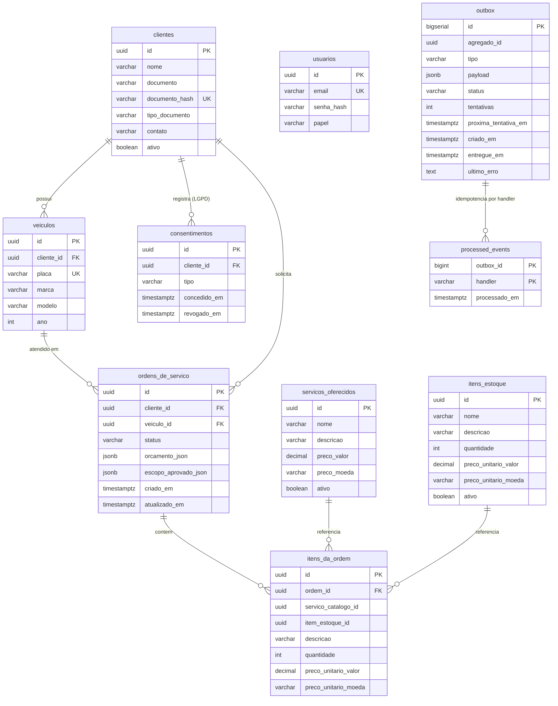
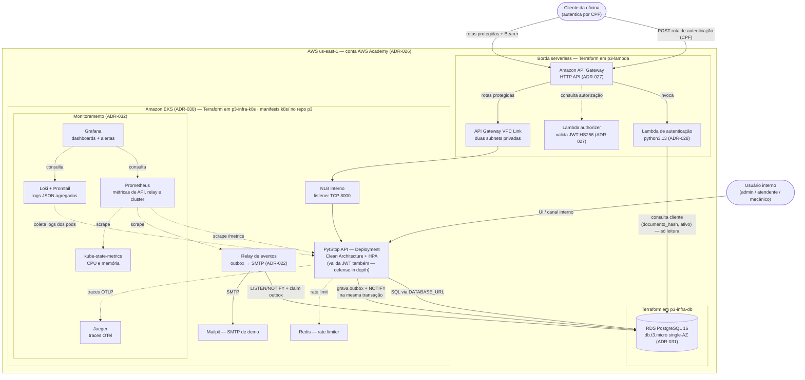
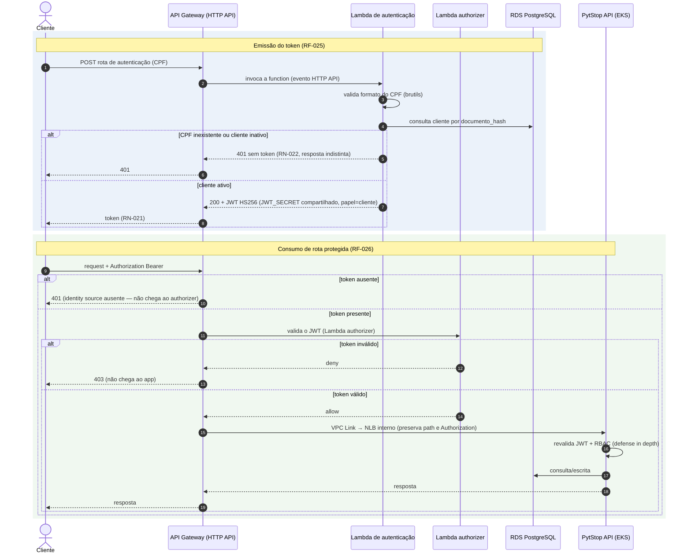
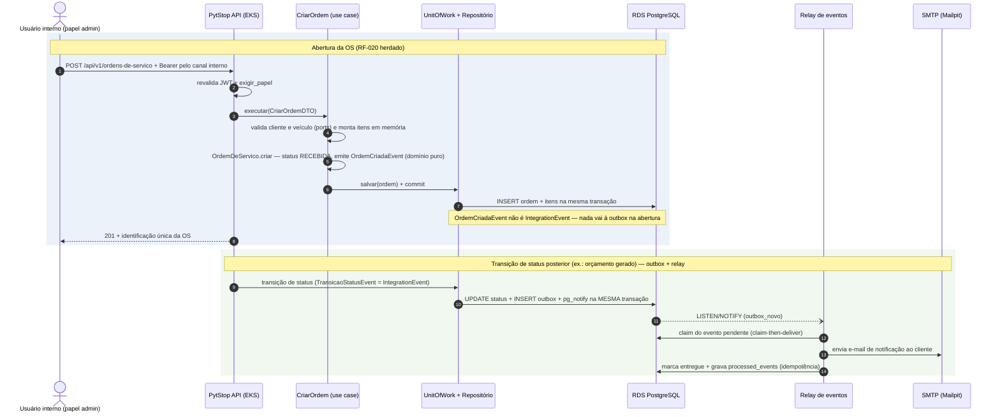

# RFC-003 — API Gateway, Autenticação Serverless e Observabilidade da Fase 3

> [↑ Raiz do projeto](../../../../README.md) · [↑ Arquitetura](../../README.md)

**Data**: 2026-07-11
**Equipe**: PytStop (João Amaral, Allan Aurélio, Carlos Silva, Guilherme Sousa, Nicolas Gerbi)

> **Status**: Aceita

## Conformidade com Template RFC (Software Architecture — Aula 4)

Como nas [RFC-001](../rfc-001-design-do-sistema.md) e [RFC-002](../fase2/rfc-002-infraestrutura-e-deploy-fase-2.md), o documento é estruturado por tópico técnico. A tabela abaixo mapeia cada seção obrigatória do template do curso para o conteúdo correspondente nesta RFC.

| Seção do Template | Cobertura nesta RFC |
|---|---|
| **Título** | RFC-003 — API Gateway, Autenticação Serverless e Observabilidade da Fase 3 |
| **Data** | 2026-07-11 |
| **Status** | Aceita |
| **Resumo** | Borda AWS (API Gateway HTTP API + Lambda de autenticação por CPF + Lambda authorizer) na frente do monolito em EKS, com RDS PostgreSQL 16 gerenciado, tudo Terraform em quatro repositórios com CI/CD próprio, monitoramento Prometheus/Grafana/Loki/Jaeger e espelho local completo (kind + docker-compose + SAM). Ver seção 1. |
| **Problema** | A fase 2 roda em kind local sem gateway, sem serverless e sem dashboards; a fase 3 exige nuvem por enunciado — gateway, function de autenticação, banco gerenciado, cluster K8s escalável, 4 repos com CI/CD e observabilidade completa. Ver [gap analysis](../../../requisitos/fase3/gap-analysis-fase-3.md). |
| **Proposta Técnica** | Seções 2 (Topologia de nuvem), 3 (Topologia local espelho), 4 (Diagrama de componentes), 5 (Diagramas de sequência), 6 (Deploy multi-repo), 7 (Correlação de logs e traces). |
| **Impacto Esperado** | RF-025–RF-027, RN-021/RN-022 e RNF-025–RNF-030 endereçados com custo pessoal zero (AWS Academy), desenvolvimento 100% local e nuvem restrita a janelas de validação/demo. |
| **Alternativas Consideradas** | Detalhadas decisão a decisão nos [ADR-026](../../adr/fase3/026-cloud-alvo-aws-academy.md) a [ADR-033](../../adr/fase3/033-cicd-multi-repo.md). Resumo na seção 8. |
| **Pontos em Aberto** | **Decididos na implementação**: `POST /auth`; Lambda de autenticação na VPC do RDS; integração privada `HTTP_PROXY` por VPC Link e NLB interno; `JWT_SECRET` por GitHub Secrets/`TF_VAR_*`. Não há decisão arquitetural em aberto para o fluxo de autenticação de clientes. |

---

## 1. Resumo e objetivos

Esta RFC consolida as decisões da fase 3 — [ADR-026](../../adr/fase3/026-cloud-alvo-aws-academy.md) a [ADR-033](../../adr/fase3/033-cicd-multi-repo.md) — num desenho integrado único. Os ADRs permanecem a fonte de verdade de cada decisão e das alternativas rejeitadas; este documento mostra como as peças se encaixam: o que vive em qual repositório, como a borda serverless conversa com o cluster e o banco, em que ordem o deploy multi-repo acontece e como um request é correlacionado de ponta a ponta.

Objetivos, amarrados aos requisitos do [gap analysis](../../../requisitos/fase3/gap-analysis-fase-3.md):

- **Autenticação serverless de clientes por CPF** (RF-025, RN-021, RN-022): Lambda Python própria valida o CPF, consulta existência e status do cliente na base e emite JWT HS256 compatível com o validador do app ([ADR-028](../../adr/fase3/028-autenticacao-serverless-cpf.md));
- **API Gateway na frente das rotas** (RF-026): Amazon API Gateway em modo HTTP API, com Lambda authorizer nas rotas sensíveis e validação JWT redundante mantida no app ([ADR-027](../../adr/fase3/027-api-gateway-aws.md));
- **Dashboards e monitoramento** (RF-027, RNF-028, RNF-029): stack aberta Prometheus + Grafana + Loki + Jaeger evoluindo a base da fase 2, com métricas de negócio, alertas e logs correlacionados ([ADR-032](../../adr/fase3/032-monitoramento-grafana-loki.md));
- **Quatro repositórios com CI/CD e deploy automático homolog/produção** (RNF-025): GitHub Actions por repo, main protegida, PRs obrigatórios ([ADR-033](../../adr/fase3/033-cicd-multi-repo.md));
- **Terraform provisionando gateway, function, banco e cluster na AWS** (RNF-026): AWS Academy Learner Lab como conta, com as restrições (LabRole, sessões ~4h, budget) assumidas como premissa de desenho ([ADR-026](../../adr/fase3/026-cloud-alvo-aws-academy.md));
- **Banco gerenciado com justificativa formal e ER** (RNF-027): Amazon RDS for PostgreSQL 16, justificativa formal no [ADR-031](../../adr/fase3/031-banco-gerenciado-rds.md), ER atualizado na seção 2 desta RFC;
- **Cluster Kubernetes escalável na nuvem** (RNF-025/RNF-026): Amazon EKS com node group gerenciado mínimo, kind mantido como alvo local ([ADR-030](../../adr/fase3/030-cluster-kubernetes-eks.md));
- **Documentação arquitetural completa** (RNF-030): diagrama de componentes com visão de nuvem (seção 4) e diagramas de sequência de autenticação e abertura de OS (seção 5), reusáveis nos READMEs dos repositórios.

Não são objetivos desta RFC: redecidir o que os ADRs 026–033 já decidiram (as alternativas rejeitadas estão lá, resumidas na seção 8); operação de produção real (Multi-AZ, HA, paging 24/7 — limitações aceitas e registradas); e valores finais de tuning (thresholds de alerta, sizing de Loki/Prometheus), deferidos ao plano da fase de implementação e ao documento de SLO.

## 2. Topologia de nuvem

### Conta, região e restrições operacionais

A nuvem da fase 3 é a **AWS via conta AWS Academy Learner Lab**, região fixa `us-east-1` ([ADR-026](../../adr/fase3/026-cloud-alvo-aws-academy.md)). As restrições da conta moldam toda a topologia:

| Restrição | Consequência no desenho |
|---|---|
| Sessões de ~4h com credenciais rotativas | secrets de CI re-gravados a cada _Start Lab_ (runbook); nenhum ambiente sempre-no-ar |
| IAM travado (`LabRole` fixa) | Terraform nunca cria roles; forma o ARN da `LabRole` com o account ID retornado por STS, sem `iam:GetRole` |
| Budget pequeno com encerramento definitivo | nuvem restrita à preparação e gravação; recursos cobrados destruídos ao final da janela de até sete dias |
| Credenciais efêmeras e execução local/CI | três states independentes no bucket S3 privado, com versionamento e lock nativo |

### Borda serverless: gateway + duas Lambdas

- **Amazon API Gateway, modo HTTP API** ([ADR-027](../../adr/fase3/027-api-gateway-aws.md)): porta de entrada única do sistema na nuvem. A rota de autenticação de cliente vai à Lambda de autenticação; as rotas protegidas do app passam pelo Lambda authorizer e seguem por VPC Link até o listener do NLB interno. O parameter mapping remove o prefixo do stage e preserva o caminho esperado pelo FastAPI. O Service da aplicação não publica endpoint acessível pela internet.
- **Lambda de autenticação** ([ADR-028](../../adr/fase3/028-autenticacao-serverless-cpf.md)): runtime `python3.13`, valida formato do CPF com brutils, consulta o cliente no RDS pela mesma estratégia `documento_hash` do app, nega token a CPF inexistente ou cliente inativo (RN-022, resposta 401 indistinta para não vazar existência de CPF) e emite JWT HS256 com o `JWT_SECRET` compartilhado e a claim `papel="cliente"` (RN-021). Acesso ao banco somente leitura, restrito à consulta de cliente.
- **Lambda authorizer** ([ADR-027](../../adr/fase3/027-api-gateway-aws.md)): valida a assinatura HS256 do token (emitido pela Lambda de autenticação ou pelo login interno do app — mesmo segredo, mesmo validador) antes de o gateway rotear às rotas sensíveis. O app **mantém a validação redundante** em `obter_usuario_atual` (defense in depth + paridade local).

### Cluster e workloads (EKS)

O **Amazon EKS** ([ADR-030](../../adr/fase3/030-cluster-kubernetes-eks.md)) roda com node group gerenciado mínimo (2× `t3.medium`) e hospeda os workloads herdados e evoluídos da fase 2, aplicados pelos manifests de `k8s/` do repo principal (overlay kustomize novo para EKS):

- **PytStop API** (Deployment + Service + HPA min 1 / max 5, CPU 70% / memória 80% — metrics-server instalado no provisionamento, como no kind da fase 2);
- **Relay de eventos** (outbox → SMTP, [ADR-022](../../adr/fase2/022-transactional-outbox-relay.md)), **Redis** (rate limiter compartilhado) e **Mailpit** (SMTP de demo) — herdados sem mudança de papel;
- **Stack de monitoramento** ([ADR-032](../../adr/fase3/032-monitoramento-grafana-loki.md)): Prometheus (agora raspando também a API instrumentada), **Grafana** (dashboards JSON versionados + alerting), **Loki + Promtail** (agregação dos logs JSON), **kube-state-metrics** (CPU/memória de pods e nodes) e **Jaeger** (traces OTel, `OTEL_ENABLED` ligado por padrão nos ambientes de demo).

### Banco gerenciado (RDS)

**Amazon RDS for PostgreSQL 16**, `db.t3.micro` single-AZ ([ADR-031](../../adr/fase3/031-banco-gerenciado-rds.md)) — mesmo engine e versão da fase 2, mudando apenas o operador. Consumidores: o app no EKS (leitura/escrita via `DATABASE_URL`), o relay (claim da outbox) e a Lambda de autenticação (somente leitura de clientes).

**Segurança de rede**: RDS **sem exposição pública**, acessível apenas de dentro da VPC; a Lambda de autenticação entra na VPC com saída limitada ao PostgreSQL. O app permanece no EKS e o tráfego Gateway → app entra por VPC Link e NLB interno em duas subnets privadas sem rota default ou NAT. A gestão do `JWT_SECRET` compartilhado entre app e Lambda é decidida no [ADR-033](../../adr/fase3/033-cicd-multi-repo.md): GitHub Secrets/`TF_VAR_*` nos pipelines e `terraform.tfvars` local git-ignored no fluxo manual — SSM/Secrets Manager descartados pelas restrições de IAM/KMS do Learner Lab ([ADR-026](../../adr/fase3/026-cloud-alvo-aws-academy.md)).

### Onde vive cada Terraform

| Repositório | Provisiona | ADRs |
|---|---|---|
| `postech-sw-arch-p3-lambda` | API Gateway, rotas, authorizer, VPC Link, Lambda de autenticação e Lambda authorizer; SAM apenas para a autenticação local | [ADR-027](../../adr/fase3/027-api-gateway-aws.md), [ADR-028](../../adr/fase3/028-autenticacao-serverless-cpf.md), [ADR-029](../../adr/fase3/029-emulacao-local-lambda.md) |
| `postech-sw-arch-p3-infra-k8s` | Cluster EKS, node group, metrics-server e duas subnets privadas para NLB/VPC Link | [ADR-030](../../adr/fase3/030-cluster-kubernetes-eks.md) |
| `postech-sw-arch-p3-infra-db` | RDS PostgreSQL 16 (instância, subnet group, security group) | [ADR-031](../../adr/fase3/031-banco-gerenciado-rds.md) |
| `postech-sw-arch-p3` | Nenhum Terraform — manifests `k8s/` da aplicação (deploy no cluster via pipeline do app) | [ADR-030](../../adr/fase3/030-cluster-kubernetes-eks.md), [ADR-033](../../adr/fase3/033-cicd-multi-repo.md) |

> A colocação do Terraform do gateway no repo `p3-lambda` foi **decidida no [ADR-027](../../adr/fase3/027-api-gateway-aws.md)**; esta RFC apenas a consolida (gateway e functions compartilham ciclo de vida e são provisionados juntos — o authorizer referencia o ARN da function).

### Modelo de dados (ER atualizado)

O ER da fase 1 ([RFC-001, seção 3](../rfc-001-design-do-sistema.md)) permanece válido para as entidades de negócio; as migrações `003`–`008` da fase 2 adicionaram a infraestrutura do transactional outbox e o snapshot de escopo aprovado. O diagrama abaixo é a versão vigente, que o RDS recebe via `alembic upgrade head` (cumpre a parte "diagrama ER e explicação dos relacionamentos" do RNF-027, junto com a justificativa formal do [ADR-031](../../adr/fase3/031-banco-gerenciado-rds.md)):



Relacionamentos: as FKs cross-contexto (`cliente_id`, `veiculo_id`) seguem o trade-off consciente da RFC-001 (integridade referencial do PostgreSQL num monolito com banco único); `servico_catalogo_id` e `item_estoque_id` em `itens_da_ordem` são referências lógicas sem `FOREIGN KEY` (o consumidor valida pela porta do contexto vizinho; índice em `item_estoque_id` para a consulta cross-contexto). `consentimentos` guarda o consentimento LGPD por cliente (`tipo`, concessão e revogação), com remoção em cascata. `outbox` e `processed_events` não têm FK para as tabelas de negócio de propósito — `agregado_id` é referência lógica ao agregado emissor, e `processed_events` garante idempotência de entrega por `(outbox_id, handler)` (PK composta desde a migração `008`). O JSONB em `orcamento_json`, `escopo_aprovado_json` e `payload` é o recurso específico do PostgreSQL que ancora a justificativa formal do banco ([ADR-031](../../adr/fase3/031-banco-gerenciado-rds.md)). A Lambda de autenticação lê apenas `clientes` (colunas `documento_hash` — HMAC-SHA256 determinístico do documento, único — e `ativo`; `documento` em si fica cifrado com Fernet).

## 3. Topologia local espelho

O desenvolvimento é **100% local** ([ADR-026](../../adr/fase3/026-cloud-alvo-aws-academy.md)): a AWS entra só para validação e demo, dentro de sessões do Learner Lab. O espelho local tem três peças:

- **kind + `k8s/`**: o cluster local da fase 2 permanece o alvo de dev e demo sem custo ([ADR-030](../../adr/fase3/030-cluster-kubernetes-eks.md)), agora provisionado pelo dev-loop (`make`) em vez do Terraform do monorepo; o PostgreSQL 16 local roda em Docker/kind com o mesmo engine e versão do RDS;
- **docker-compose**: o caminho rápido de desenvolvimento (app + banco + Mailpit + Redis), herdado sem mudança;
- **SAM CLI** ([ADR-029](../../adr/fase3/029-emulacao-local-lambda.md)): `sam local invoke` e `sam local start-api` emulam o par API Gateway + Lambda para `POST /auth`, com o runtime real `python3.13` em container; o authorizer é validado por pytest e o proxy privado existe somente na AWS.

Paridade cloud × local, componente a componente:

| Componente | Cloud (AWS) | Local | Paridade |
|---|---|---|---|
| API Gateway — rota de autenticação | HTTP API → Lambda | `sam local start-api` (gateway emulado + function) | **Sim** — mesma rota, mesmo formato de evento |
| API Gateway — roteamento às rotas do app | HTTP API → authorizer → VPC Link → NLB → app | As rotas são chamadas diretamente no app local | **Paridade parcial** — o transporte privado só existe na AWS; a validação redundante mantém a mesma segurança no app |
| Lambda authorizer | valida JWT na borda | pytest executa o handler diretamente; o template SAM não declara rota protegida | **Paridade de lógica** — assinatura, expiração, tipo e papel são cobertos sem emular o vínculo do Gateway |
| Lambda de autenticação | função `python3.13` na AWS | pytest (handler direto + testcontainers) + SAM (runtime real em container) | **Sim** — mesmo handler, mesmo Postgres |
| Cluster Kubernetes | EKS (overlay kustomize EKS) | kind (manifests `k8s/*.yaml` aplicados direto — não há overlay local) | **Sim** — mesmos manifests base, HPA e probes; muda o overlay |
| Banco | RDS PostgreSQL 16 | PostgreSQL 16 em Docker/kind | **Sim** — mesmo engine, mesma versão, mesmas migrações |
| Monitoramento | Prometheus/Grafana/Loki/Jaeger no EKS | a mesma stack no kind | **Sim** — manifests idênticos ([ADR-032](../../adr/fase3/032-monitoramento-grafana-loki.md)) |
| Relay + outbox + Mailpit + Redis | no EKS | no kind/compose | **Sim** — herança da fase 2 |
| CI/CD | GitHub Actions (4 repos) | gate local espelho (`make check` / `make gate`) | **Complementar** — pré-check antes do push; o CI é o gate canônico desde 01/08/2026 ([ADR-033](../../adr/fase3/033-cicd-multi-repo.md)) |

A consequência prática da paridade parcial do gateway: o trecho **gateway → app no EKS só é testável na AWS**, dentro de uma sessão do Learner Lab — risco assumido na seção 8.

## 4. Diagrama de componentes

Visão de nuvem integrada — borda serverless, cluster, banco e monitoramento — com a marcação de qual repositório provisiona o quê. É o diagrama de referência para os READMEs dos quatro repositórios (RNF-030).



Notas de leitura:

- Linhas cheias são o caminho principal de requisições e dados; pontilhadas são fluxos de autorização, telemetria e coleta.
- Neste incremento, o Gateway publica `POST /auth` e as duas rotas protegidas `/api/v1/minhas-ordens`; as demais rotas mantêm seus canais atuais.
- No ambiente local, `sam local start-api` cobre `POST /auth`; as rotas de cliente são chamadas diretamente no app, e o EKS é substituído pelo kind.

## 5. Diagramas de sequência

### 5.1 Autenticação de cliente por CPF e consumo de rota protegida

Cobre RF-025, RF-026, RN-021 e RN-022. O caminho do CPF na Lambda é o mesmo do app: validação de formato com brutils e consulta por `documento_hash` ([ADR-028](../../adr/fase3/028-autenticacao-serverless-cpf.md)). O nome exato da rota de autenticação no gateway é *detalhamento, decisão na implementação*.



O login de **usuários internos** (admin/atendente/mecânico) permanece no app (`POST /api/v1/autenticacao/login`): dois emissores com públicos disjuntos, um único segredo e um único validador ([ADR-028](../../adr/fase3/028-autenticacao-serverless-cpf.md)).

### 5.2 Abertura de ordem de serviço

Cobre o fluxo exigido pelo RNF-030, sobre as rotas reais do app: `POST /api/v1/ordens-de-servico` (`src/ordem_servico/interfaces/router.py`), protegido por `exigir_papel("admin")` — no código atual, a abertura de OS exige papel `admin`. Na abertura, o agregado emite `OrdemCriadaEvent` (evento de domínio puro, que **não** vai à outbox); a cadeia outbox → relay → notificação dispara nas **transições de status** (`TransicaoStatusEvent`, que são `IntegrationEvent` — [ADR-022](../../adr/fase2/022-transactional-outbox-relay.md)), mostrada na segunda parte do diagrama.



O acompanhamento público por placa+documento (`router_publico.py`) permanece como está nesta fase — a sua eventual absorção pelas rotas autenticadas de cliente fica registrada como evolução possível (gap analysis, §2), não exercida agora.

## 6. Fluxo de deploy multi-repo (CI/CD)

Padrão uniforme por repositório ([ADR-033](../../adr/fase3/033-cicd-multi-repo.md)): `ci.yml` com os gates adequados ao conteúdo e `cd.yml` com deploy automático por branch — push em **`homolog` → ambiente de homologação**; push em **`main` → produção**. PR e checks são obrigatórios, com proteção técnica da `main` ativa desde 03/09/2026 (Adendos (e) e (h) do [ADR-033](../../adr/fase3/033-cicd-multi-repo.md)).

| Repo | `ci.yml` | `cd.yml` |
|---|---|---|
| `p3-infra-db` | `terraform fmt -check` + `validate` + `tflint` | `terraform apply` do RDS |
| `p3-infra-k8s` | idem | `terraform apply` do EKS |
| `p3-lambda` | gates Python (cobertura ≥ 95%) + `sam validate` | `terraform apply` de gateway + functions |
| `p3` (app) | lint, typecheck, segurança, testes ≥ 95% (herdado do p2) | build da imagem + deploy dos manifests `k8s/` no cluster |

> **Nota** ([Adendo (b) do ADR-033](../../adr/fase3/033-cicd-multi-repo.md#b-homolog-nos-repos-de-infra-terraform-plan)): nos repos de infra (`p3-infra-k8s`, `p3-infra-db`), push em `homolog` executa **`terraform plan`** — o apply automático acontece só na `main`; duplicar EKS + RDS para um homolog de infra é inviável no budget do Learner Lab. App e lambda mantêm homolog real.

**Ordem de deploy entre repositórios — documentada, não automatizada** (ordem corrigida no [Adendo do ADR-033](../../adr/fase3/033-cicd-multi-repo.md#adendo-2026-07-11--limitações-constatadas-e-decisões-complementares), item (c)):

```
1. p3-infra-db    →  RDS no ar (endpoint + credenciais)
2. p3-infra-k8s   →  EKS no ar (kubeconfig)
3. p3 (app)       →  migração + deploy da aplicação no EKS (NLB interno + listener TCP 8000)
4. p3-lambda      →  gateway + Lambdas + VPC Link (exige o ARN do listener e o endpoint do banco)
```

O gatilho entre repos é manual (README/runbook) — quatro pipelines pequenos com deploy pouco frequente não justificam orquestração cross-repo ([ADR-033](../../adr/fase3/033-cicd-multi-repo.md)).

O fluxo de produção foi executado em 07/09/2026 na ordem documentada. Os quatro
runs concluíram com sucesso: [RDS](https://github.com/fiap-postech-sw-architecture/postech-sw-arch-p3-infra-db/actions/runs/34177626665),
[EKS](https://github.com/fiap-postech-sw-architecture/postech-sw-arch-p3-infra-k8s/actions/runs/34178105568),
[aplicação](https://github.com/fiap-postech-sw-architecture/postech-sw-arch-p3/actions/runs/34178566291) e
[Lambda/Gateway](https://github.com/fiap-postech-sw-architecture/postech-sw-arch-p3-lambda/actions/runs/34179043515).

**Secrets rotativos do Academy**: cada _Start Lab_ emite novo trio access key + secret + session token; o primeiro passo do runbook de sessão (`aws-academy-setup.md`, repo `postech-sw-arch-p3-docs`) é re-gravar os GitHub Secrets dos repos que tocam a AWS. OIDC/segredos de longa duração são inviáveis nesta conta; promover a OIDC quando houver conta AWS estável é evolução compatível.

**Cota do GitHub Actions** (esgotada em julho/2026, renovada em 01/08/2026): enquanto os pipelines não executavam, ficaram commitados e corretos e o **gate local espelho** foi o freio — `make check` no app e alvo `make gate` equivalente nos demais repos (fmt/validate/tflint, `sam validate`, testes). O CI voltou a ser o gate canônico sem mudança nos workflows; o gate local segue como pré-check antes de cada push, e os repositórios públicos (03/09/2026) eliminam o limite de minutos.

## 7. Correlação de logs e traces

O requisito RNF-029 exige logs JSON com correlação entre requisições — e a fase 3 estende a cadeia para **gateway → lambda → app**:

- **Nascimento do id**: o `X-Request-ID` passa a nascer **no gateway** — o API Gateway gera um `requestId` por requisição (`$context.requestId`) e o propaga ao backend como header. *Detalhamento, decisão na implementação*: usar o `requestId` nativo como valor do header ou gerar UUID próprio numa transformação de request.
- **Lambda**: a function de autenticação loga em JSON estruturado incluindo o request id recebido do gateway — o 401 de um CPF inativo é correlacionável com a tentativa vista na borda.
- **App**: o middleware (`src/compartilhado/interfaces/middleware.py`) **já aceita o `X-Request-ID` externo** vindo do gateway quando válido, gerando um UUID apenas na ausência (caso do tráfego local sem gateway) ou quando o valor é inválido, sem quebrar o scrub de PII — o gap apontado no [gap analysis](../../../requisitos/fase3/gap-analysis-fase-3.md) (RNF-029 e §5) está fechado na implementação (`middleware.py`, `dispatch`).
- **Loki**: o Promtail agrega os logs JSON dos pods com labels por workload (app, relay, monitoramento); como o `request_id` é campo do JSON, a consulta no Grafana filtra por ele e reconstrói a linha do tempo de uma requisição atravessando app e relay ([ADR-032](../../adr/fase3/032-monitoramento-grafana-loki.md)).
- **Traces**: a instrumentação OTel herdada ([ADR-020](../../adr/fase2/020-observabilidade-opentelemetry.md)) exporta ao Jaeger, com `OTEL_ENABLED` ligado por padrão nos ambientes de demo; o request id nos logs e o trace no Jaeger dão as duas vistas do mesmo request exigidas no vídeo ("logs e traces em execução").

## 8. Riscos e alternativas

| # | Risco | Origem | Mitigação |
|---|---|---|---|
| 1 | Budget Academy pequeno com encerramento **definitivo** da conta ao esgotar — EKS, RDS, NLB e VPC Link consomem enquanto existem | [ADR-026](../../adr/fase3/026-cloud-alvo-aws-academy.md) | desenvolvimento local; nuvem limitada à preparação e gravação; desmontagem inversa ao final da janela de até sete dias |
| 2 | Credenciais de ~4h: pipeline que toca a AWS falha com credencial expirada; esquecer a rotação derruba o CD | [ADR-026](../../adr/fase3/026-cloud-alvo-aws-academy.md), [ADR-033](../../adr/fase3/033-cicd-multi-repo.md) | re-gravação dos secrets como primeiro passo do runbook de sessão; nenhum fluxo assume ambiente sempre-no-ar |
| 3 | Paridade parcial do gateway: o trecho VPC Link → NLB interno → app não existe localmente | [ADR-027](../../adr/fase3/027-api-gateway-aws.md) | `sam local start-api` cobre a autenticação; validação JWT redundante preserva a segurança; o roteamento completo é validado na AWS |
| 4 | EKS com `LabRole` fixa: IAM não-idiomático (sem roles mínimas por recurso), inaceitável em produção real | [ADR-026](../../adr/fase3/026-cloud-alvo-aws-academy.md), [ADR-030](../../adr/fase3/030-cluster-kubernetes-eks.md) | restrição da conta; Terraform forma o ARN com o account ID retornado por STS — trocar para roles próprias em conta real é mudança pontual |
| 5 | Cota do GitHub Actions esgotada em julho/2026: "pipelines funcionais" (entregável) não demonstráveis até a renovação — **mitigado**: cota renovada em 01/08/2026 (runs verdes nos 4 repos) e repositórios públicos em 03/09/2026 (minutos ilimitados) | [ADR-033](../../adr/fase3/033-cicd-multi-repo.md) | gate local espelho como pré-check; runs verdes referenciados no documento de entrega |
| 6 | Correlação quebrada na borda: o middleware original ignorava id externo; scrub de PII precisa continuar valendo | gap analysis §5 | **Mitigado (implementado)**: o middleware aceita o `X-Request-ID` do gateway quando válido, coberto por teste; seção 7 |
| 7 | Deriva entre template SAM e Terraform da function (dois descritores) | [ADR-029](../../adr/fase3/029-emulacao-local-lambda.md) | fronteira de papéis explícita: mudança real sempre no Terraform; o template segue para manter a emulação fiel; `sam deploy` proibido |
| 8 | Drift entre overlays kind × EKS | [ADR-030](../../adr/fase3/030-cluster-kubernetes-eks.md) | base `k8s/` única; overlay EKS limitado às imagens GHCR, secrets de nuvem e NLB interno; render e smoke por port-forward a cada mudança |
| 9 | Ordem manual de deploy entre repos violada, deixando listener ou VPC Link órfão | [ADR-033](../../adr/fase3/033-cicd-multi-repo.md) | ordem de criação e desmontagem documentada no README e no runbook |
| 10 | Contratos duplicados entre app e Lambda (hash de documento, claims) sem código compartilhado | [ADR-028](../../adr/fase3/028-autenticacao-serverless-cpf.md) | testes de integração na Lambda validando o token contra as claims esperadas pelo app |
| 11 | RDS single-AZ sem réplica: RPO/RTO de demo, não de produção | [ADR-031](../../adr/fase3/031-banco-gerenciado-rds.md) | limitação consciente; upgrade (Multi-AZ, réplica) é parâmetro Terraform, não mudança de arquitetura |
| 12 | Stack de monitoramento consome recursos do node group mínimo | [ADR-032](../../adr/fase3/032-monitoramento-grafana-loki.md) | sizing observado no kind antes do EKS; node group elástico como folga |

As alternativas foram avaliadas decisão a decisão nos ADRs — esta RFC não as redecide:

| Decisão adotada | Alternativas rejeitadas | Detalhe |
|---|---|---|
| AWS via conta AWS Academy Learner Lab | Azure for Students (nuvem da fase 2); conta AWS pessoal | [ADR-026](../../adr/fase3/026-cloud-alvo-aws-academy.md) |
| Amazon API Gateway (HTTP API) + Lambda authorizer | Kong self-hosted no cluster; Traefik | [ADR-027](../../adr/fase3/027-api-gateway-aws.md) |
| Lambda Python própria (CPF → JWT HS256, segredo compartilhado) | Amazon Cognito user pool; segundo segredo/JWKS RS256 | [ADR-028](../../adr/fase3/028-autenticacao-serverless-cpf.md) |
| pytest (handler direto + testcontainers) + SAM CLI local | LocalStack; Lambda RIE puro; shim FastAPI próprio | [ADR-029](../../adr/fase3/029-emulacao-local-lambda.md) |
| Amazon EKS (node group gerenciado mínimo) + kind local | ECS Fargate; k3s em EC2; Azure AKS | [ADR-030](../../adr/fase3/030-cluster-kubernetes-eks.md) |
| Amazon RDS for PostgreSQL 16 (`db.t3.micro`) | RDS MySQL; RDS SQL Server; DynamoDB; Aurora Serverless v2 | [ADR-031](../../adr/fase3/031-banco-gerenciado-rds.md) |
| Stack aberta Prometheus + Grafana + Loki + Jaeger | Datadog; New Relic; Zabbix; CloudWatch | [ADR-032](../../adr/fase3/032-monitoramento-grafana-loki.md) |
| GitHub Actions por repo, sem orquestração cross-repo | monorepo com paths-filter; reusable workflows centrais; GitLab CI | [ADR-033](../../adr/fase3/033-cicd-multi-repo.md) |

## Referências

- [Gap Analysis — Fase 3](../../../requisitos/fase3/gap-analysis-fase-3.md) — RF-025–RF-027, RNF-025–RNF-030, RN-021/RN-022 e riscos
- [Tech Challenge Fase 3](../../../requisitos/fase3/desafio-tech-fase-3.md) — especificação original
- [RFC-001](../rfc-001-design-do-sistema.md) — design do sistema (fase 1), base do ER atualizado na seção 2
- [RFC-002](../fase2/rfc-002-infraestrutura-e-deploy-fase-2.md) — infraestrutura e deploy da fase 2, base que esta RFC evolui
- [ADR-026](../../adr/fase3/026-cloud-alvo-aws-academy.md) — AWS via conta AWS Academy Learner Lab
- [ADR-027](../../adr/fase3/027-api-gateway-aws.md) — Amazon API Gateway (HTTP API)
- [ADR-028](../../adr/fase3/028-autenticacao-serverless-cpf.md) — autenticação serverless de clientes por CPF
- [ADR-029](../../adr/fase3/029-emulacao-local-lambda.md) — emulação local da Lambda (pytest + SAM CLI)
- [ADR-030](../../adr/fase3/030-cluster-kubernetes-eks.md) — Amazon EKS como cluster da fase 3
- [ADR-031](../../adr/fase3/031-banco-gerenciado-rds.md) — Amazon RDS for PostgreSQL como banco gerenciado
- [ADR-032](../../adr/fase3/032-monitoramento-grafana-loki.md) — stack de monitoramento Prometheus + Grafana + Loki
- [ADR-033](../../adr/fase3/033-cicd-multi-repo.md) — CI/CD multi-repo com GitHub Actions

---

> [↑ Raiz do projeto](../../../../README.md) · [↑ Arquitetura](../../README.md)
