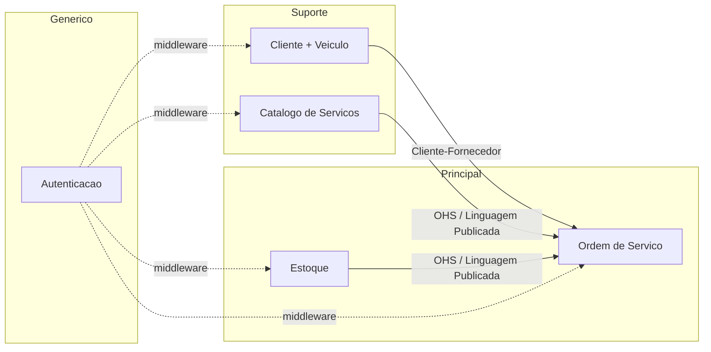
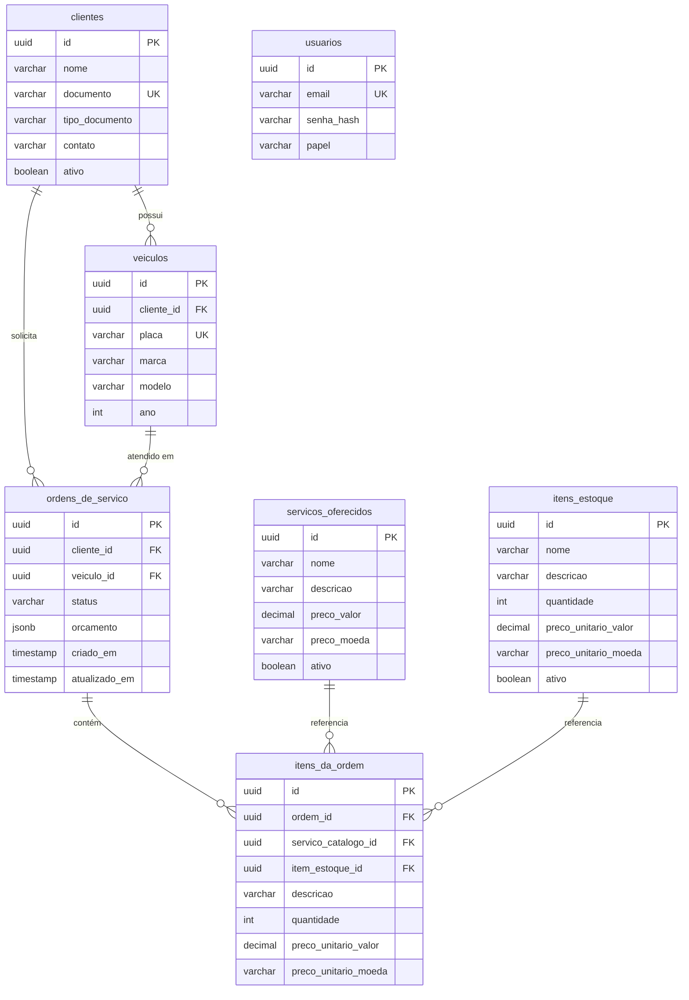
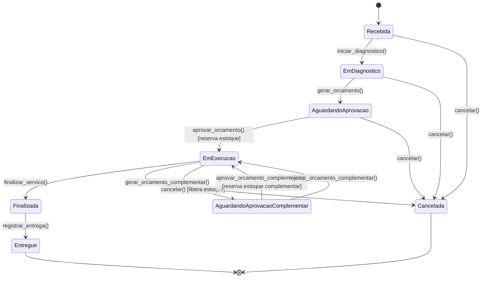

# RFC-001: Design do Sistema — MVP Oficina Mecânica

> [↑ Raiz do projeto](../../../README.md) · [↑ Arquitetura](../README.md)

**Data**: 2026-03-11
**Equipe**: PytStop (João Amaral, Allan Aurélio, Carlos Silva, Guilherme Sousa, Nicolas Gerbi)

> **Status**: Encerrada — Aprovada

## Conformidade com Template RFC (Software Architecture — Aula 4)

Esta RFC foi estruturada por tópico técnico (Arquitetura, Mapa de Contextos, Modelo de Dados, etc.) em vez do template sequencial do curso. A tabela abaixo mapeia cada seção obrigatória do template para o conteúdo correspondente nesta RFC.

| Seção do Template | Cobertura nesta RFC |
|---|---|
| **Título** | RFC-001: Design do Sistema — MVP Oficina Mecânica |
| **Data** | 2026-03-11 |
| **Status** | Encerrada — Aprovada |
| **Resumo** | MVP back-end para oficina mecânica com DDD + Onion Architecture, 5 bounded contexts, máquina de estados com 8 status, autenticação JWT. |
| **Problema** | Oficina opera com anotações manuais e planilhas, gerando erros e ineficiência. O Tech Challenge exige demonstração de DDD. Ver [PRD §Declaração do Problema](../../requisitos/prd.md). |
| **Proposta Técnica** | Seções 1 (Arquitetura), 2 (Mapa de Contextos), 3 (Modelo de Dados), 4 (Máquina de Estados), 5 (Orçamento), 6 (Autenticação), 7 (Erros), 8 (Testes), 9 (Orçamento Complementar), 10 (Outbox). |
| **Impacto Esperado** | Digitalização completa do ciclo de OS; 90%+ cobertura de testes nos domínios principais; isolamento do domínio via Onion. Ver [PRD §Objetivos](../../requisitos/prd.md). |
| **Alternativas Consideradas** | Seção 1 (Arquitetura em camadas simples rejeitada). Detalhamento completo em [ADR-003](../adr/003-arquitetura-ddd-onion.md). |
| **Pontos em Aberto** | Nenhum no escopo do MVP. Evoluções futuras documentadas nos débitos técnicos ([tech-debt.md](../../tech-debt/README.md)) e na priorização MoSCoW Could/Won't do [PRD](../../requisitos/prd.md). |

---

## 1. Arquitetura (DDD + Onion)

### Abordagem

Monolito modular com Domain-Driven Design e Onion Architecture. Cada contexto delimitado é um módulo Python independente com 4 camadas:

```
contexto/
├── dominio/         # Entidades, VOs, eventos, exceções, portas de repositório
├── aplicacao/       # Casos de uso, portas cross-contexto, DTOs
├── infraestrutura/  # Repositórios SQLAlchemy, adaptadores, mapping
└── interfaces/      # Routers FastAPI, schemas Pydantic, dependencies
```

**Regra de dependência**: camadas internas nunca importam camadas externas. O domínio não conhece infraestrutura nem framework.

**Stack**: Python 3.12, FastAPI, SQLAlchemy 2.0 (imperative mapping), PostgreSQL 16, Alembic, pytest, testcontainers.

### Alternativa considerada

Arquitetura em camadas simples (permitida pelo tech challenge: "é possível criar um Monolito utilizando a arquitetura em camadas"). Rejeitada porque o objetivo pedagógico é demonstrar DDD — a escolha por Onion Architecture evidencia separação de domínio e inversão de dependência, que são avaliadas na disciplina.

## 2. Mapa de Contextos

5 contextos delimitados com padrões de integração DDD:



OHS = Open Host Service (padrão DDD de integração). Ver [Glossário](../../requisitos/glossario.md).

| Contexto | Classificação | Responsabilidade |
|---|---|---|
| Ordem de Serviço | Principal | Máquina de estados da OS, orçamentos, orquestração cross-contexto |
| Cliente + Veículo | Suporte | Cadastro de clientes e veículos, validação de CPF/CNPJ |
| Catálogo de Serviços | Suporte | Tipos de serviço disponíveis, preços |
| Estoque | Principal | Peças e insumos, reserva pessimista, controle de quantidade |
| Autenticação | Genérico | JWT, credenciais, RBAC. Substituível por Auth0/Keycloak. |

**Comunicação**: in-process via portas e adaptadores. Portas definidas pelo consumidor (Ordem de Serviço). Adaptadores na infraestrutura. Transações cross-contexto via `UnitOfWork` compartilhada quando necessário (reserva de estoque).

## 3. Modelo de Dados e Design de API

### Agregados

| Agregado | Entidades Filhas | Objetos de Valor |
|---|---|---|
| `OrdemDeServico` | `ItemDaOrdem[]` | `Orcamento` (JSONB), `StatusOrdem` (Enum) |
| `Cliente` | `Veiculo[]` | `CPF`, `CNPJ`, `Placa` |
| `ItemEstoque` | — | `Dinheiro` |
| `ServicoOferecido` | — | `Dinheiro` |
| `Usuario` | — | `Papel` (Enum) |

### Modelo de dados (tabelas principais)



> As foreign keys cross-contexto (`cliente_id`, `veiculo_id` em `ordens_de_servico`) são um trade-off consciente: num monolito com banco único, a integridade referencial do PostgreSQL simplifica o MVP. Em evolução para microsserviços, essas FKs seriam removidas.

### API

RESTful sob `/api/v1/`. Paginação offset-based (padrão 20, máximo 100). Transições de status via endpoints dedicados (ex: `POST /ordens-de-servico/{id}/aprovacao`). Ver inventário completo em [`requisitos.md`](../../requisitos/requisitos.md).

## 4. Máquina de Estados da OS

8 status com 12 transições válidas:



**Colaborador `MaquinaDeStatus`**: stateless, instanciado pelo agregado. Valida transições, executa guardas e retorna eventos a emitir. O agregado delega `transicionar_para(novo_status)`.

**Guardas** (validadas pela `MaquinaDeStatus` no domínio):
1. >= 1 item para gerar orçamento
2. Orçamento existente para aprovar
3. Estoque disponível na aprovação
4. Status correto para adicionar/remover item (Recebida/EmDiagnostico)
5. Status correto para cada transição
6. Motivo obrigatório para cancelar em EmExecucao

**Pré-condição da camada de interfaces**: Admin autenticado (verificado no middleware FastAPI, não no domínio).

**Efeitos colaterais do cancelamento**:
- De Recebida/EmDiagnostico: sem efeitos
- De AguardandoAprovacao: sem estoque a liberar
- De EmExecucao: liberar estoque reservado
- De Finalizada/Entregue/Cancelada: bloqueado (estados terminais ou pós-terminal)

## 5. Algoritmo de Orçamento

O orçamento é calculado como soma dos itens da OS:

```
total = Σ (item.preco_unitario × item.quantidade)
```

- `preco_unitario` é `Dinheiro` (Decimal, 2 casas, `ROUND_HALF_UP`, BRL)
- Cada `ItemDaOrdem` obtém o preço do `CatalogoPort` no momento da adição
- O campo `orcamento` da OS é `None` até o comando explícito `gerar_orcamento()` (transição EmDiagnostico → AguardandoAprovacao). Não há cálculo automático ao adicionar/remover itens.
- O `Orcamento` (objeto de valor) é imutável. Após RN-016, itens não podem ser alterados uma vez gerado o orçamento — para modificar, cancelar a OS e criar uma nova.
- Armazenamento como JSONB com `versao_schema: 1` para compatibilidade futura
- Orçamentos anteriores mantidos como histórico (array JSONB com timestamp) — RF-017 (Could Have)

**Tempo médio de execução** (RF-008):
- Calculado por tipo de serviço sobre OS finalizadas
- Intervalo: timestamp da transição AguardandoAprovacao→EmExecucao até EmExecucao→Finalizada
- OS sem itens excluída da agregação

## 6. Estratégia de Autenticação (JWT)

| Aspecto | Decisão |
|---|---|
| Algoritmo | HS256 com `algorithms=["HS256"]` explícito no decode |
| Lifespan | 15 min (configurável via `JWT_ACCESS_TOKEN_EXPIRE_MINUTES`) |
| Segredo | `openssl rand -hex 32`, variável de ambiente, >= 32 bytes, validado no startup em produção (issue #74; a guarda também rejeita segredos demo) |
| Claims | `sub` (user_id), `papel` (Enum: Admin), `exp`, `iat`, `jti` (UUID, usado para revogação) |
| Entrega | Somente header `Authorization: Bearer` — sem cookies |
| Revogação | Tabela `tokens_revogados` com JTI. Verificação no middleware. Logout revoga token corrente (RF-012, Could Have). |
| Refresh tokens | Refresh token com rotação. TTL configurável via `JWT_REFRESH_TOKEN_EXPIRE_DAYS` (padrão: 7). Endpoint `POST /autenticacao/refresh` (RF-013, Could Have). |
| RBAC | Admin e Mecanico (Enum Papel). `exigir_papel()` como dependência FastAPI. Mecânico não pode cadastrar clientes nem gerenciar estoque (RF-014, Should Have). No MVP, o Enum pode conter apenas `Admin` até RF-014 ser implementado. |

**Política de senha**: 12+ chars, rejeição top-10000 (SecLists), lockout 5 falhas/15 min, bloqueio IP 15 falhas/30 min.

**Rate limiting**: 5/min login, 10/min consulta pública, 60/min global (slowapi, por IP).

## 7. Estratégia de Tratamento de Erros

### Hierarquia de exceções

```
DomainException (base)
  ├── EntidadeNaoEncontradaException → 404
  ├── ViolacaoRegraDeNegocioException → 422
  ├── TransicaoStatusInvalidaException → 409
  ├── EstoqueInsuficienteException → 409
  ├── EntidadeDuplicadaException → 409
  ├── FalhaAutenticacaoException → 401
  └── FalhaAutorizacaoException → 403
```

### Envelope JSON de erro

```json
{
  "erro": {
    "codigo": "TRANSICAO_STATUS_INVALIDA",
    "mensagem": "Transição de EmExecucao para EmDiagnostico não é permitida.",
    "id_requisicao": "550e8400-e29b-41d4-a716-446655440000"
  }
}
```

- Exceções de infraestrutura (falha de BD, timeout) → 503 com mensagem opaca
- Exceções não mapeadas → 500 com `id_requisicao` para correlação
- Stack traces somente em logs (ERROR), nunca na resposta

## 8. Estratégia de Testes

### Cobertura por faixa

| Escopo | Linha | Branch |
|---|---|---|
| `ordem_de_servico/dominio/` + `aplicacao/` | 90%+ | 85%+ |
| `estoque/dominio/` + `aplicacao/` | 90%+ | 85%+ |
| Outros `*/dominio/` | 80%+ | 70%+ |
| `compartilhado/dominio/` | 85%+ | 75%+ |
| `*/infraestrutura/` + `*/interfaces/` | 65%+ | 50%+ |

### Ferramentas

| Ferramenta | Uso |
|---|---|
| pytest | Framework de testes |
| testcontainers | PostgreSQL real (necessário para ENUM, SELECT FOR UPDATE) |
| polyfactory | Fábricas para schemas Pydantic |
| pytest-xdist | Paralelização (1 container/sessão, SAVEPOINT/worker) |
| mutmut | Mutation testing no domínio (meta 70%+, piso 50%) |
| schemathesis | Contract testing de endpoints (code freeze) |

### Categorias de teste

1. **Máquina de estados**: 12 transições válidas (9 base + 3 do orçamento complementar RF-016), 52 inválidas (8×8 − 12 = 52, incluindo auto-transições como inválidas), 7 guardas, testes de concorrência. Verificação explícita de que estados terminais (Cancelada, Entregue) rejeitam qualquer transição.
2. **Cancelamento**: efeitos colaterais por estado de origem
3. **Objetos de valor**: igualdade, imutabilidade, hashability, round-trip JSONB
4. **CPF/CNPJ/Placa**: fronteiras (válido, inválido, formatação, dígitos iguais)
5. **Autenticação**: tokens válidos/expirados/malformados, algorithm confusion, startup validation
6. **Estoque**: reserva atômica, lock failure, tudo-ou-nada, liberação no cancelamento
7. **E2E**: ciclo completo Recebida → Entregue, cancelamento com liberação, consulta pública
8. **Segurança**: rate limiting, CORS, headers, Swagger condicional

## 9. Orçamento Complementar (RF-016, Could Have)

Durante a execução, serviços adicionais podem ser identificados. O fluxo adiciona uma transição:

```
EmExecucao → AguardandoAprovacaoComplementar → EmExecucao
```

- Itens complementares adicionados em `AguardandoAprovacaoComplementar`
- Orçamento complementar gerado com os novos itens
- Aprovação reserva estoque dos itens complementares
- Orçamentos anteriores mantidos como histórico (array JSONB com timestamp) — RF-017 (Could Have)
- Rejeição do complementar retorna para `EmExecucao` **revertendo o escopo** (#111): restaura o orçamento aprovado, remove os itens complementares não aprovados e libera suas reservas de estoque na mesma transação, sem cancelar a OS. O escopo aprovado é um snapshot (orçamento + ids dos itens cobertos) persistido em `ordens_de_servico.escopo_aprovado_json` (JSONB, migração 007), congelado a cada aprovação
- Finalização recusa itens fora do orçamento aprovado (#122): trabalho adicionado em `EmExecucao` sem gerar/aprovar o complementar não pode ser finalizado — evita cobrar trabalho não aprovado

## 10. Transactional Outbox (RF-018, Could Have)

Eventos de domínio persistidos na tabela `outbox` dentro da mesma transação da operação de domínio:

```
outbox {
    uuid id PK
    varchar tipo_evento
    jsonb payload
    timestamp criado_em
    timestamp processado_em
}
```

> **Nota**: este é o esboço da fase 1 (RFC encerrada). O schema final implementado na fase 2 diverge — `id` bigserial, colunas `agregado_id`/`tipo`/`entregue_em` e a tabela `processed_events` (idempotência/DLQ), com entrega via relay dedicado. Ver [ADR-022](../adr/fase2/022-transactional-outbox-relay.md) e `migrations/versions/003_outbox.py`.

- Background task (loop ou scheduler) lê eventos não processados e despacha
- Falha de despacho não causa rollback — o evento permanece na tabela para retry
- Garante consistência entre estado do domínio e eventos emitidos
- No MVP, o "despacho" é in-process (sem broker externo)

## Referências

- [Glossário](../../requisitos/glossario.md) — Linguagem Ubíqua
- [Requisitos](../../requisitos/requisitos.md) — RF, RNF, RN
- [PRD](../../requisitos/prd.md) — Personas, user stories
- [Event Storming](../event-storming/) — Fluxos de domínio
- [Tech Challenge](../../requisitos/desafio-tech-fase-1.md) — Especificação original
- [ADR-003](../adr/003-arquitetura-ddd-onion.md) — Arquitetura DDD + Onion
- [ADR-004](../adr/004-autenticacao-jwt.md) — Autenticação JWT
- [ADR-008](../adr/008-bloqueio-pessimista-estoque.md) — Bloqueio pessimista de estoque

---

> [↑ Raiz do projeto](../../../README.md) · [↑ Arquitetura](../README.md)

