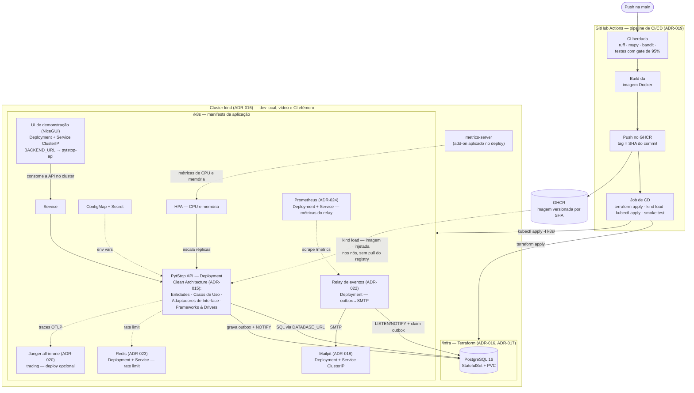
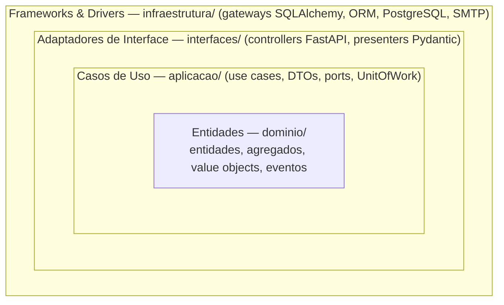

# Documento de Entrega — Tech Challenge Fase 2

> [↑ Raiz do projeto](https://github.com/fiap-postech-sw-architecture/postech-sw-arch-p2) · [↑ Entrega Fase 2](https://github.com/fiap-postech-sw-architecture/postech-sw-arch-p2/tree/main/docs/entrega/fase2)

> **Versão**: 1.6 — julho/2026.

Documento de entrega da fase 2 do Tech Challenge da Pós-Graduação em Arquitetura de Software (FIAP). O conteúdo cobre os itens exigidos pelo enunciado da fase: identificação do grupo, link do repositório (compartilhado com o avaliador), desenho da arquitetura, instruções de execução e deploy, link da collection das APIs e link do vídeo de demonstração.

## Como ler este documento

O repositório é a fonte de verdade. Os artefatos exigidos estão versionados e disponíveis nos links abaixo (branch `main`): código refatorado (Clean Architecture), Dockerfile e docker-compose, manifests em `/k8s`, Terraform em `/infra`, pipeline de CI/CD e README. O desenho da arquitetura é Mermaid renderizado pelo GitHub, com fonte única na [RFC-002 §3](https://github.com/fiap-postech-sw-architecture/postech-sw-arch-p2/blob/main/docs/arquitetura/rfc/fase2/rfc-002-infraestrutura-e-deploy-fase-2.md), replicada no [README](https://github.com/fiap-postech-sw-architecture/postech-sw-arch-p2/blob/main/README.md) e na seção 7. As decisões estão nas ADRs 015–025 e na RFC-002; a rastreabilidade requisito → evidência está na seção 6.

---

## 1. Identificação do grupo

| Campo | Valor |
|---|---|
| Nome do grupo | PytStop |
| Turma | 15SOAT — Pós-Graduação em Arquitetura de Software (FIAP) |

### Participantes

| Nome | RM | Discord |
|---|---|---|
| João Amaral | RM373448 | joao_13997 |
| Allan Aurélio | RM372116 | all66_ |
| Carlos Silva | RM374191 | carlossilva156 |
| Guilherme Sousa | RM373609 | romen0 |
| Nicolas Gerbi | RM372644 | sethiiz_gerbi |

## 2. Link do repositório

Repositório privado no GitHub, compartilhado com `soat-architecture` conforme exigido pelo enunciado (confirmação do convite: pendência 1, seção 9). A fase 2 continua no mesmo histórico da fase 1: o repositório preserva os 118 commits do MVP ([PR #11](https://github.com/fiap-postech-sw-architecture/postech-sw-arch-p2/pull/11)) e evolui a partir deles.

| Recurso | URL |
|---|---|
| Repositório | https://github.com/fiap-postech-sw-architecture/postech-sw-arch-p2 |
| README (arquitetura, execução local, deploy K8s, Terraform) | https://github.com/fiap-postech-sw-architecture/postech-sw-arch-p2/blob/main/README.md |
| Dockerfile | https://github.com/fiap-postech-sw-architecture/postech-sw-arch-p2/blob/main/Dockerfile |
| docker-compose.yml | https://github.com/fiap-postech-sw-architecture/postech-sw-arch-p2/blob/main/docker-compose.yml |
| Manifests Kubernetes (`/k8s`) | https://github.com/fiap-postech-sw-architecture/postech-sw-arch-p2/tree/main/k8s |
| Scripts Terraform (`/infra`) | https://github.com/fiap-postech-sw-architecture/postech-sw-arch-p2/tree/main/infra |
| Pipeline de CI (herdada da fase 1) | https://github.com/fiap-postech-sw-architecture/postech-sw-arch-p2/blob/main/.github/workflows/ci.yml |
| Pipeline de CD (build de imagem + deploy + smoke test) | https://github.com/fiap-postech-sw-architecture/postech-sw-arch-p2/blob/main/.github/workflows/cd.yml |
| Collection das APIs (Postman, gerada do OpenAPI) | https://github.com/fiap-postech-sw-architecture/postech-sw-arch-p2/blob/main/docs/entrega/fase2/postman_collection.json |

A collection foi gerada a partir do contrato OpenAPI vivo da aplicação (48 requisições agrupadas por tag) e é executável — validada com Newman (CLI do Postman) contra o cluster ([PR #157](https://github.com/fiap-postech-sw-architecture/postech-sw-arch-p2/pull/157)). A requisição de decisão externa de orçamento traz um pre-request script que assina a chamada com HMAC (hash-based message authentication code — `X-Webhook-Signature` + `X-Webhook-Timestamp`, espelhando `webhook_signature.py`). O Swagger UI em `/docs` permanece a referência interativa — instruções de acesso no README.

### Execuções verdes do CD na main

O pipeline de CD provisiona um cluster kind (Kubernetes in Docker) efêmero no runner via Terraform, publica a imagem no GHCR (GitHub Container Registry) com tag imutável por SHA e aplica os manifests com smoke test ao final ([ADR-019](https://github.com/fiap-postech-sw-architecture/postech-sw-arch-p2/blob/main/docs/arquitetura/adr/fase2/019-pipeline-cicd-deploy.md)):

| Execução | Conteúdo | URL |
|---|---|---|
| Run 27450493913 | Primeiro deploy completo (merge do [PR #21](https://github.com/fiap-postech-sw-architecture/postech-sw-arch-p2/pull/21)) | https://github.com/fiap-postech-sw-architecture/postech-sw-arch-p2/actions/runs/27450493913 |
| Run 27451618014 | Deploy com OpenTelemetry/Jaeger (merge do [PR #22](https://github.com/fiap-postech-sw-architecture/postech-sw-arch-p2/pull/22)) | https://github.com/fiap-postech-sw-architecture/postech-sw-arch-p2/actions/runs/27451618014 |
| Run 28891918640 | Deploy na HEAD final (merge do [PR #194](https://github.com/fiap-postech-sw-architecture/postech-sw-arch-p2/pull/194)) | https://github.com/fiap-postech-sw-architecture/postech-sw-arch-p2/actions/runs/28891918640 |

## 3. Link do vídeo

Vídeo de até 15 minutos demonstrando deploy, execução do CI/CD, consumo das APIs e escalabilidade automática, conforme o enunciado. Roteiro de gravação: [roteiro-video.md](https://github.com/fiap-postech-sw-architecture/postech-sw-arch-p2/blob/main/docs/entrega/fase2/roteiro-video.md).

| Recurso | URL |
|---|---|
| Vídeo de demonstração | _link será adicionado após a gravação_ <!-- VIDEO-LINK-FASE-2 --> |

## 4. Link da documentação

Toda a documentação versionada está no próprio repositório, na pasta `docs/`.

### 4.1 Índice geral

| Recurso | URL |
|---|---|
| Pasta `docs/` (índice) | https://github.com/fiap-postech-sw-architecture/postech-sw-arch-p2/tree/main/docs |
| Requisitos da fase 2 (enunciado transcrito) | https://github.com/fiap-postech-sw-architecture/postech-sw-arch-p2/blob/main/docs/requisitos/fase2/desafio-tech-fase-2.md |
| Gap analysis — enunciado × código da fase 1 (RF-020–024, RNF-017–024, RN-018–020) | https://github.com/fiap-postech-sw-architecture/postech-sw-arch-p2/blob/main/docs/requisitos/fase2/gap-analysis-fase-2.md |
| Anexo C — funcionalidades extras da fase 2 (além do enunciado) | https://github.com/fiap-postech-sw-architecture/postech-sw-arch-p2/blob/main/docs/entrega/fase2/apendice-funcionalidades-extras.md |
| Scans de segurança — fechamento da fase 2 (bateria na HEAD final) | https://github.com/fiap-postech-sw-architecture/postech-sw-arch-p2/blob/main/docs/seguranca/scan-fase-2.md |

### 4.2 Decisões de arquitetura da fase 2

| Artefato | Decisão | URL |
|---|---|---|
| RFC-002 | Infraestrutura e deploy da fase 2 — desenho integrado e diagrama de referência | https://github.com/fiap-postech-sw-architecture/postech-sw-arch-p2/blob/main/docs/arquitetura/rfc/fase2/rfc-002-infraestrutura-e-deploy-fase-2.md |
| ADR-015 | Clean Architecture como arquitetura alvo (sem rewrite) | https://github.com/fiap-postech-sw-architecture/postech-sw-arch-p2/blob/main/docs/arquitetura/adr/fase2/015-arquitetura-alvo-fase-2.md |
| ADR-016 | kind como plataforma Kubernetes (dev, vídeo e CI) | https://github.com/fiap-postech-sw-architecture/postech-sw-arch-p2/blob/main/docs/arquitetura/adr/fase2/016-plataforma-kubernetes.md |
| ADR-017 | PostgreSQL como StatefulSet provisionado pelo Terraform | https://github.com/fiap-postech-sw-architecture/postech-sw-arch-p2/blob/main/docs/arquitetura/adr/fase2/017-provisionamento-banco.md |
| ADR-018 | Notificação de status por e-mail via adapter SMTP com Mailpit | https://github.com/fiap-postech-sw-architecture/postech-sw-arch-p2/blob/main/docs/arquitetura/adr/fase2/018-notificacao-email.md |
| ADR-019 | Pipeline de CI/CD com deploy em cluster kind efêmero no runner | https://github.com/fiap-postech-sw-architecture/postech-sw-arch-p2/blob/main/docs/arquitetura/adr/fase2/019-pipeline-cicd-deploy.md |
| ADR-020 | Observabilidade com OpenTelemetry e Jaeger em escopo mínimo | https://github.com/fiap-postech-sw-architecture/postech-sw-arch-p2/blob/main/docs/arquitetura/adr/fase2/020-observabilidade-opentelemetry.md |
| ADR-021 | Aprovação e recusa externas de orçamento via token dedicado | https://github.com/fiap-postech-sw-architecture/postech-sw-arch-p2/blob/main/docs/arquitetura/adr/fase2/021-aprovacao-externa-orcamento.md |
| ADR-022 | Transactional Outbox + relay para entrega de eventos de integração | https://github.com/fiap-postech-sw-architecture/postech-sw-arch-p2/blob/main/docs/arquitetura/adr/fase2/022-transactional-outbox-relay.md |
| ADR-023 | Rate limiter com storage compartilhado (Redis) sob HPA | https://github.com/fiap-postech-sw-architecture/postech-sw-arch-p2/blob/main/docs/arquitetura/adr/fase2/023-rate-limiter-storage-compartilhado.md |
| ADR-024 | Métricas de observabilidade com Prometheus e OpenTelemetry no relay | https://github.com/fiap-postech-sw-architecture/postech-sw-arch-p2/blob/main/docs/arquitetura/adr/fase2/024-metricas-prometheus.md |
| ADR-025 | Ambiente cloud de demonstração persistente (Azure for Students / AKS) — aditivo ao kind | https://github.com/fiap-postech-sw-architecture/postech-sw-arch-p2/blob/main/docs/arquitetura/adr/fase2/025-ambiente-cloud-demonstracao.md |

A documentação da fase 1 (Event Storming, Domain Storytelling, Linguagem Ubíqua, mapa de contextos, modelo de domínio, ADRs 001–014) permanece válida e versionada nas mesmas pastas — índice em [`docs/`](https://github.com/fiap-postech-sw-architecture/postech-sw-arch-p2/tree/main/docs).

## 5. Relatório de análise de vulnerabilidades

A postura de segurança da fase 2 é verificada por CI: os seis scanners que a fase 1 rodava manualmente foram automatizados como gates de pipeline ([PR #116](https://github.com/fiap-postech-sw-architecture/postech-sw-arch-p2/pull/116), fecha [#75](https://github.com/fiap-postech-sw-architecture/postech-sw-arch-p2/issues/75)) e reexecutados na HEAD final, já sobre Python 3.14 ([PR #150](https://github.com/fiap-postech-sw-architecture/postech-sw-arch-p2/pull/150)). Os seis passaram verdes — SAST (Static Application Security Testing, análise estática do código), SCA (Software Composition Analysis, vulnerabilidades em dependências), scan de container, segredos, análise semântica e DAST (Dynamic Application Security Testing, teste dinâmico contra a API viva); detalhe por ferramenta na tabela 5.1. A sétima camada é o SonarQube, scan manual de fechamento de fase ([TD-010/ADR-011](https://github.com/fiap-postech-sw-architecture/postech-sw-arch-p2/blob/main/docs/arquitetura/adr/011-pipeline-seguranca-analise-estatica.md)), executado na mesma HEAD com todos os achados tratados.

### 5.1 Ferramentas e resultado na HEAD final

| Ferramenta | Tipo | Alvo | Resultado |
|---|---|---|---|
| bandit | SAST | `src/` + `relay/` (10.112 LoC) | 0 high / 0 medium / 0 low |
| pip-audit | SCA — dependências | deps de runtime resolvidas do `uv.lock` | 0 vulnerabilidades (3 CVEs de nicegui dev-only aceitos — justificativa no [relatório de vulnerabilidades](https://github.com/fiap-postech-sw-architecture/postech-sw-arch-p2/blob/main/docs/seguranca/relatorio-vulnerabilidades.md) e `--ignore-vuln` comentado em [`security.yml`](https://github.com/fiap-postech-sw-architecture/postech-sw-arch-p2/blob/main/.github/workflows/security.yml)) |
| trivy | SCA — imagem Docker | imagem de runtime `pytstop` (Python 3.14) | 0 HIGH/CRITICAL no gate |
| gitleaks | Detecção de segredos | árvore de trabalho, com allowlist | 0 leaks |
| CodeQL | SAST semântico | python + javascript-typescript (default setup) | `Analyze` verde, sem alertas ativos |
| OWASP ZAP | DAST baseline | API viva via OpenAPI (stack compose) | 0 FAIL — 2 WARN aceitos como IGNORE |
| SonarQube | Análise estática + security hotspots | `src/` (7,4k LoC, cobertura importada) | Quality Gate Passed — 0 security, 0 reliability, coverage 95,3%; hotspots 3 → 0 |

No ciclo do SonarQube, a primeira análise apontou 3 security hotspots: um ReDoS (Regular Expression Denial of Service — regra S5852) na regex de extração de e-mail e dois em avisos de `http://` no exporter do OpenTelemetry. A regex foi corrigida no código, e a mesma classe de defeito foi eliminada também na regex do scrubber de logs ([PR #155](https://github.com/fiap-postech-sw-architecture/postech-sw-arch-p2/pull/155)); os avisos de `http://` foram revisados como seguros (tráfego gRPC intra-cluster, com endpoint externo entrando via env com `https`). A reanálise fechou com 0 hotspots; o antes/depois está no Anexo B do PDF (seção 8). O SonarQube é o scan manual de fechamento, ancorado ao commit registrado em `scan-fase-2.md`; os seis gates de CI seguem verdes a cada push na `main`.

Gates em [`security.yml`](https://github.com/fiap-postech-sw-architecture/postech-sw-arch-p2/blob/main/.github/workflows/security.yml) (pip-audit, gitleaks, trivy), [`ci.yml`](https://github.com/fiap-postech-sw-architecture/postech-sw-arch-p2/blob/main/.github/workflows/ci.yml) (bandit) e [`full-test-ci.yml`](https://github.com/fiap-postech-sw-architecture/postech-sw-arch-p2/blob/main/.github/workflows/full-test-ci.yml) (ZAP), mais o CodeQL pelo default setup do GitHub e o Dependabot mensal.

### 5.2 Principais itens de segurança resolvidos

Além dos scans limpos, a auditoria de finalização ([issue #128](https://github.com/fiap-postech-sw-architecture/postech-sw-arch-p2/issues/128)) gerou correções de segurança com teste TDD — recorte dos principais; a lista completa está nos documentos da seção 5.3:

- **Revogação de refresh token** (CWE-613 — expiração de sessão insuficiente) e logout idempotente ([PR #142](https://github.com/fiap-postech-sw-architecture/postech-sw-arch-p2/pull/142) — [#118](https://github.com/fiap-postech-sw-architecture/postech-sw-arch-p2/issues/118)/[#121](https://github.com/fiap-postech-sw-architecture/postech-sw-arch-p2/issues/121));
- **Corrida TOCTOU (time-of-check/time-of-use) na recusa externa de orçamento** — revalidação sob lock antes do cancelamento ([PR #142](https://github.com/fiap-postech-sw-architecture/postech-sw-arch-p2/pull/142) — [#119](https://github.com/fiap-postech-sw-architecture/postech-sw-arch-p2/issues/119));
- **Item de estoque desativado** barrado em OS nova e na reserva ([PR #142](https://github.com/fiap-postech-sw-architecture/postech-sw-arch-p2/pull/142) — [#120](https://github.com/fiap-postech-sw-architecture/postech-sw-arch-p2/issues/120));
- **Seed com denylist sensível a ambiente** — `seed_admin.py` rejeita o `ADMIN_PASSWORD` público de demo fora de `development`/`test` ([PR #152](https://github.com/fiap-postech-sw-architecture/postech-sw-arch-p2/pull/152) — [#95](https://github.com/fiap-postech-sw-architecture/postech-sw-arch-p2/issues/95); escopo por ambiente no [PR #159](https://github.com/fiap-postech-sw-architecture/postech-sw-arch-p2/pull/159));
- **Papel de usuário fail-closed** — removido `default="admin"` do mapping, inserção sem papel passa a falhar com violação de `NOT NULL` ([PR #152](https://github.com/fiap-postech-sw-architecture/postech-sw-arch-p2/pull/152) — [#96](https://github.com/fiap-postech-sw-architecture/postech-sw-arch-p2/issues/96));
- **Webhook de orçamento assinado por HMAC** ([PR #114](https://github.com/fiap-postech-sw-architecture/postech-sw-arch-p2/pull/114), TD-027), com a collection do Postman assinando via pre-request script ([PR #157](https://github.com/fiap-postech-sw-architecture/postech-sw-arch-p2/pull/157));
- **Rate limiter global sob HPA** com storage compartilhado Redis ([PR #62](https://github.com/fiap-postech-sw-architecture/postech-sw-arch-p2/pull/62), [ADR-023](https://github.com/fiap-postech-sw-architecture/postech-sw-arch-p2/blob/main/docs/arquitetura/adr/fase2/023-rate-limiter-storage-compartilhado.md));
- **Mensagens de erro sem eco de dado pessoal** — invariantes de domínio com PII (Personally Identifiable Information, dado pessoal identificável) usam rótulo fixo (varredura de todos os `raise ValueError` do domínio — 75 à época do [PR #155](https://github.com/fiap-postech-sw-architecture/postech-sw-arch-p2/pull/155)) e o 422 de validação de schema deixou de devolver o `input` cru ([#126](https://github.com/fiap-postech-sw-architecture/postech-sw-arch-p2/issues/126));
- **Scrubber de PII nos logs ampliado** — telefones BR sem espaços ou com `+55` colado passam a ser mascarados pelo valor, e os campos `telefone`/`celular`/`contato`, pelo nome ([PR #155](https://github.com/fiap-postech-sw-architecture/postech-sw-arch-p2/pull/155) — [#99](https://github.com/fiap-postech-sw-architecture/postech-sw-arch-p2/issues/99)).

### 5.3 Documentos completos

| Documento | URL |
|---|---|
| Scans de fechamento da fase 2 (v2.1, HEAD final — inclui o ciclo SonarQube) | https://github.com/fiap-postech-sw-architecture/postech-sw-arch-p2/blob/main/docs/seguranca/scan-fase-2.md |
| Relatório de Vulnerabilidades (baseline OWASP API Top 10, fase 1) | https://github.com/fiap-postech-sw-architecture/postech-sw-arch-p2/blob/main/docs/seguranca/relatorio-vulnerabilidades.md |

## 6. Rastreabilidade requisito → evidência

Cada requisito da fase 2 ([gap analysis](https://github.com/fiap-postech-sw-architecture/postech-sw-arch-p2/blob/main/docs/requisitos/fase2/gap-analysis-fase-2.md)) está mapeado para o PR que o implementou e para a evidência principal no código; a sequência de demonstração está no [roteiro do vídeo](https://github.com/fiap-postech-sw-architecture/postech-sw-arch-p2/blob/main/docs/entrega/fase2/roteiro-video.md).

### Requisitos funcionais

| ID | PR | Requisito | Evidência (arquivo / teste chave) |
|---|---|---|---|
| RF-020 | [#15](https://github.com/fiap-postech-sw-architecture/postech-sw-arch-p2/pull/15) | Abertura de OS com cliente, veículo, serviços e peças, retornando id único | `CriarOrdemDTO` com `servicos`/`pecas` (`src/ordem_servico/aplicacao/dtos.py`) e montagem única de itens em `use_cases.py`; e2e `tests/integracao/test_api_e2e.py::TestCriacaoOsComItens` |
| RF-021 | [#14](https://github.com/fiap-postech-sw-architecture/postech-sw-arch-p2/pull/14) | Consulta de status no vocabulário do enunciado | `situacao_de` em `src/ordem_servico/aplicacao/situacoes.py` + campo `situacao` nos 3 schemas de resposta; `tests/unitarios/ordem_servico/test_presenters.py` |
| RF-022 | [#16](https://github.com/fiap-postech-sw-architecture/postech-sw-arch-p2/pull/16) | Endpoint externo de aprovação/recusa de orçamento | Rota `POST /api/v1/publico/ordens-de-servico/{ordem_id}/decisao-orcamento` em `src/compartilhado/interfaces/router_publico.py`; use case `DecidirOrcamento`; [ADR-021](https://github.com/fiap-postech-sw-architecture/postech-sw-arch-p2/blob/main/docs/arquitetura/adr/fase2/021-aprovacao-externa-orcamento.md) |
| RF-023 | [#13](https://github.com/fiap-postech-sw-architecture/postech-sw-arch-p2/pull/13) | Listagem ordenada por prioridade de status, sem encerradas (exclusão lógica) | `_PRIORIDADE_STATUS`/`_ESTADOS_ENCERRADOS` + parâmetro `incluir_encerradas` em `src/ordem_servico/infraestrutura/repository.py`; teste-guarda em `tests/unitarios/ordem_servico/test_repository_os.py` |
| RF-024 | [#17](https://github.com/fiap-postech-sw-architecture/postech-sw-arch-p2/pull/17), [#56](https://github.com/fiap-postech-sw-architecture/postech-sw-arch-p2/pull/56) | Notificação de atualização de status por e-mail (interpretação registrada no [ADR-018](https://github.com/fiap-postech-sw-architecture/postech-sw-arch-p2/blob/main/docs/arquitetura/adr/fase2/018-notificacao-email.md): o e-mail notifica a mudança de status) | A UnitOfWork grava o `IntegrationEvent` na mesma transação da mudança de OS e o relay entrega o e-mail, com idempotência e retries ([ADR-022](https://github.com/fiap-postech-sw-architecture/postech-sw-arch-p2/blob/main/docs/arquitetura/adr/fase2/022-transactional-outbox-relay.md)). Handler em `relay/handlers.py` + adapter SMTP em `infraestrutura/`; `tests/unitarios/ordem_servico/test_notificacoes.py` |

### Requisitos não funcionais

| ID | PR | Requisito | Evidência (arquivo / teste chave) |
|---|---|---|---|
| RNF-017 | [#12](https://github.com/fiap-postech-sw-architecture/postech-sw-arch-p2/pull/12) | Clean Architecture formalizada e verificada | Contratos de camadas em `[tool.importlinter]` (`pyproject.toml`), verificados na CI (step `Architecture contracts`, `lint-imports`; paridade local via `make lint-arch`); [ADR-015](https://github.com/fiap-postech-sw-architecture/postech-sw-arch-p2/blob/main/docs/arquitetura/adr/fase2/015-arquitetura-alvo-fase-2.md) |
| RNF-018 | [#13](https://github.com/fiap-postech-sw-architecture/postech-sw-arch-p2/pull/13)–[#17](https://github.com/fiap-postech-sw-architecture/postech-sw-arch-p2/pull/17) (transversal) | Testes dos fluxos críticos mantidos na evolução | Gate de 95% em `.coveragerc` (1.802 testes unitários + 162 de integração na HEAD final); cobertura de 95,3% em `src/` medida no fechamento (Anexo A do PDF; [`scan-fase-2.md`](https://github.com/fiap-postech-sw-architecture/postech-sw-arch-p2/blob/main/docs/seguranca/scan-fase-2.md)) — CI verde na main ([run 28637221227](https://github.com/fiap-postech-sw-architecture/postech-sw-arch-p2/actions/runs/28637221227)) |
| RNF-019 | [#18](https://github.com/fiap-postech-sw-architecture/postech-sw-arch-p2/pull/18) | Dockerfile e docker-compose revisados (healthcheck do app) | `HEALTHCHECK` no `Dockerfile` + bloco `healthcheck` do serviço `app` no `docker-compose.yml`, ambos probando `/api/v1/saude` |
| RNF-020 | [#19](https://github.com/fiap-postech-sw-architecture/postech-sw-arch-p2/pull/19) | Manifests K8s: Deployment, Service, ConfigMap, Secret, HPA | [`k8s/`](https://github.com/fiap-postech-sw-architecture/postech-sw-arch-p2/tree/main/k8s) — `namespace.yaml`, `deployment.yaml`, `service.yaml`, `configmap.yaml`, `secret.yaml`, `hpa.yaml`, `jobs/migration-job.yaml`, `mailpit.yaml`, `jaeger.yaml`, `relay.yaml`, `redis.yaml`, `prometheus.yaml`, `ui-{deployment,service,configmap}.yaml` (UI no cluster, issue #186) |
| RNF-021 | [#20](https://github.com/fiap-postech-sw-architecture/postech-sw-arch-p2/pull/20) | IaC: Terraform provisiona cluster e banco, documentado | [`infra/`](https://github.com/fiap-postech-sw-architecture/postech-sw-arch-p2/tree/main/infra) — cluster kind + namespace + Secret + StatefulSet PostgreSQL + Service num único apply; recursos documentados em [`infra/README.md`](https://github.com/fiap-postech-sw-architecture/postech-sw-arch-p2/blob/main/infra/README.md) |
| RNF-022 | [#21](https://github.com/fiap-postech-sw-architecture/postech-sw-arch-p2/pull/21) | CI/CD: os 6 estágios do enunciado — build; testes; imagem versionada no GHCR; deploy do banco (Terraform); deploy da app; apply dos manifests | [`.github/workflows/cd.yml`](https://github.com/fiap-postech-sw-architecture/postech-sw-arch-p2/blob/main/.github/workflows/cd.yml) (jobs `image` → `deploy`, com smoke test ao final) + alvos `make k8s-up`/`k8s-smoke`/`cd-local` espelhando o workflow |
| RNF-023 | [#19](https://github.com/fiap-postech-sw-architecture/postech-sw-arch-p2/pull/19) | HPA-readiness: probes e resources no Deployment | Liveness/readiness em `/api/v1/saude` + requests/limits em `k8s/deployment.yaml`; HPA escala por CPU (70%) e memória (80%), 1–5 réplicas (`k8s/hpa.yaml`); metrics-server instalado pelo fluxo de deploy |
| RNF-024 | [#19](https://github.com/fiap-postech-sw-architecture/postech-sw-arch-p2/pull/19), [#62](https://github.com/fiap-postech-sw-architecture/postech-sw-arch-p2/pull/62) | Statelessness para escala horizontal | JWT stateless com denylist no PostgreSQL; `ENCRYPTION_KEY` estável via `k8s/secret.yaml`; pool dimensionado (`DB_POOL_SIZE`); rate limiter com storage compartilhado no Redis — limite global sob HPA, com degradação graciosa por réplica se o Redis cair ([ADR-023](https://github.com/fiap-postech-sw-architecture/postech-sw-arch-p2/blob/main/docs/arquitetura/adr/fase2/023-rate-limiter-storage-compartilhado.md), TD-016) |

### Regras de negócio

| ID | PR | Regra | Evidência (arquivo / teste chave) |
|---|---|---|---|
| RN-018 | [#13](https://github.com/fiap-postech-sw-architecture/postech-sw-arch-p2/pull/13) | Prioridade Em execução > Aguardando aprovação > Em diagnóstico > Recebida; mais antigas primeiro, desempate por id | `CASE` de prioridade + `criado_em ASC, id` em `src/ordem_servico/infraestrutura/repository.py` |
| RN-019 | [#13](https://github.com/fiap-postech-sw-architecture/postech-sw-arch-p2/pull/13) | Exclusão lógica de `FINALIZADA`/`ENTREGUE` (nenhum delete físico) | Filtro de consulta `notin_(_ESTADOS_ENCERRADOS)`; `incluir_encerradas=true` prova que as linhas permanecem |
| RN-020 | [#13](https://github.com/fiap-postech-sw-architecture/postech-sw-arch-p2/pull/13) (ratificada no [ADR-021](https://github.com/fiap-postech-sw-architecture/postech-sw-arch-p2/blob/main/docs/arquitetura/adr/fase2/021-aprovacao-externa-orcamento.md)) | Status extras: Aguardando Aprovação Complementar ordena junto de Aguardando aprovação; `CANCELADA` excluída como encerrada | Teste-guarda de totalidade dos 8 estados (6 do enunciado + Cancelada + Aguardando Aprovação Complementar) em `tests/unitarios/ordem_servico/test_repository_os.py` |

**Clean Code** (prática exigida pelo enunciado, ao lado da Clean Architecture): a simplicidade e o tamanho das funções são cobrados por gate de CI (`ruff check` + `ruff format`, com limites de complexidade). Os nomes seguem a linguagem ubíqua, e Value Objects substituem primitivos (`CPF`, `Placa`, `Contato`). O baixo acoplamento entre camadas é imposto pelo import-linter (RNF-017). Os refactors estão catalogados no ledger de dívida técnica abaixo.

**Além dos requisitos**: observabilidade com OpenTelemetry. O FastAPI e o SQLAlchemy emitem traces, visíveis no Jaeger ([ADR-020](https://github.com/fiap-postech-sw-architecture/postech-sw-arch-p2/blob/main/docs/arquitetura/adr/fase2/020-observabilidade-opentelemetry.md), [PR #22](https://github.com/fiap-postech-sw-architecture/postech-sw-arch-p2/pull/22)). O relay expõe métricas no Prometheus: profundidade da outbox, idade do pendente mais antigo, DLQ (dead-letter queue, fila de eventos que esgotaram as tentativas) e contadores de entrega/falha/retry ([ADR-024](https://github.com/fiap-postech-sw-architecture/postech-sw-arch-p2/blob/main/docs/arquitetura/adr/fase2/024-metricas-prometheus.md), [PR #66](https://github.com/fiap-postech-sw-architecture/postech-sw-arch-p2/pull/66), TD-022). Ambos rodam no cluster de demonstração e aparecem na demonstração do vídeo.

### Qualidade além do escopo — dívida técnica endereçada

O backlog de dívida técnica é mantido como um ledger versionado em [`docs/tech-debt/README.md`](https://github.com/fiap-postech-sw-architecture/postech-sw-arch-p2/blob/main/docs/tech-debt/README.md), com itens classificados e rastreados desde a fase 1. O ledger registra hoje **29 itens resolvidos** e **5 abertos**. Os 5 abertos são deliberados e justificados, sem impacto de produção no caminho suportado; os achados da [auditoria pré-entrega](https://github.com/fiap-postech-sw-architecture/postech-sw-arch-p2/blob/main/docs/tech-debt/auditoria-pre-entrega-fase2.md) foram tratados por completo. Fora do escopo exigido pela fase 2, o grupo amortizou boa parte desse backlog em tiers priorizados ([plano-ataque.md](https://github.com/fiap-postech-sw-architecture/postech-sw-arch-p2/blob/main/docs/tech-debt/plano-ataque.md)). Os de maior valor:

| Item | PR | O que foi feito |
|---|---|---|
| TD-008 (Transactional Outbox) | [#56](https://github.com/fiap-postech-sw-architecture/postech-sw-arch-p2/pull/56) | Dispatch de eventos via outbox transacional + processo relay, eliminando o dual-write das notificações (mecanismo detalhado no [ADR-022](https://github.com/fiap-postech-sw-architecture/postech-sw-arch-p2/blob/main/docs/arquitetura/adr/fase2/022-transactional-outbox-relay.md)) |
| TD-015 (corrida de migração multi-réplica) | [#64](https://github.com/fiap-postech-sw-architecture/postech-sw-arch-p2/pull/64) | Migração movida do entrypoint do pod para o Job dedicado `pytstop-migrate`, aplicado antes do rollout — resolve a corrida com N réplicas |
| TD-016 (rate limiter sob HPA — RNF-024) | [#62](https://github.com/fiap-postech-sw-architecture/postech-sw-arch-p2/pull/62) | Rate limiter com storage compartilhado (Redis) e degradação graciosa; limite correto entre réplicas |
| TD-019 (Clean Architecture — RNF-017) | [#50](https://github.com/fiap-postech-sw-architecture/postech-sw-arch-p2/pull/50) | Extração de `PasswordHasherPort`/`JWTServicePort`, removendo o último acoplamento `aplicação → infraestrutura`; contrato do import-linter passou a verificá-lo em todos os contextos |
| TD-021 (relay HA — fencing de lease) | [#66](https://github.com/fiap-postech-sw-architecture/postech-sw-arch-p2/pull/66) | Fencing de lease na entrega torna `replicas>1` seguro sem duplicar entrega (ressalva residual de contador sob lease vencido rastreada em [#166](https://github.com/fiap-postech-sw-architecture/postech-sw-arch-p2/issues/166)) |
| #75 (gates de segurança em CI) | [#116](https://github.com/fiap-postech-sw-architecture/postech-sw-arch-p2/pull/116) | pip-audit (corrigiu 5 CVEs em cryptography/starlette), gitleaks e trivy automatizados em [`security.yml`](https://github.com/fiap-postech-sw-architecture/postech-sw-arch-p2/blob/main/.github/workflows/security.yml); bandit ampliado, CodeQL no default setup, Dependabot mensal |

O conjunto completo dos 29 resolvidos (incluindo TD-005, TD-007, TD-009, TD-011, TD-022, TD-023 e a reconciliação do ledger) está no [ledger](https://github.com/fiap-postech-sw-architecture/postech-sw-arch-p2/blob/main/docs/tech-debt/README.md#itens-resolvidos-29).

## 7. Desenho da arquitetura

Diagrama de referência da fase 2 — pipeline de deploy, infraestrutura provisionada e workloads no cluster. Fonte única: [RFC-002 §3](https://github.com/fiap-postech-sw-architecture/postech-sw-arch-p2/blob/main/docs/arquitetura/rfc/fase2/rfc-002-infraestrutura-e-deploy-fase-2.md).

<!-- fonte: RFC-002 §3 — manter em sincronia -->

No fluxo acima, a CI roda em todo PR e o merge só acontece com os checks verdes — garantido hoje pelo processo do time; a [#184](https://github.com/fiap-postech-sw-architecture/postech-sw-arch-p2/issues/184) rastreia torná-lo bloqueio automático de merge. No push à `main`, CI e CD disparam em paralelo — a seta sequencial representa a ordem lógica (qualidade antes do deploy), não uma dependência entre workflows.

A demonstração pode ser conduzida inteiramente no cluster. A UI de simulação (NiceGUI, [issue #186](https://github.com/fiap-postech-sw-architecture/postech-sw-arch-p2/issues/186) — além do que o enunciado exige) sobe como o Deployment `pytstop-ui` e consome a API pelo Service interno `pytstop-api:8000`. `make cd-local` a implanta junto com o resto; `kubectl -n pytstop port-forward svc/pytstop-ui 8080:8080` a expõe em `http://localhost:8080`. Alternativamente, o `docker-compose.yml` sobe a mesma UI localmente (`make up`); o passo a passo dos dois caminhos está no [README](https://github.com/fiap-postech-sw-architecture/postech-sw-arch-p2/blob/main/README.md#ui-de-simula%C3%A7%C3%A3o) e no [`k8s/README.md`](https://github.com/fiap-postech-sw-architecture/postech-sw-arch-p2/blob/main/k8s/README.md).

### Camadas — Clean Architecture (fase 2)

A fase 1 já usava ports & adapters no modelo Onion ([ADR-003](https://github.com/fiap-postech-sw-architecture/postech-sw-arch-p2/blob/main/docs/arquitetura/adr/003-arquitetura-ddd-onion.md)), sem ordem formal entre `interfaces/` e `infraestrutura/`. A fase 2 ([ADR-015](https://github.com/fiap-postech-sw-architecture/postech-sw-arch-p2/blob/main/docs/arquitetura/adr/fase2/015-arquitetura-alvo-fase-2.md), RNF-017) adotou a Clean Architecture sem rewrite: formalizou a nomenclatura de Robert C. Martin e subdividiu a borda — `interfaces/` virou **Adaptadores de Interface** (controllers e presenters) e `infraestrutura/` **Frameworks & Drivers** (gateways SQLAlchemy, ORM, banco), seguindo a leitura do material da disciplina registrada no ADR-015.

<!-- fonte: ADR-015 — camadas da fase 2 -->

A regra de dependência deixou de ser convenção e virou gate: o [import-linter](https://github.com/fiap-postech-sw-architecture/postech-sw-arch-p2/blob/main/pyproject.toml) roda na CI com oito contratos, em quatro frentes — camadas `interfaces → aplicacao → dominio` em todos os contextos (inclusive o shared kernel), proibição de `dominio/` e `aplicacao/` importarem `infraestrutura/`, isolamento do sidecar (`src` não importa `relay`) e independência entre os cinco contextos delimitados, um contrato por contexto ([ADR-015](https://github.com/fiap-postech-sw-architecture/postech-sw-arch-p2/blob/main/docs/arquitetura/adr/fase2/015-arquitetura-alvo-fase-2.md)).

### Ambiente cloud de demonstração (opcional — ADR-025)

Além do cluster kind (dev, vídeo e CI), a solução roda na nuvem como ambiente vivo para o avaliador navegar — complementar, sem alterar o CD canônico do RNF-022. O veículo é uma VM Azure Spot (instância com desconto, sujeita a interrupção) com k3s (distribuição leve de Kubernetes), provisionada por `infra/azure-vm/` e `make vm-up`: Kubernetes real com as mesmas imagens por SHA, os mesmos manifests de `k8s/` (via overlay kustomize) e o mesmo Job de migração. A conta de estudante não libera o AKS (Azure Kubernetes Service) gerenciado — quota zero nos tamanhos de VM aceitos, aumento negado; o trilho AKS segue pronto em `infra/azure-aks/` (`make cloud-aks-up`) para quando a quota liberar. Decisão, custos e bloqueio no [ADR-025](https://github.com/fiap-postech-sw-architecture/postech-sw-arch-p2/blob/main/docs/arquitetura/adr/fase2/025-ambiente-cloud-demonstracao.md); plano de execução na [issue #188](https://github.com/fiap-postech-sw-architecture/postech-sw-arch-p2/issues/188).

> **Ambiente de demonstração:** UI em http://20.80.3.252:8080 <!-- CLOUD-URL-FASE-2 --> (mesmo IP: API `:8000` para Postman, Jaeger `:16686`, Prometheus `:9090`) — disponível 24/7 durante julho/2026, com dados sintéticos de demonstração. A partir de 01/08/2026 (horário de Brasília) é destruído para preservar o crédito de estudante, reerguível em ~10 min — o endereço muda se o ambiente for recriado do zero (este documento é então atualizado). O aceite do enunciado (vídeo + repositório + IaC do kind) não depende deste ambiente.

## 8. Conteúdo do PDF de submissão

O PDF entregue no portal do aluno é gerado a partir deste documento pelo [`scripts/build-entrega-pdf.sh`](https://github.com/fiap-postech-sw-architecture/postech-sw-arch-p2/blob/main/scripts/build-entrega-pdf.sh), que acrescenta uma capa ABNT no início, renderiza os diagramas Mermaid como imagens, converte os links relativos em absolutos e anexa os apêndices de evidência. A seção 9 (Pendências) é um checklist interno da equipe e **não** é incluída no PDF submetido.

O PDF contém os três itens exigidos pelo enunciado:

1. **Link do repositório GitHub** compartilhado com o usuário `soat-architecture`: https://github.com/fiap-postech-sw-architecture/postech-sw-arch-p2
2. **Desenho da arquitetura** com os recursos escolhidos (seção 7 — kind, Terraform, GHCR, manifests K8s com HPA, Mailpit, Jaeger, Prometheus).
3. **Link do vídeo** de até 15 minutos apresentando a solução (seção 3 — preenchido após a gravação).

Mais três anexos de evidência:

- **Anexo A — Scans de Segurança da Fase 2**: bateria de fechamento na HEAD final ([`scan-fase-2.md`](https://github.com/fiap-postech-sw-architecture/postech-sw-arch-p2/blob/main/docs/seguranca/scan-fase-2.md)).
- **Anexo B — Evidências Visuais**: capturas da demonstração no cluster (pipeline verde, HPA escalando 1 → 5, traces no Jaeger, e-mails no Mailpit, métricas no Prometheus e o antes/depois do SonarQube — hotspots 3 → 0, Quality Gate Passed).
- **Anexo C — Funcionalidades Extras da Fase 2**: catálogo além do enunciado ([`apendice-funcionalidades-extras.md`](https://github.com/fiap-postech-sw-architecture/postech-sw-arch-p2/blob/main/docs/entrega/fase2/apendice-funcionalidades-extras.md)).

## 9. Pendências para fechar a entrega

Ações manuais que permanecem com a equipe (nenhuma bloqueia a navegação do repositório):

| # | Pendência | Onde |
|---|---|---|
| 1 | Confirmar que `soat-architecture` está como colaborador do repositório (o convite é enviado pelo grupo, ação manual) | GitHub → Settings → Collaborators |
| 2 | Gravar o vídeo seguindo o [roteiro](https://github.com/fiap-postech-sw-architecture/postech-sw-arch-p2/blob/main/docs/entrega/fase2/roteiro-video.md) e publicar (YouTube/Vimeo, não listado) | — |
| 3 | Preencher o link do vídeo na seção 3 deste documento e no README (marcadores `VIDEO-LINK-FASE-2`) | `docs/entrega/fase2/entrega-fase-2.md` + `README.md` |
| 4 | Mergear as alterações finais (link do vídeo) na `main` — os links do PDF apontam para a `main` | PR do branch de entrega |
| 5 | Regerar o PDF (`documento-entrega-fase-2.pdf`) com o link do vídeo preenchido e submeter no portal do aluno | fluxo descrito no [README da pasta](https://github.com/fiap-postech-sw-architecture/postech-sw-arch-p2/blob/main/docs/entrega/fase2/README.md) |
| 6 _(opcional)_ | Ambiente cloud de demonstração no ar (seção 7); reerguível com `make vm-up` se cair fora da janela de julho | ver [ADR-025](https://github.com/fiap-postech-sw-architecture/postech-sw-arch-p2/blob/main/docs/arquitetura/adr/fase2/025-ambiente-cloud-demonstracao.md) e [#188](https://github.com/fiap-postech-sw-architecture/postech-sw-arch-p2/issues/188) |

---

> [↑ Raiz do projeto](https://github.com/fiap-postech-sw-architecture/postech-sw-arch-p2) · [↑ Entrega Fase 2](https://github.com/fiap-postech-sw-architecture/postech-sw-arch-p2/tree/main/docs/entrega/fase2)
