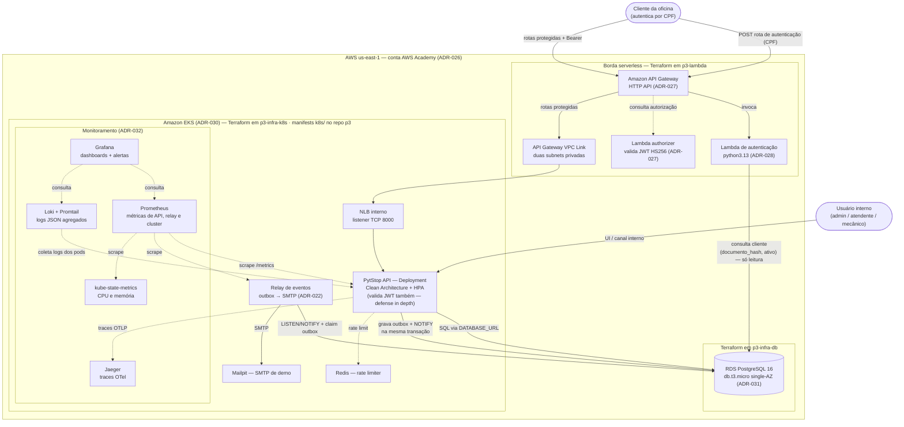
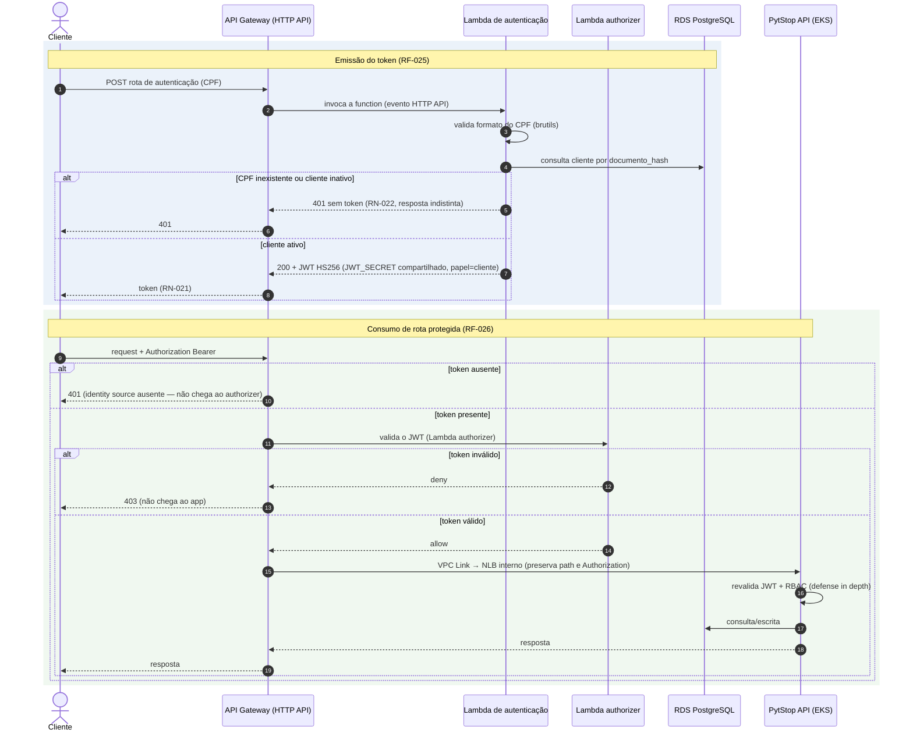
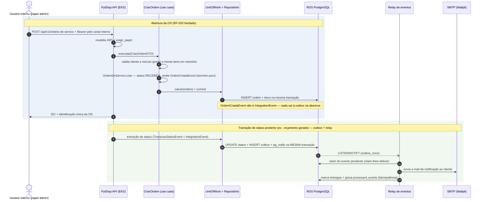
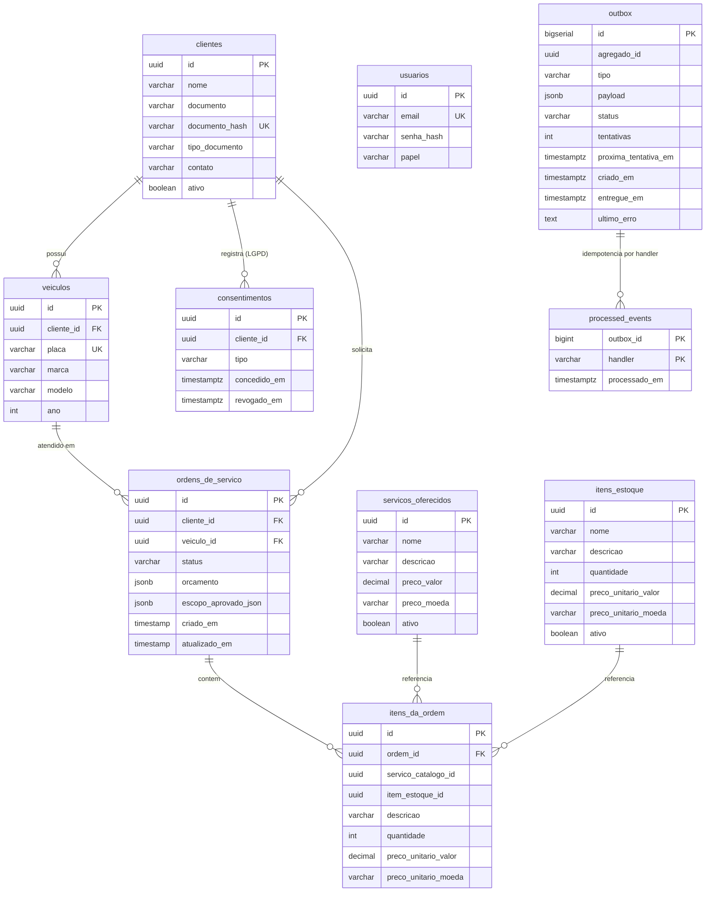

# Documento de Entrega — Tech Challenge Fase 3

> [↑ Raiz do projeto](https://github.com/fiap-postech-sw-architecture/postech-sw-arch-p3) · [↑ Entrega Fase 3](https://github.com/fiap-postech-sw-architecture/postech-sw-arch-p3/tree/main/docs/entrega/fase3)

> **Versão**: 1.3 — 10/09/2026 (revisão multi-perspectiva); 1.2 — 09/09/2026; 1.1 — 03/09/2026; 1.0 — 11/07/2026.

Documento de entrega da fase 3 do Tech Challenge da Pós-Graduação em Arquitetura de Software (FIAP). O conteúdo cobre os itens exigidos pelo enunciado da fase: identificação do grupo, links dos quatro repositórios (compartilhados com o avaliador), link do vídeo de demonstração, links das documentações, desenho da arquitetura e a confirmação do usuário `soat-architecture` como colaborador.

## Como ler este documento

Os repositórios são a fonte de verdade. A fase 3 segrega a solução em quatro repositórios com CI/CD próprio (mais um quinto de processo): aplicação em Kubernetes, function serverless de autenticação + API Gateway, Terraform do cluster EKS e Terraform do banco gerenciado RDS — papéis na seção 2. O desenho da arquitetura está em Mermaid, renderizado pelo GitHub, com fonte única na [RFC-003 §4](https://github.com/fiap-postech-sw-architecture/postech-sw-arch-p3/blob/main/docs/arquitetura/rfc/fase3/rfc-003-gateway-serverless-observabilidade.md), replicada na seção 7. As decisões estão nas ADRs 026–033 e na RFC-003. A rastreabilidade requisito → evidência está na seção 6, com o estado operacional registrado (deploy AWS — seção 2).

Siglas usadas: EKS (Amazon Elastic Kubernetes Service), RDS (Amazon Relational Database Service), NLB (Network Load Balancer), VPC Link (ligação privada do API Gateway à VPC), HPA (Horizontal Pod Autoscaler), JWT (JSON Web Token), RBAC (controle de acesso por papel), PII (dados pessoais identificáveis), ER (entidade-relacionamento), CI/CD (integração e entrega contínuas), PR (pull request), OS (ordem de serviço).

---

## 1. Identificação do grupo

| Campo | Valor |
|---|---|
| Nome do grupo | PytStop |
| Turma | 15SOAT — Pós-Graduação em Arquitetura de Software (FIAP) |

### Participantes

| Nome | RM | Discord |
|---|---|---|
| João Amaral | RM373448 | joao_13997 |
| Allan Aurélio | RM372116 | all66_ |
| Carlos Silva | RM374191 | carlossilva156 |
| Guilherme Sousa | RM373609 | romen0 |
| Nicolas Gerbi | RM372644 | sethiiz_gerbi |

## 2. Links dos repositórios

Repositórios **públicos** no GitHub (organização `fiap-postech-sw-architecture`) desde 03/09/2026, por orientação da FIAP: a correção automatizada do Tech Challenge exige repositórios públicos (Adendo (e) do [ADR-033](https://github.com/fiap-postech-sw-architecture/postech-sw-arch-p3/blob/main/docs/arquitetura/adr/fase3/033-cicd-multi-repo.md)). A visibilidade pública fornece minutos ilimitados do Actions e torna a proteção técnica da `main` disponível no plano free. O usuário `soat-architecture` recebeu convite de colaborador de leitura nos cinco repositórios em 09/09/2026 (aceite pendente na data desta versão); como os repositórios são públicos, a leitura já é possível. São os quatro repositórios exigidos pelo enunciado, mais um quinto de processo:

| Repositório | Papel na fase 3 | URL |
|---|---|---|
| `postech-sw-arch-p3` | Aplicação principal executando em Kubernetes (snapshot evoluído do p2 — Clean Architecture, manifests `k8s/`, monitoramento) | https://github.com/fiap-postech-sw-architecture/postech-sw-arch-p3 |
| `postech-sw-arch-p3-lambda` | Function serverless de autenticação por CPF + API Gateway + Lambda authorizer (código Python e Terraform da borda) | https://github.com/fiap-postech-sw-architecture/postech-sw-arch-p3-lambda |
| `postech-sw-arch-p3-infra-k8s` | Infraestrutura Kubernetes: Terraform do cluster Amazon EKS (node group, add-ons) | https://github.com/fiap-postech-sw-architecture/postech-sw-arch-p3-infra-k8s |
| `postech-sw-arch-p3-infra-db` | Infraestrutura do banco gerenciado: Terraform do Amazon RDS for PostgreSQL | https://github.com/fiap-postech-sw-architecture/postech-sw-arch-p3-infra-db |
| `postech-sw-arch-p3-docs` | Processo da fase (specs, planos, runbooks de operação AWS) — além dos 4 exigidos | https://github.com/fiap-postech-sw-architecture/postech-sw-arch-p3-docs |

Cada um dos quatro repositórios exigidos tem README com propósito, tecnologias, passos de execução e deploy, diagrama da arquitetura específica e pipelines `ci.yml` + `cd.yml` com deploy automático por branch: push em `homolog` e push em `main` disparam o deploy nos quatro. Com um único Learner Lab, os dois ambientes compartilham a infraestrutura. No app, os GitHub Environments `homologacao` e `producao` rotulam o deploy, mas overlay, cluster e namespace são os mesmos; na lambda, uma única function atende os stages `homolog` e `prod` da mesma HTTP API; nos repos de infra, push em `homolog` roda só `terraform plan` e o apply automático fica na `main` (Adendos (b) e (i) do [ADR-033](https://github.com/fiap-postech-sw-architecture/postech-sw-arch-p3/blob/main/docs/arquitetura/adr/fase3/033-cicd-multi-repo.md)). Dockerfiles: `Dockerfile` (API) e `ui/Dockerfile` no `p3`; nos outros três repositórios não se aplica (Terraform puro e function empacotada em zip pelo pipeline), como cada README registra.

A `main` dos cinco repositórios tem proteção técnica ativa desde 03/09/2026: PR obrigatório, sem commit direto (administradores incluídos) e, nos quatro repositórios com pipeline, checks de CI e Security obrigatórios. A verificação de 09/09/2026 com a conta administradora está no [Adendo (h) do ADR-033](https://github.com/fiap-postech-sw-architecture/postech-sw-arch-p3/blob/main/docs/arquitetura/adr/fase3/033-cicd-multi-repo.md#h-verificação-da-branch-protection-com-conta-administradora-2026-09-09).

### 2.1 Estado do CI/CD e gate local espelho

Os pipelines dos quatro repositórios **executam no GitHub Actions** desde 01/08/2026 — a cota da organização, esgotada em julho, foi renovada, e repositórios públicos têm minutos ilimitados. Runs verdes de referência: `p3` — [CI](https://github.com/fiap-postech-sw-architecture/postech-sw-arch-p3/actions/runs/30712167211), [Security](https://github.com/fiap-postech-sw-architecture/postech-sw-arch-p3/actions/runs/30712167219), [CD em `main` (produção)](https://github.com/fiap-postech-sw-architecture/postech-sw-arch-p3/actions/runs/30712167204), [CD em `homolog` (homologação)](https://github.com/fiap-postech-sw-architecture/postech-sw-arch-p3/actions/runs/30713618605), [full-test E2E](https://github.com/fiap-postech-sw-architecture/postech-sw-arch-p3/actions/runs/30712167236); [`p3-lambda` CI](https://github.com/fiap-postech-sw-architecture/postech-sw-arch-p3-lambda/actions/runs/30706272676); [`p3-infra-k8s` CI](https://github.com/fiap-postech-sw-architecture/postech-sw-arch-p3-infra-k8s/actions/runs/30706274897); [`p3-infra-db` CI](https://github.com/fiap-postech-sw-architecture/postech-sw-arch-p3-infra-db/actions/runs/30706273765).

O deploy automático na AWS foi comprovado em 07/09/2026, na ordem [RDS](https://github.com/fiap-postech-sw-architecture/postech-sw-arch-p3-infra-db/actions/runs/34177626665) → [EKS](https://github.com/fiap-postech-sw-architecture/postech-sw-arch-p3-infra-k8s/actions/runs/34178105568) → [aplicação](https://github.com/fiap-postech-sw-architecture/postech-sw-arch-p3/actions/runs/34178566291) → [Lambda/API Gateway](https://github.com/fiap-postech-sw-architecture/postech-sw-arch-p3-lambda/actions/runs/34179043515). Um run verde do CD fora de uma sessão do Academy não implica deploy: com a credencial vencida, o job registra o aviso "passos AWS pulados" no summary; os quatro runs acima fizeram o deploy real. O gate local espelho ([RFC-003 §6](https://github.com/fiap-postech-sw-architecture/postech-sw-arch-p3/blob/main/docs/arquitetura/rfc/fase3/rfc-003-gateway-serverless-observabilidade.md)) continua obrigatório antes de cada push — números do CI da `main` em 10/09/2026 ([run 34473374831](https://github.com/fiap-postech-sw-architecture/postech-sw-arch-p3/actions/runs/34473374831)):

| Repo | Gate local | Resultado |
|---|---|---|
| `p3` (app) | `make check` (lint, import-linter, mypy, bandit, testes) | Verde — **1.859 testes**, cobertura **95,9%** (gate ≥ 95%) |
| `p3` (app) | `make test-integ` (integração com PostgreSQL real) | Verde — **165 testes** |
| `p3` (app) | `make full-test` (E2E da jornada completa, stack compose) | Verde — 1 passed |
| `p3-lambda` | `make gate` (lint, mypy strict, bandit, testes, `terraform validate`, `terraform test`, `sam validate`) | Verde — **34 testes** unitários (+3 de integração com PostgreSQL real, só locais, via `make test-integ`), cobertura **100%** |
| `p3-infra-k8s` | `make gate` (`terraform fmt -check` + `validate` + `terraform test`) | Verde |
| `p3-infra-db` | `make gate` (`terraform fmt -check` + `validate`) | Verde |

Fora do gate de cobertura, por decisão registrada no `.coveragerc`: páginas e componentes da UI NiceGUI (cobertos pela jornada E2E do `make full-test`), os entrypoints `ui/__main__.py` e `relay/__main__.py` e os Protocols de repositório do domínio (sem lógica executável).

**Endpoint público do API Gateway** na sessão de 07/09/2026: `https://rs6lbkn7p4.execute-api.us-east-1.amazonaws.com/prod` (rotas `POST /auth` e `GET /api/v1/minhas-ordens`; a raiz não responde). A conta AWS Academy é temporária e a desmontagem está prevista até 14/09/2026; a evidência permanente são os runs acima e o runbook, que permite recriar o ambiente.

## 3. Link do vídeo

Vídeo de até 15 minutos demonstrando autenticação com CPF, execução da pipeline CI/CD, deploy automatizado, consumo das APIs protegidas, dashboard de monitoramento ao vivo e logs/traces em execução, conforme o enunciado.

| Recurso | URL |
|---|---|
| Vídeo de demonstração | [https://drive.google.com/file/d/1_HbHWFpPl8dwdIFpbTqX066VjIP-UCod/view](https://drive.google.com/file/d/1_HbHWFpPl8dwdIFpbTqX066VjIP-UCod/view) |

## 4. Links da documentação

Toda a documentação versionada está nos repositórios — a de arquitetura e requisitos no `p3` (pasta `docs/`), a de processo e operação no `p3-docs`.

### 4.1 Índice geral

| Recurso | URL |
|---|---|
| Pasta `docs/` do repositório principal (índice) | https://github.com/fiap-postech-sw-architecture/postech-sw-arch-p3/tree/main/docs |
| Requisitos da fase 3 (enunciado transcrito) | https://github.com/fiap-postech-sw-architecture/postech-sw-arch-p3/blob/main/docs/requisitos/fase3/desafio-tech-fase-3.md |
| Gap analysis — enunciado × código da fase 2 (RF-025–027, RNF-025–030, RN-021–022) | https://github.com/fiap-postech-sw-architecture/postech-sw-arch-p3/blob/main/docs/requisitos/fase3/gap-analysis-fase-3.md |
| README do `p3` (app: arquitetura, execução local, kind, EKS, CI/CD) | https://github.com/fiap-postech-sw-architecture/postech-sw-arch-p3/blob/main/README.md |
| README do `p3-lambda` (function, gateway, emulação SAM, deploy Terraform) | https://github.com/fiap-postech-sw-architecture/postech-sw-arch-p3-lambda/blob/main/README.md |
| README do `p3-infra-k8s` (Terraform do EKS) | https://github.com/fiap-postech-sw-architecture/postech-sw-arch-p3-infra-k8s/blob/main/README.md |
| README do `p3-infra-db` (Terraform do RDS) | https://github.com/fiap-postech-sw-architecture/postech-sw-arch-p3-infra-db/blob/main/README.md |
| README do `p3-docs` (processo da fase) | https://github.com/fiap-postech-sw-architecture/postech-sw-arch-p3-docs/blob/main/README.md |
| Runbook — sessão AWS Academy (Start Lab, credenciais rotativas, secrets) | https://github.com/fiap-postech-sw-architecture/postech-sw-arch-p3-docs/blob/main/docs/runbooks/aws-academy-setup.md |
| Runbook — próximas etapas (ordem de deploy multi-repo e fechamento) | https://github.com/fiap-postech-sw-architecture/postech-sw-arch-p3-docs/blob/main/docs/runbooks/proximas-etapas.md |
| Roteiro do vídeo de demonstração (blocos, comandos e tempos) | https://github.com/fiap-postech-sw-architecture/postech-sw-arch-p3/blob/main/docs/entrega/fase3/roteiro-video.md |

### 4.2 Decisões de arquitetura da fase 3

Critério adotado: decisões pontuais e permanentes (nuvem, banco, autenticação, gateway) viram ADRs — o formato que o projeto usa desde a fase 1 para decisões com alternativas e consequências. A RFC-003 é o desenho integrado que costura essas decisões (o enunciado cita RFC como exemplo de formato, e o conjunto ADR+RFC cobre as três decisões citadas: nuvem no ADR-026, banco no ADR-031, autenticação no ADR-028).

| Artefato | Decisão | URL |
|---|---|---|
| RFC-003 | API Gateway, autenticação serverless e observabilidade — topologia de nuvem, ER atualizado, diagrama de componentes, diagramas de sequência (autenticação por CPF e abertura de ordem de serviço) e fluxo de deploy multi-repo | https://github.com/fiap-postech-sw-architecture/postech-sw-arch-p3/blob/main/docs/arquitetura/rfc/fase3/rfc-003-gateway-serverless-observabilidade.md |
| ADR-026 | Cloud alvo da fase 3: AWS via conta AWS Academy Learner Lab | https://github.com/fiap-postech-sw-architecture/postech-sw-arch-p3/blob/main/docs/arquitetura/adr/fase3/026-cloud-alvo-aws-academy.md |
| ADR-027 | API Gateway da fase 3: Amazon API Gateway (HTTP API) | https://github.com/fiap-postech-sw-architecture/postech-sw-arch-p3/blob/main/docs/arquitetura/adr/fase3/027-api-gateway-aws.md |
| ADR-028 | Autenticação serverless de clientes por CPF (Lambda Python) | https://github.com/fiap-postech-sw-architecture/postech-sw-arch-p3/blob/main/docs/arquitetura/adr/fase3/028-autenticacao-serverless-cpf.md |
| ADR-029 | Emulação local da Lambda de autenticação (pytest + AWS SAM CLI) | https://github.com/fiap-postech-sw-architecture/postech-sw-arch-p3/blob/main/docs/arquitetura/adr/fase3/029-emulacao-local-lambda.md |
| ADR-030 | Amazon EKS como cluster Kubernetes da fase 3 | https://github.com/fiap-postech-sw-architecture/postech-sw-arch-p3/blob/main/docs/arquitetura/adr/fase3/030-cluster-kubernetes-eks.md |
| ADR-031 | Amazon RDS for PostgreSQL como banco gerenciado (justificativa formal do banco — RNF-027) | https://github.com/fiap-postech-sw-architecture/postech-sw-arch-p3/blob/main/docs/arquitetura/adr/fase3/031-banco-gerenciado-rds.md |
| ADR-032 | Stack de monitoramento Prometheus + Grafana + Loki | https://github.com/fiap-postech-sw-architecture/postech-sw-arch-p3/blob/main/docs/arquitetura/adr/fase3/032-monitoramento-grafana-loki.md |
| ADR-033 | CI/CD multi-repo com GitHub Actions (com adendo de limitações constatadas) | https://github.com/fiap-postech-sw-architecture/postech-sw-arch-p3/blob/main/docs/arquitetura/adr/fase3/033-cicd-multi-repo.md |

A documentação das fases anteriores (Event Storming, Domain Storytelling, Linguagem Ubíqua, modelo de domínio, ADRs 001–025, RFC-001/002) permanece válida e versionada nas mesmas pastas; o glossário e o mapa de contextos ganharam nesta fase o papel `cliente` e a leitura direta da tabela `clientes` pela Lambda — índice em [`docs/`](https://github.com/fiap-postech-sw-architecture/postech-sw-arch-p3/tree/main/docs).

**Collection da API (Swagger/Postman)**: [openapi-fase3.json](https://github.com/fiap-postech-sw-architecture/postech-sw-arch-p3/blob/main/docs/entrega/fase3/openapi-fase3.json) (37 rotas e 50 operações, exportado do FastAPI) e [postman-collection-fase3.json](https://github.com/fiap-postech-sw-architecture/postech-sw-arch-p3/blob/main/docs/entrega/fase3/postman-collection-fase3.json) (inclui a rota `POST /auth` da function serverless, com variável `gateway_url` para SAM local ou AWS). O Swagger interativo fica em `/docs` na API em execução.

## 5. Relatório de análise de vulnerabilidades

A postura de segurança da fase 3 herda a bateria da fase 2. Os scanners executáveis localmente foram rodados na HEAD de 11/07/2026 e registrados abaixo com data. Os scanners do CI — trivy, gitleaks e pip-audit no [`security.yml`](https://github.com/fiap-postech-sw-architecture/postech-sw-arch-p3/blob/main/.github/workflows/security.yml), bandit no [`ci.yml`](https://github.com/fiap-postech-sw-architecture/postech-sw-arch-p3/blob/main/.github/workflows/ci.yml), ZAP no [`full-test-ci.yml`](https://github.com/fiap-postech-sw-architecture/postech-sw-arch-p3/blob/main/.github/workflows/full-test-ci.yml) e o CodeQL default setup do GitHub (habilitado em 10/09/2026; antes, o CodeQL rodava só localmente via `make codeql-quality`) — rodam a cada push, em cada PR e no cron semanal; bateria de referência verde em 03/09/2026 ([run Security do PR #14](https://github.com/fiap-postech-sw-architecture/postech-sw-arch-p3/actions/runs/33763698992)).

### 5.1 Ferramentas e resultado na HEAD atual

Scans executados em **11–12/07/2026**, na árvore de trabalho da HEAD daquela data; bandit, pip-audit, trivy e gitleaks continuam rodando no CI a cada push (linhas correspondentes com a data da última execução):

| Ferramenta | Tipo | Alvo | Resultado |
|---|---|---|---|
| bandit (`make security`, p3) | SAST (Static Application Security Testing, análise estática) | `src/` + `ui/` + `relay/` + `scripts/` (15.187 LoC no CI de 10/09/2026) | **0 high / 0 medium** / 10 low (gate falha em high; os low são achados informativos revisados) |
| bandit (`make security`, p3-lambda) | SAST | `src/` da function | **0 issues** (nenhum achado em qualquer severidade) |
| pip-audit (`uv run --with pip-audit pip-audit`, p3) | SCA (Software Composition Analysis, vulnerabilidades em dependências) | ambiente resolvido do `uv.lock` | **0 vulnerabilidades conhecidas** (apenas o pacote local `pytstop 0.2.0` não auditável — não publicado no PyPI, esperado); reconfirmado no CI em 03/09/2026 após `cryptography` 50.0.1 ([PR #14](https://github.com/fiap-postech-sw-architecture/postech-sw-arch-p3/pull/14)) |
| OWASP ZAP (baseline) | DAST (Dynamic Application Security Testing, análise dinâmica) | API viva (stack compose dedicada) | Executado localmente em 11/07/2026 via `make dast`: FAIL 0 · WARN 0 · PASS 65 em 58 URLs (2 regras IGNORE do baseline; sumário persistido em [evidencias/zap-baseline-2026-07-11.txt](https://github.com/fiap-postech-sw-architecture/postech-sw-arch-p3/blob/main/docs/entrega/fase3/evidencias/zap-baseline-2026-07-11.txt)) |
| CodeQL (suíte de qualidade) | SAST semântico | código Python | Executado localmente em 11/07/2026 via `make codeql-quality`: 0 findings ativos (72 brutos, todos tratados por config/supressão justificada; 1 constante morta removida e 2 falsos positivos suprimidos com razão nesta rodada) |
| SonarQube (community, self-hosted) | Análise estática/qualidade — scan manual de fechamento (não é gate de CI por decisão, [TD-010/ADR-011](https://github.com/fiap-postech-sw-architecture/postech-sw-arch-p3/blob/main/docs/arquitetura/adr/011-pipeline-seguranca-analise-estatica.md)) | `src/` (7.518 LoC) + coverage | Executado localmente em 11/07/2026: Quality Gate Passed — 0 bugs, 0 vulnerabilities, ratings A/A/A, 0% duplicação; 0 security hotspots, 0 code smells (os 143 do scan inicial foram zerados no PR #6); cobertura 94,6% no denominador do Sonar (o gate real media 96,4% na mesma data — divergência de universo documentada no `sonar-project.properties`); [captura do Quality Gate, aba New Code](https://github.com/fiap-postech-sw-architecture/postech-sw-arch-p3/blob/main/docs/entrega/fase3/evidencias/sonarqube-quality-gate-fase3.png) |
| SBOM (CycloneDX, `make sbom`) | Inventário de dependências (Software Bill of Materials) | dependências de runtime do `uv.lock` | Gerado e validado a cada CI (job `sbom`): 48 componentes inventariados |
| trivy · gitleaks (`security.yml`) | SCA de imagem / segredos | imagem Docker (`pytstop:ci-scan`), árvore git | **Verdes no CI em 03/09/2026** ([run](https://github.com/fiap-postech-sw-architecture/postech-sw-arch-p3/actions/runs/33763698992)): trivy 0 HIGH/CRITICAL após a remoção do `pip` das imagens de runtime ([PR #14](https://github.com/fiap-postech-sw-architecture/postech-sw-arch-p3/pull/14) — o pip da base `python:3.14-slim` trazia msgpack e setuptools vendorizados com CVE) e gitleaks 0 achados; gitleaks também rodado localmente sobre o histórico completo dos cinco repositórios antes de torná-los públicos (únicos achados: segredos de demonstração já públicos desde a fase 2) |

Observação sobre o pip-audit: o `pip-audit` não é dependência do projeto — a execução usa `uv run --with pip-audit pip-audit`, que o instala efemeramente e audita o ambiente resolvido do lockfile.

### 5.2 Postura de segurança da fase 3

Além dos scans, as decisões de segurança específicas da fase:

- **Anti-enumeração de CPF na Lambda** (RN-022): CPF inexistente e cliente inativo recebem a mesma resposta `401`, sem distinguir os casos — teste dedicado na suíte da function ([ADR-028](https://github.com/fiap-postech-sw-architecture/postech-sw-arch-p3/blob/main/docs/arquitetura/adr/fase3/028-autenticacao-serverless-cpf.md));
- **Defense in depth na borda** ([ADR-027](https://github.com/fiap-postech-sw-architecture/postech-sw-arch-p3/blob/main/docs/arquitetura/adr/fase3/027-api-gateway-aws.md)): o Lambda authorizer valida o JWT no gateway **e** o app revalida assinatura + RBAC — token inválido não chega ao app; token válido ainda passa pelo controle de papel;
- **Busca cega por CPF**: a function consulta o cliente por `documento_hash` (HMAC-SHA256 derivado da `ENCRYPTION_KEY`), a mesma proteção de PII do app — o CPF em claro não vai ao banco nem aos logs (scrub de PII herdado, [ADR-028](https://github.com/fiap-postech-sw-architecture/postech-sw-arch-p3/blob/main/docs/arquitetura/adr/fase3/028-autenticacao-serverless-cpf.md));
- **Segredos**: `JWT_SECRET`/`ENCRYPTION_KEY` compartilhados entre app e function via GitHub Secrets nos pipelines e variáveis Terraform no deploy; credenciais AWS Academy rotativas regravadas a cada sessão pelo runbook ([`aws-academy-setup.md`](https://github.com/fiap-postech-sw-architecture/postech-sw-arch-p3-docs/blob/main/docs/runbooks/aws-academy-setup.md)) — nada de segredo de longa duração em código;
- **Herança da fase 2** intacta no snapshot: webhook de orçamento assinado por HMAC, scrubber de PII nos logs, revogação de refresh token, rate limiter com storage compartilhado, mensagens de erro sem eco de dado pessoal.

### 5.3 Documentos completos

| Documento | URL |
|---|---|
| Scans de fechamento da fase 3 (bateria de 2026-07-11, resultados da seção 5.1) | https://github.com/fiap-postech-sw-architecture/postech-sw-arch-p3/blob/main/docs/seguranca/scan-fase-3.md |
| Scans de fechamento da fase 2 (baseline herdada pelo snapshot) | https://github.com/fiap-postech-sw-architecture/postech-sw-arch-p3/blob/main/docs/seguranca/scan-fase-2.md |
| Relatório de Vulnerabilidades (baseline OWASP API Top 10, fase 1) | https://github.com/fiap-postech-sw-architecture/postech-sw-arch-p3/blob/main/docs/seguranca/relatorio-vulnerabilidades.md |
| Plano de segurança (camadas e ferramentas) | https://github.com/fiap-postech-sw-architecture/postech-sw-arch-p3/blob/main/docs/seguranca/plano-seguranca.md |

## 6. Rastreabilidade requisito → evidência

Cada requisito obrigatório da fase 3 ([gap analysis](https://github.com/fiap-postech-sw-architecture/postech-sw-arch-p3/blob/main/docs/requisitos/fase3/gap-analysis-fase-3.md)) está mapeado para onde foi implementado/decidido e para a evidência de verificação. Os números do gate local estão na tabela da seção 2.1 (CI da `main` em 10/09/2026).

### 6.1 Requisitos funcionais

| ID | Requisito | Implementação / decisão | Evidência de verificação |
|---|---|---|---|
| RF-025 | Function serverless: valida CPF, consulta existência e status do cliente, emite JWT | Handler em [`postech-sw-arch-p3-lambda/src`](https://github.com/fiap-postech-sw-architecture/postech-sw-arch-p3-lambda) — validação com brutils, busca por `documento_hash`, emissão HS256 com claims compatíveis com o app ([ADR-028](https://github.com/fiap-postech-sw-architecture/postech-sw-arch-p3/blob/main/docs/arquitetura/adr/fase3/028-autenticacao-serverless-cpf.md), emulação local [ADR-029](https://github.com/fiap-postech-sw-architecture/postech-sw-arch-p3/blob/main/docs/arquitetura/adr/fase3/029-emulacao-local-lambda.md)) | Gate local verde: 34 testes unitários no gate (incl. teste de paridade do hash/claims com o app) + 3 testes de integração com PostgreSQL real (testcontainers, alvo `make test-integ` à parte), cobertura 100%; `sam local` valida o runtime real — demonstração integrada executada em 11/07/2026 com códigos HTTP reais (seção 7.5) |
| RF-026 | API Gateway protegendo rotas sensíveis, com controle e roteamento | HTTP API + rota pública `POST /auth` + Lambda authorizer nas rotas protegidas, Terraform em [`p3-lambda/terraform`](https://github.com/fiap-postech-sw-architecture/postech-sw-arch-p3-lambda) ([ADR-027](https://github.com/fiap-postech-sw-architecture/postech-sw-arch-p3/blob/main/docs/arquitetura/adr/fase3/027-api-gateway-aws.md)); app revalida JWT + RBAC (defense in depth) | [CD AWS verde](https://github.com/fiap-postech-sw-architecture/postech-sw-arch-p3-lambda/actions/runs/34179043515); smoke do grupo em 07/09/2026: `POST /auth` = 200, `GET /api/v1/minhas-ordens` = 200 com token de cliente e 401 sem token; integração privada Gateway → VPC Link → NLB (Network Load Balancer) interno → EKS validada; testes: `terraform/tests/vpc_link.tftest.hcl` (lambda), `tests/unitarios/ordem_servico/test_router_cliente.py` e `tests/integracao/ordem_servico/test_consulta_ordens_cliente.py` (app) |
| RF-027 | Dashboards: volume diário de OS, tempo médio por status, erros de integrações | Dashboards **PytStop — Negócio** e **PytStop — Plataforma** provisionados como código em [`k8s/grafana.yaml`](https://github.com/fiap-postech-sw-architecture/postech-sw-arch-p3/blob/main/k8s/grafana.yaml); métricas de negócio instrumentadas na API (`src/compartilhado/infraestrutura/metrics.py` — OS criadas, duração por status, latência HTTP) ([ADR-032](https://github.com/fiap-postech-sw-architecture/postech-sw-arch-p3/blob/main/docs/arquitetura/adr/fase3/032-monitoramento-grafana-loki.md)) | Painéis `Volume de OS criadas (por hora)`, `Tempo médio de OS por status` e `Erros de integração (outbox, por hora)` no dashboard de negócio; `make cd-local` sobe a stack completa no kind com os dashboards prontos — mesmos manifests do EKS; roteiro do vídeo prevê a demonstração ao vivo; testes das métricas dentro do `make check` |

### 6.2 Requisitos não funcionais

| ID | Requisito | Implementação / decisão | Evidência de verificação |
|---|---|---|---|
| RNF-025 | 4 repositórios com CI/CD e deploy automático (homolog/produção); main protegida; PRs obrigatórios | Repos `p3`, `p3-lambda`, `p3-infra-k8s`, `p3-infra-db`, cada um com `ci.yml` + `cd.yml`; app/lambda: `homolog` e `main` disparam o deploy, sobre infraestrutura compartilhada (Adendo (i)); infra: `homolog` = `terraform plan`, apply só na `main` (Adendo (b)). Branch protection técnica ativa na `main` dos cinco repositórios desde 03/09/2026 — PR obrigatório, administradores incluídos, checks obrigatórios onde há pipeline (Adendos (e) e (h) do [ADR-033](https://github.com/fiap-postech-sw-architecture/postech-sw-arch-p3/blob/main/docs/arquitetura/adr/fase3/033-cicd-multi-repo.md)) | Deploy automático de produção comprovado nos quatro runs da seção 2.1; proteção da `main` verificável em *Settings → Branches* de cada repositório (a API de proteção exige permissão `admin`; o campo `protected` da branch é público) |
| RNF-026 | Terraform provisionando API Gateway, Function, banco gerenciado e cluster K8s com escalabilidade | EKS + node group em [`p3-infra-k8s`](https://github.com/fiap-postech-sw-architecture/postech-sw-arch-p3-infra-k8s) ([ADR-030](https://github.com/fiap-postech-sw-architecture/postech-sw-arch-p3/blob/main/docs/arquitetura/adr/fase3/030-cluster-kubernetes-eks.md)); RDS em [`p3-infra-db`](https://github.com/fiap-postech-sw-architecture/postech-sw-arch-p3-infra-db) ([ADR-031](https://github.com/fiap-postech-sw-architecture/postech-sw-arch-p3/blob/main/docs/arquitetura/adr/fase3/031-banco-gerenciado-rds.md)); gateway + functions em [`p3-lambda/terraform`](https://github.com/fiap-postech-sw-architecture/postech-sw-arch-p3-lambda); HPA (Horizontal Pod Autoscaler) herdado em [`k8s/hpa.yaml`](https://github.com/fiap-postech-sw-architecture/postech-sw-arch-p3/blob/main/k8s/hpa.yaml) | Applies automáticos verdes (runs na seção 2.1; capturas no Anexo B): RDS PostgreSQL 16.13 `available`; EKS 1.34 e node group `ACTIVE`; aplicação com 2 réplicas; Lambdas `Active`; states S3 versionados |
| RNF-027 | Banco gerenciado + justificativa formal + diagrama ER | RDS PostgreSQL 16 via Terraform ([`p3-infra-db`](https://github.com/fiap-postech-sw-architecture/postech-sw-arch-p3-infra-db)); justificativa formal no [ADR-031](https://github.com/fiap-postech-sw-architecture/postech-sw-arch-p3/blob/main/docs/arquitetura/adr/fase3/031-banco-gerenciado-rds.md); ER atualizado com explicação dos relacionamentos na [RFC-003 §2](https://github.com/fiap-postech-sw-architecture/postech-sw-arch-p3/blob/main/docs/arquitetura/rfc/fase3/rfc-003-gateway-serverless-observabilidade.md), replicado na seção 7.4 | Apply automático verde ([CD do RDS, 07/09/2026](https://github.com/fiap-postech-sw-architecture/postech-sw-arch-p3-infra-db/actions/runs/34177626665)): PostgreSQL 16.13 `available`, state remoto versionado; mesmo engine/versão do PostgreSQL local (paridade das 8+ migrações Alembic); ADR e RFC versionados |
| RNF-028 | Monitorar latência das APIs, CPU/memória do K8s, healthchecks/uptime, alertas de falha no processamento de OS | Prometheus + kube-state-metrics + cAdvisor (recursos), histograma de latência por rota na API, painéis de uptime/health e **5 regras de alerta provisionadas** (CPU > 80%, p95 > 300 ms, 5xx > 1%, `outbox_dead > 0` para falha no processamento de OS e API fora do ar) — [`k8s/`](https://github.com/fiap-postech-sw-architecture/postech-sw-arch-p3/tree/main/k8s) ([ADR-032](https://github.com/fiap-postech-sw-architecture/postech-sw-arch-p3/blob/main/docs/arquitetura/adr/fase3/032-monitoramento-grafana-loki.md)) | Stack verificada no kind via `make cd-local` e aplicada no EKS pelo [CD de 07/09/2026](https://github.com/fiap-postech-sw-architecture/postech-sw-arch-p3/actions/runs/34178566291) (mesmos manifests); alertas visíveis em *Alerting → Alert rules* no Grafana; roteiro do vídeo prevê a demonstração ao vivo |
| RNF-029 | Logs estruturados JSON com correlação entre requisições | structlog JSON com scrub de PII (herdado); middleware passa a **aceitar o `X-Request-ID` externo** vindo do gateway (`src/compartilhado/interfaces/middleware.py`), gerando UUID só na ausência; agregação com Loki + Promtail e consulta por `request_id` no Grafana ([RFC-003 §7](https://github.com/fiap-postech-sw-architecture/postech-sw-arch-p3/blob/main/docs/arquitetura/rfc/fase3/rfc-003-gateway-serverless-observabilidade.md)) | Testes do middleware no `make check`; consulta LogQL documentada no [`k8s/README.md`](https://github.com/fiap-postech-sw-architecture/postech-sw-arch-p3/blob/main/k8s/README.md); bloco 7 do roteiro do vídeo |
| RNF-030 | Documentação arquitetural completa: componentes (visão de nuvem), sequência (autenticação e abertura de OS), RFCs, ADRs, justificativa do banco + ER | [RFC-003](https://github.com/fiap-postech-sw-architecture/postech-sw-arch-p3/blob/main/docs/arquitetura/rfc/fase3/rfc-003-gateway-serverless-observabilidade.md) (§4 componentes com nuvem/APIs/banco/monitoramento; §5 sequências de autenticação por CPF e abertura de OS; §2 ER) + ADRs 026–033 (seção 4.2) | Documentos versionados e renderizados pelo GitHub (Mermaid); componentes, sequências e ER replicados na seção 7; diagrama de componentes nos READMEs dos 4 repos |

### 6.3 Regras de negócio

| ID | Regra | Implementação / decisão | Evidência de verificação |
|---|---|---|---|
| RN-021 | O token emitido pela function é aceito pelas APIs protegidas | Dois emissores com públicos disjuntos (app = usuários internos; lambda = clientes), **mesmo segredo, mesmos claims, validador único** — o app valida o JWT da lambda sem mudança ([ADR-028](https://github.com/fiap-postech-sw-architecture/postech-sw-arch-p3/blob/main/docs/arquitetura/adr/fase3/028-autenticacao-serverless-cpf.md)) | Teste de paridade de claims/assinatura na suíte da lambda (34 testes, cobertura 100%); rota real `GET /api/v1/minhas-ordens` responde 200 ao token de cliente e 404 para ordem de outro cliente (`tests/unitarios/ordem_servico/test_router_cliente.py`); demonstração integrada local (lambda SAM + app no kind) no README do `p3-lambda` e evidência executada na seção 7.5 |
| RN-022 | CPF inexistente ou cliente inativo não recebe token | Consulta de existência + status (`ativo`) no banco antes da emissão; `401` indistinto nos dois casos (anti-enumeração) — [ADR-028](https://github.com/fiap-postech-sw-architecture/postech-sw-arch-p3/blob/main/docs/arquitetura/adr/fase3/028-autenticacao-serverless-cpf.md) | Testes unitários e de integração dedicados na suíte da lambda (cliente inexistente, inativo e ativo, com PostgreSQL real) |

**Clean Code / Clean Architecture** (herança verificada): os contratos de camadas do import-linter continuam como gate (`make lint-arch`, dentro do `make check`), e a cobertura sustentou-se acima do gate na fase 3 (95,9% na `main` de 10/09/2026) — a lambda nasceu com 100% para não rebaixar o padrão (risco mapeado no [gap analysis §5](https://github.com/fiap-postech-sw-architecture/postech-sw-arch-p3/blob/main/docs/requisitos/fase3/gap-analysis-fase-3.md)).

## 7. Desenho da arquitetura

Os diagramas da RFC-003 replicados aqui: componentes (§4), sequências de autenticação por CPF e de abertura de ordem de serviço (§5) e o modelo de dados (§2). A RFC é a fonte única; esta seção espelha os blocos Mermaid.

### 7.1 Diagrama de componentes

Visão de nuvem integrada: borda serverless (API Gateway, VPC Link e Lambdas), cluster EKS com o NLB interno, banco gerenciado RDS e monitoramento, com a marcação de qual repositório provisiona o quê.

<!-- fonte: RFC-003 §4 — manter em sincronia -->

### 7.2 Sequência: autenticação por CPF

<!-- fonte: RFC-003 §5 — manter em sincronia -->

### 7.3 Sequência: abertura de ordem de serviço

<!-- fonte: RFC-003 §5 — manter em sincronia -->

### 7.4 Modelo de dados (ER)

Relacionamentos explicados na [RFC-003 §2](https://github.com/fiap-postech-sw-architecture/postech-sw-arch-p3/blob/main/docs/arquitetura/rfc/fase3/rfc-003-gateway-serverless-observabilidade.md); justificativa formal do banco no ADR-031.

<!-- fonte: RFC-003 §2 — manter em sincronia -->

### 7.5 Paridade local (kind + SAM)

Evidências executadas em 11/07/2026 (demonstração integrada completa): `POST /auth` no gateway emulado → 200 com JWT (CPF semeado), 400 (malformado), 401 (inexistente e inativo, indistintos); rota protegida com Lambda authorizer emulado → 401 sem token, 403 com token adulterado (o authorizer só devolve permitir ou negar, e o API Gateway converte a negação em 403), handler alcançado com token válido; token da lambda contra a API no kind → 403 "Papel nao autorizado" (assinatura e claims aceitos — a negação é do RBAC, prova do RN-021), contra 401 "Token invalido" do token adulterado. Collection Postman executada via newman: 28 assertions, 0 falhas (login, ciclo completo de OS até em_execucao, `/auth` da lambda).

O desenvolvimento é **100% local** ([ADR-026](https://github.com/fiap-postech-sw-architecture/postech-sw-arch-p3/blob/main/docs/arquitetura/adr/fase3/026-cloud-alvo-aws-academy.md)): a AWS entra só para validação e demo, dentro de sessões do Learner Lab. No espelho local, a caixa `borda` é substituída pelo `sam local start-api` (gateway e authorizer emulados, com o runtime real `python3.13` em container — [ADR-029](https://github.com/fiap-postech-sw-architecture/postech-sw-arch-p3/blob/main/docs/arquitetura/adr/fase3/029-emulacao-local-lambda.md)) e o EKS pelo **kind** (`make cd-local`). Mesmos manifests base, mesmo PostgreSQL 16, mesma stack de monitoramento. A única lacuna de transporte é o trecho VPC Link → NLB interno → app, validado na AWS. Tabela componente a componente na [RFC-003 §3](https://github.com/fiap-postech-sw-architecture/postech-sw-arch-p3/blob/main/docs/arquitetura/rfc/fase3/rfc-003-gateway-serverless-observabilidade.md).

## 8. Conteúdo do PDF de submissão

O PDF entregue no portal do aluno é gerado a partir deste documento pelo [`scripts/build-entrega-pdf.sh`](https://github.com/fiap-postech-sw-architecture/postech-sw-arch-p3/blob/main/scripts/build-entrega-pdf.sh), que acrescenta uma capa ABNT no início, renderiza os diagramas Mermaid como imagens e converte os links relativos em absolutos. A seção 9 (Pendências) é um checklist interno da equipe e **não** é incluída no PDF submetido.

O PDF contém os quatro itens exigidos pelo enunciado:

1. **Links dos 4 repositórios** (seção 2): app, lambda, infra-k8s, infra-db; a mesma tabela lista, à parte, o repositório de processo, que não é exigido.
2. **Link do vídeo** de até 15 minutos (seção 3).
3. **Links das documentações** (seção 4): enunciado transcrito, gap analysis, RFC-003, ADRs 026–033, READMEs dos cinco repositórios e runbooks de operação.
4. **Confirmação do usuário `soat-architecture`** adicionado a todos os repositórios (seção 2).

Mais os anexos de evidência: os diagramas (seção 7), a rastreabilidade requisito → evidência (seção 6), o relatório de análise de vulnerabilidades (seção 5) e, ao final, o Anexo A (scans de segurança da fase 3) e o Anexo B (evidências visuais: runs do deploy automático na AWS, SonarQube e ZAP).

## 9. Pendências para fechar a entrega

Ações manuais que permanecem com a equipe (nenhuma bloqueia a navegação dos repositórios). Os planos de desbloqueio detalhados estão versionados no repo [`postech-sw-arch-p3-docs`](https://github.com/fiap-postech-sw-architecture/postech-sw-arch-p3-docs) — [orquestrador](https://github.com/fiap-postech-sw-architecture/postech-sw-arch-p3-docs/blob/main/docs/superpowers/plans/2026-07-11-orquestrador-desbloqueio.md) + planos 1–3:

| # | Pendência | Onde |
|---|---|---|
| 1 | Gravar o vídeo da fase 3 seguindo o [roteiro](https://github.com/fiap-postech-sw-architecture/postech-sw-arch-p3/blob/main/docs/entrega/fase3/roteiro-video.md), publicar (YouTube/Vimeo, não listado) e trocar o link da seção 3 (hoje o vídeo da fase 2, por decisão do grupo em 10/09/2026); regerar o PDF depois | `docs/entrega/fase3/entrega-fase-3.md` |
| 2 | Aceite do convite de `soat-architecture` (leitura), enviado nos cinco repositórios em 09/09/2026; conferir com `gh api repos/<org>/<repo>/collaborators/soat-architecture` (204 = aceito) | GitHub → Settings → Collaborators |
| 3 | ~~Ativar a proteção técnica da `main`~~: ativa nos cinco repositórios desde 03/09/2026, verificada com conta `admin` em 09/09/2026 (Adendo (h) do ADR-033) | GitHub → Settings → Branches de cada repositório |
| 4 | ~~Executar o deploy AWS de ponta a ponta~~: concluído em 07/09/2026, com os quatro runs verdes da seção 2 e smoke externo `200/200/401` | Runbook [`aws-academy-setup.md`](https://github.com/fiap-postech-sw-architecture/postech-sw-arch-p3-docs/blob/main/docs/runbooks/aws-academy-setup.md) |
| 5 | Mergear as alterações finais, preencher o link do vídeo, regenerar o PDF e submeter no portal do aluno | [Plano de desbloqueio 3](https://github.com/fiap-postech-sw-architecture/postech-sw-arch-p3-docs/blob/main/docs/superpowers/plans/2026-07-11-desbloqueio-3-entrega-final.md) |
| 6 | Desmontar a infraestrutura AWS ao final da gravação — Lambda/Gateway/VPC Link → app/NLB → EKS → RDS — e encerrar o lab (End Lab): EKS, NLB e VPC Link não têm pausa sem cobrança; prazo interno de sete dias a partir de 07/09/2026 | Runbook [`deploy-manual-aws.md`](https://github.com/fiap-postech-sw-architecture/postech-sw-arch-p3-docs/blob/main/docs/runbooks/deploy-manual-aws.md) |

---

> [↑ Raiz do projeto](https://github.com/fiap-postech-sw-architecture/postech-sw-arch-p3) · [↑ Entrega Fase 3](https://github.com/fiap-postech-sw-architecture/postech-sw-arch-p3/tree/main/docs/entrega/fase3)
