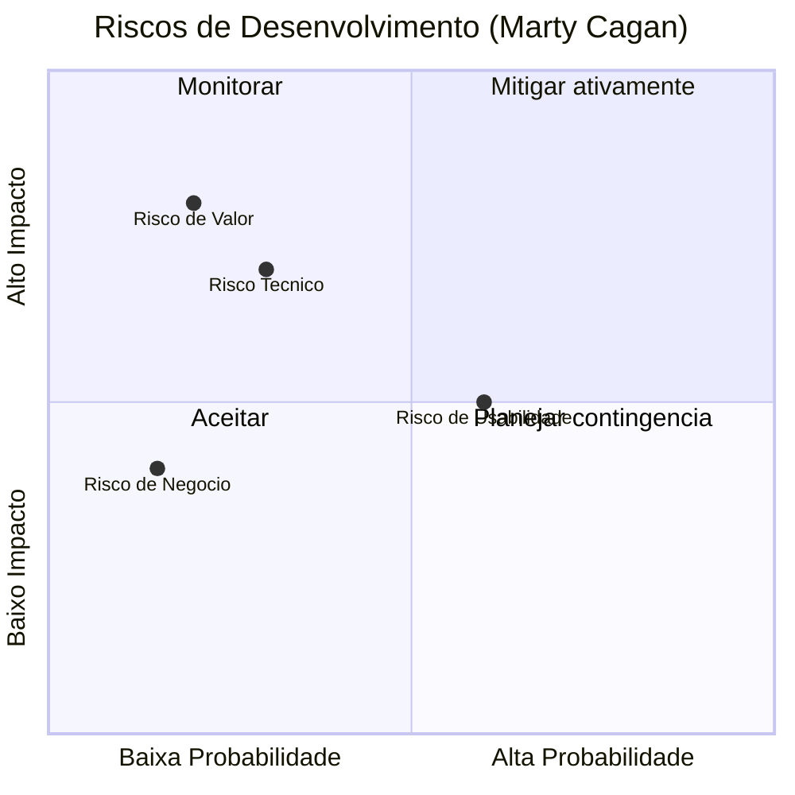
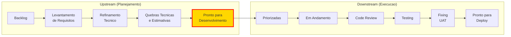
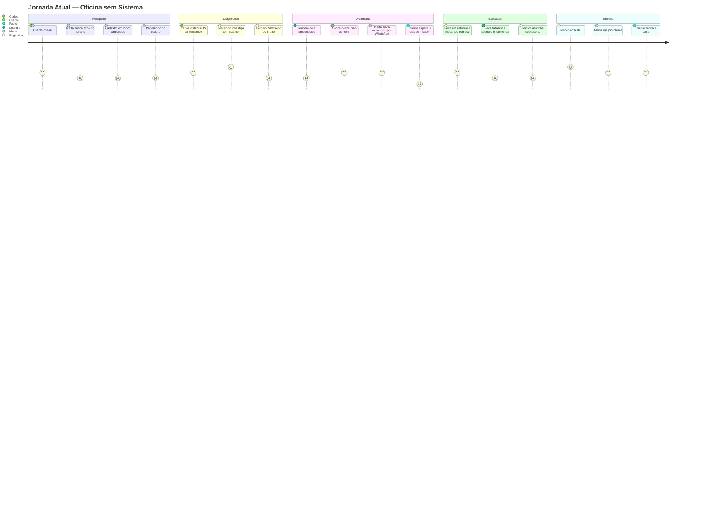
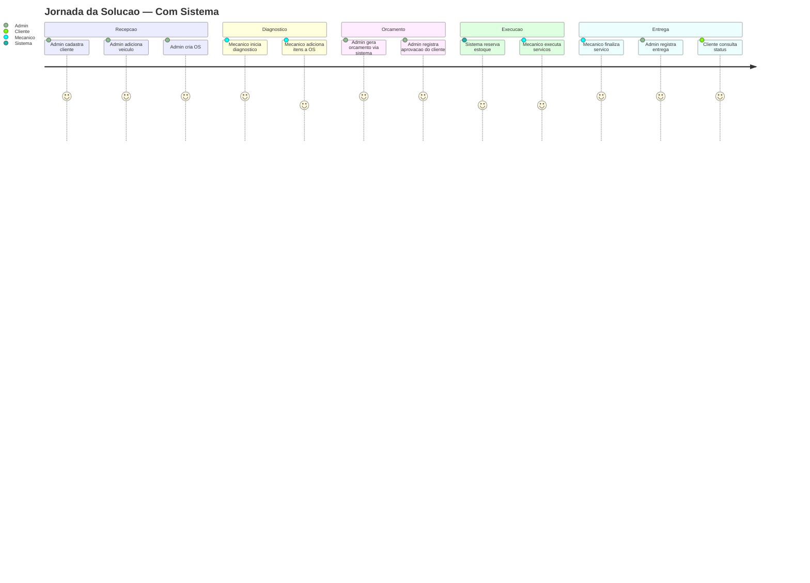

# Levantamento de Requisitos — Oficina Mecânica

> [↑ Raiz do projeto](../../README.md) · [↑ Requisitos](README.md)

> **Versão**: 1.0 — Fase 1 MVP.

> Levantamento de requisitos gerado com assistência de IA (Claude) e revisado pela equipe PytStop.
> Segue a metodologia de Marty Cagan aplicada ao domínio da oficina mecânica.
> Os especialistas de domínio são fictícios — ver [perfis completos](../arquitetura/domain-storytelling/especialistas-de-dominio.md).

---

## 1. Análise de Riscos (Marty Cagan)

Marty Cagan identifica 4 riscos no desenvolvimento de produtos digitais (CAGAN, 2017). Aplicamos cada um ao projeto da oficina mecânica:

| Risco | Aplicação à Oficina | Mitigação | Status |
|---|---|---|---|
| **Valor** | O sistema resolve dores reais? Seu Carlos: "saber onde cada carro está". Dona Marta: "achar informação — perco quinze minutos". Fabio: "três dias sem saber de nada" | Entrevistas com 5 especialistas validaram as dores. Domain Storytelling confirmou os fluxos | Mitigado |
| **Negócio** | Agrega ao objetivo da oficina? Viável financeiramente? Risco legal? | Back-end MVP sem front-end. LGPD considerada (RF-011 encriptação PII, RF-015 endpoints Art. 18). Stack open source sem custo de licenciamento | Mitigado |
| **Usabilidade** | Solução será adotada? Experiência intuitiva? | MVP é API-only (sem UI). Consulta pública simples (placa + documento). Swagger para admins | Risco aceito (sem UI no MVP) |
| **Técnico** | Time tem recursos? Stack viável? | Python 3.12 + FastAPI + SQLAlchemy 2.0 + PostgreSQL. Spike de 4h para imperative mapping ([ADR-006](../arquitetura/adr/006-mapeamento-imperativo-sqlalchemy.md)) | Mitigado via ADRs |

> O quadrante acima é uma adaptação para o projeto. A Fig 1 da Aula 07 apresenta os 4 riscos em formato radial.

---

## 2. Upstream e Downstream

O desenvolvimento de software se divide em duas fases (FERREIRA, 2023):

- **Upstream** (planejamento): mapear, explorar, validar e transformar ideias em tarefas de desenvolvimento
- **Downstream** (execução): do início do desenvolvimento até o deploy para o usuário final

O nó "Pronto para Desenvolvimento" está destacado — é a posição atual do projeto.

Negligenciar o Upstream causa:
- Não compreensão dos requisitos
- Imprevisibilidades no desenvolvimento
- Surgimento de bugs e débitos técnicos

---

## 3. Personas

Três personas do sistema, enriquecidas com dados dos [especialistas de domínio](../arquitetura/domain-storytelling/especialistas-de-dominio.md). Outros papéis da oficina (Orçamentista, Comprador) são absorvidos pelo Admin no MVP.

| Persona (sistema) | Representantes na Oficina | Necessidades | Frustrações atuais |
|---|---|---|---|
| Admin | Seu Carlos (dono), Dona Marta (recepção), Leandro (orçamentos) | Visão de todas as OS, controle de estoque, métricas, orçamentos | Papéis perdidos, quadro desatualizado, planilha manual |
| Mecânico | Reginaldo | Saber quais OS atender, histórico do veículo | Começar do zero sem histórico |
| Cliente | Fábio | Acompanhar status, saber quando está pronto | 3 dias sem comunicação |

> Na Jornada Atual (Seção 4) usamos os nomes reais dos especialistas para representar o mundo pré-sistema. Na Jornada da Solução (Seção 6) usamos os papéis do sistema (Admin, Mecanico, Cliente, Sistema).

---

## 4. Problema e Jornada Atual

A oficina opera com anotações manuais, cadernos carbonados, quadro de papelzinhos na parede e WhatsApp. Isso gera: perda de informação, dificuldade de rastreamento, falta de visibilidade para o cliente e controle de estoque inexistente.

### Pontos de dor

Mapeados para os hotspots do [Event Storming](../arquitetura/event-storming/workshop-event-storming.md) (Passo 3):

| # | Ponto de dor | Levantado por |
|---|---|---|
| H1 | Carro abandonado — cliente não responde após orçamento (timeout indefinido) | Seu Carlos |
| H2 | Achar informação — consulta de status lenta e manual | Dona Marta |
| H3 | Histórico do veículo inexistente entre OS diferentes | Reginaldo |
| H4 | Controle de chegada de peças falho (esquece de marcar) | Leandro |
| H5 | Falta de comunicação proativa ao cliente | Fábio |
| H6 | Limite de autonomia para serviços adicionais (~15%) não formalizado — escopo futuro | Seu Carlos |

---

## 5. Objetivo da Solução

Digitalizar o ciclo da Ordem de Serviço com 3 objetivos mensuráveis:

1. **Eliminar papéis e planilhas** — 100% digital (resolve H1, H2, H3, H4)
2. **Consulta pública de status** — cliente acompanha sem ligar (resolve H5)
3. **Estoque com reserva atômica** — evitar falta de peças durante execução (resolve H4)

Ver detalhes no [PRD](prd.md).

---

## 6. Jornada da Solução

A tabela abaixo segue a estrutura da Aula 07 (Figura 3): 4 atributos por etapa, transposta para formato vertical (uma linha por etapa) para legibilidade em Markdown.

A numeração indica a sequência mais comum, não uma ordem obrigatória.

| # | Etapa | Observações | Persona | Sistema |
|---|---|---|---|---|
| 01 | Cadastrar cliente com CPF/CNPJ | Validação algorítmica, duplicata rejeitada | Admin | API REST |
| 02 | Adicionar veiculo ao cliente | Placa única entre todos os clientes. Veículo é entidade filha do agregado Cliente | Admin | API REST |
| 03 | Criar OS associando cliente e veiculo | Status inicial: Recebida. Verifica existência via ClientePort | Admin | API REST |
| 04 | Iniciar diagnostico | Status: EmDiagnostico. Mecânico avalia o veículo | Mecanico | API REST |
| 05 | Adicionar itens a OS | Consulta CatalogoPort para preço. Só aceito em Recebida/EmDiagnostico | Admin, Mecanico | API REST |
| 06 | Gerar orcamento | Só aceito em EmDiagnostico. Admin solicita, sistema calcula total dos itens. Status: AguardandoAprovacao | Admin | API REST |
| 07 | Aprovar orcamento | Estoque reservado atomicamente via EstoquePort. Status: EmExecucao | Admin | API REST, EstoquePort |
| 08 | Executar servicos | Mecânico realiza os reparos | Mecanico | -- |
| 09 | Finalizar servico | Mecânico confirma conclusão. Status: Finalizada | Mecanico | API REST |
| 10 | Registrar entrega | Admin confirma retirada pelo cliente. Status: Entregue | Admin | API REST |
| 11 | Consultar status | Cliente acompanha a qualquer momento por placa + documento | Cliente | API pública |

Caminhos alternativos (cancelamento, estoque insuficiente) estão documentados em [fluxo-1-ciclo-os.md](../arquitetura/event-storming/fluxo-1-ciclo-os.md).

### Comparação antes e depois

| Aspecto | Antes (manual) | Depois (sistema) |
|---|---|---|
| Cadastro de cliente | Fichário alfabético | API com CPF/CNPJ validado |
| Status da OS | Papelzinho no quadro | Máquina de estados (7 status) |
| Orçamento | Planilha + WhatsApp | Geração automática via API |
| Controle de estoque | Visual ("olho na prateleira") | Reserva pessimista atômica |
| Comunicação | Marta liga/WhatsApp | Consulta pública por placa |
| Histórico | Arquivo físico (se achar) | Banco de dados persistente |

---

## 7. Requisitos Funcionais e Não-Funcionais (Resumo)

Resumo categorizado com referência ao documento completo:

- **Funcionais**: 10 Must-have (RF-001 a RF-010), 9 Should/Could (RF-011 a RF-019). Ver [requisitos.md](requisitos.md).
- **Não-Funcionais**: 17 RNFs cobrindo desempenho, segurança, privacidade, qualidade, infraestrutura. Ver [requisitos.md](requisitos.md).
- **Regras de Negócio**: 17 RNs. Ver [requisitos.md](requisitos.md).
- **Rastreabilidade**: Cada RF mapeado para seção do Tech Challenge. Ver tabela de rastreabilidade em [requisitos.md](requisitos.md).

---

## Referências

CAGAN, M. Inspired: How to Create Tech Products Customers Love. New Jersey: Wiley, 2017.

FERREIRA, A. Fluxo de Trabalho: o upstream, midstream e downstream. 2023. Disponível em: <https://k21.global/br/blog/fluxo-de-trabalho-upstream-midstream-downstream>.

RODRIGO, T. Documento de requisitos de produto (PRD) — o que é e como fazer um. 2023. Disponível em: <https://brasil.uxdesign.cc/documento-de-requisitos-de-produto-prd-o-que-%C3%A9-e-como-fazer-um-d86d03c23e8c>.

---

## Relação com Outros Documentos

- [PRD](prd.md) — Personas, objetivos, user stories, priorização MoSCoW
- [Requisitos](requisitos.md) — RF, RNF, RN, endpoints API, rastreabilidade
- [Tech Challenge](desafio-tech-fase-1.md) — Enunciado original do desafio
- [Glossário](glossario.md) — Linguagem Ubíqua com termos de domínio
- [Event Storming — Workshop](../arquitetura/event-storming/workshop-event-storming.md) — Workshop progressivo de 10 passos
- [Event Storming — Fluxo OS](../arquitetura/event-storming/fluxo-1-ciclo-os.md) — Máquina de estados e fluxo de eventos
- [Especialistas de Domínio](../arquitetura/domain-storytelling/especialistas-de-dominio.md) — Entrevistas com os 5 especialistas
- [Refinamento Técnico](refinamento-tecnico.md) — Especificação técnica derivada desta jornada
- [DoR / DoD](dor-dod.md) — Gates de qualidade para desenvolvimento
- [Mapa de Contextos](../arquitetura/mapa-contextos.md) — Relação entre os 5 contextos delimitados

> [↑ Raiz do projeto](../../README.md) · [↑ Requisitos](README.md)
