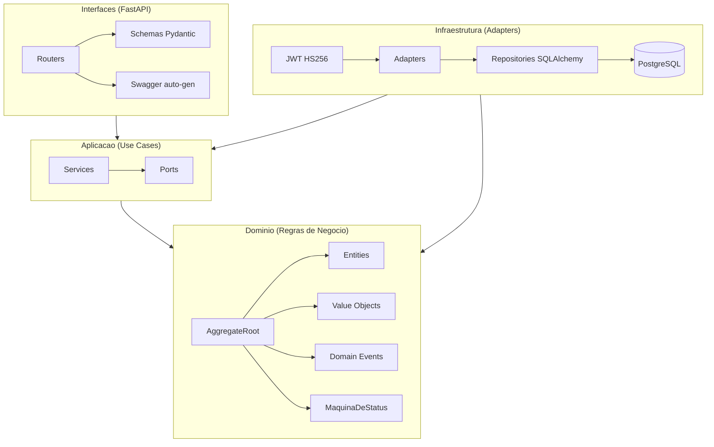

# Refinamento Técnico — Oficina Mecânica

> [↑ Raiz do projeto](../../README.md) · [↑ Requisitos](README.md)

> **Versão**: 1.0 — Fase 1 MVP.

> Refinamento técnico gerado com assistência de IA (Claude) e revisado pela equipe PytStop.
> Segue a metodologia da Aula 08 aplicada ao domínio da oficina mecânica.

---

## 1. Refinamento da Jornada do Usuário

Retomando a [Jornada da Solução](levantamento-de-requisitos.md) (11 passos), detalhamos as considerações técnicas para cada etapa:

| # | Etapa | Consideração técnica | Decisão/Documento |
|---|---|---|---|
| 01 | Cadastrar cliente | CPF/CNPJ como Value Object com validação algorítmica via brutils | [ADR-010](../arquitetura/adr/010-validacao-documentos-brutils.md) |
| 02 | Adicionar veículo | Placa como Value Object, unique constraint cross-clientes. Veículo é entidade filha do agregado Cliente | [Modelo de Domínio](../arquitetura/modelo-dominio.md) |
| 03 | Criar OS | ClientePort.cliente_existe() e veiculo_pertence_ao_cliente() — Customer-Supplier pattern | [Mapa de Contextos](../arquitetura/mapa-contextos.md) |
| 04 | Iniciar diagnóstico | MaquinaDeStatus valida transição Recebida → EmDiagnostico | [Fluxo OS](../arquitetura/event-storming/fluxo-1-ciclo-os.md) |
| 05 | Adicionar itens | CatalogoPort.obter_servico() para preço. Guard RN-007: só em Recebida/EmDiagnostico | [Requisitos](requisitos.md) |
| 06 | Gerar orçamento | Orcamento como Value Object imutável, JSONB. RN-008 (≥ 1 item), RN-013 (imutável) | [RFC-001 §5](../arquitetura/rfc/rfc-001-design-do-sistema.md) |
| 07 | Aprovar orçamento | EstoquePort.reservar() com bloqueio pessimista. UnitOfWork compartilhada. Tudo-ou-nada | [ADR-008](../arquitetura/adr/008-bloqueio-pessimista-estoque.md) |
| 08 | Executar serviços | Sem chamada API — mecânico trabalha offline. Status permanece EmExecucao | — |
| 09 | Finalizar serviço | Transição EmExecucao → Finalizada via MaquinaDeStatus | [Fluxo OS](../arquitetura/event-storming/fluxo-1-ciclo-os.md) |
| 10 | Registrar entrega | Estado terminal Entregue — OS não aceita mais transições | [Glossário](glossario.md) |
| 11 | Consultar status | API pública sem JWT. Busca por placa + documento via ClientePort | [RF-007](requisitos.md) |

---

## 2. Spikes e POCs

Spikes e POCs validam soluções técnicas antes do desenvolvimento. Registramos as validações realizadas:

| Spike/POC | Objetivo | Resultado | Documento |
|---|---|---|---|
| Imperative Mapping SQLAlchemy 2.0 | Validar mapeamento imperativo sem poluir agregados de domínio | Go — `mapper_registry.map_imperatively()` mantém domínio puro. Spike de 4h com critérios go/no-go | [ADR-006](../arquitetura/adr/006-mapeamento-imperativo-sqlalchemy.md) |
| Bloqueio pessimista estoque | Validar `SELECT FOR UPDATE NOWAIT` com locks ordenados para prevenir deadlocks | Go — locks em ordem crescente de `item_id` previnem deadlocks entre transações concorrentes | [ADR-008](../arquitetura/adr/008-bloqueio-pessimista-estoque.md) |
| Orçamento como JSONB | Validar imutabilidade e performance de query com campo JSONB | Go — substituição integral (sem diff parcial), `versao_schema` para evoluções futuras | [RFC-001 §5](../arquitetura/rfc/rfc-001-design-do-sistema.md) |
| Validação CPF/CNPJ/Placa | Validar brutils para cálculo algorítmico de documentos | Go — brutils cobre CPF, CNPJ e Placa (Mercosul + antigo) | [ADR-010](../arquitetura/adr/010-validacao-documentos-brutils.md) |

---

## 3. Desenho da Arquitetura

O sistema segue DDD com Onion Architecture em 4 camadas ([ADR-003](../arquitetura/adr/003-arquitetura-ddd-onion.md)):

Dependência aponta para dentro: Interfaces → Aplicação → Domínio ← Infraestrutura.

Detalhes em [RFC-001](../arquitetura/rfc/rfc-001-design-do-sistema.md). Os 5 Bounded Contexts e seus padrões de integração estão em [Mapa de Contextos](../arquitetura/mapa-contextos.md).

---

## 4. Requisito Técnico da Solução

Seguindo os 10 tópicos da metodologia de refinamento técnico:

| Tópico | Aplicação ao projeto |
|---|---|
| **Descrição** | Back-end monolítico MVP para gestão de OS em oficina mecânica. 5 BCs, 7 status de OS, reserva atômica de estoque |
| **Tecnologias** | Python 3.12, FastAPI, SQLAlchemy 2.0 (imperativo), PostgreSQL 16, Alembic, pytest, structlog |
| **Integrações** | 5 BCs via Ports/Adapters in-process: ClientePort (Customer-Supplier), CatalogoPort (OHS), EstoquePort (OHS), middleware JWT |
| **Estratégia** | 8 MVPs iterativos (MVP-0.01 a MVP-1.0). Tech debt priorizável via MoSCoW. Feature freeze planejado |
| **Segurança** | JWT HS256 (15 min), rate limiting, PII masking (RNF-008), CORS whitelist, headers de segurança |
| **Escalabilidade** | Monolito modular com bloqueio pessimista. Paginação offset-based (max 100). Evolução para microsserviços planejada |
| **Testes** | pytest + testcontainers + mutmut. 90%+ core domains, 80%+ demais, 65%+ infra. Scanning: bandit, pip-audit, trivy, SonarQube, OWASP ZAP |
| **Documentação** | Swagger auto-gen (FastAPI), markdown no repo (11 ADRs, RFC, glossário, event storming), CLAUDE.md para IA |
| **Implantação** | Dockerfile multi-stage + `docker-compose.yml`. Alembic auto-migrate no startup. README com instruções |
| **Critérios de aceite** | RF-001 a RF-010 implementados e testados, cobertura ≥ 90% core, Docker funcional, Swagger acessível, consulta pública operacional |

Ver [requisitos.md](requisitos.md) para a especificação completa (19 RFs, 17 RNFs, 17 RNs).

---

## 5. Estimativas

### Planning Poker (Fibonacci)

Estimativa por user story usando a sequência de Fibonacci (1, 2, 3, 5, 8, 13), considerando tamanho e complexidade técnica:

| US | Descrição | SP | Justificativa |
|---|---|---|---|
| US-001 | Cadastrar cliente CPF/CNPJ | 3 | CRUD + validação algorítmica (brutils) |
| US-002 | Vincular veículos | 2 | Entidade filha, placa unique |
| US-003 | Criar OS | 5 | Cross-context (ClientePort), máquina de estados, status Recebida |
| US-004 | Adicionar itens à OS | 3 | CatalogoPort, guard RN-007 |
| US-005 | Gerar orçamento | 5 | Value Object imutável, JSONB, cálculo de total |
| US-006 | Aprovar orçamento + reserva | 8 | Atomicidade cross-contexto, pessimistic locking, UnitOfWork compartilhada |
| US-007 | Cancelar OS | 5 | Múltiplos status de origem, liberação condicional de estoque |
| US-008 | Gerenciar estoque | 3 | CRUD + soft delete + guards (RN-011) |
| US-009 | Tempo médio execução | 2 | Agregação SQL, endpoint de métricas |
| US-010 | Gerenciar catálogo | 2 | CRUD + soft delete |
| US-011 | Iniciar diagnóstico | 1 | Transição simples de status |
| US-012 | Finalizar serviço | 1 | Transição simples de status |
| US-013 | Consulta pública | 3 | API sem auth, busca cross-context por placa + doc |
| | **Total** | **43** | |

### Monte Carlo

O método de Monte Carlo complementa o Planning Poker ao calcular a probabilidade de entrega dentro de um prazo. Usa dados históricos de velocidade do time para simular cenários (HUSER-BERTA, 2023).

Para este projeto do grupo PytStop sem dados históricos de sprints anteriores, o Monte Carlo não é aplicável diretamente. A estimativa de 43 story points serve como referência para planejamento de sprints e priorização MoSCoW.

---

## Referências

AGARWAL, M. Grooming in Agile Scrum. 2023. Disponível em: <https://www.techbeamers.com/agile-scrum-grooming/>.

HUSER-BERTA, B. Using Monte Carlo Forecasts in your Scrum Events. 2023. Disponível em: <https://medium.com/serious-scrum/using-monte-carlo-forecasts-in-your-scrum-events-45ac3d37c2fd>.

MCQUATER, R. A Simplified Checklist for Technical Backlog Refinement. 2021. Disponível em: <https://spin.atomicobject.com/2021/01/04/technical-backlog-refinement/>.

---

## Relação com Outros Documentos

- [Levantamento de Requisitos](levantamento-de-requisitos.md) — Jornada do usuário que originou este refinamento
- [PRD](prd.md) — User stories com critérios de aceite e priorização MoSCoW
- [Requisitos](requisitos.md) — RF, RNF, RN, endpoints API
- [RFC-001](../arquitetura/rfc/rfc-001-design-do-sistema.md) — Design técnico do sistema
- [ADRs](../arquitetura/adr/) — Decisões arquiteturais documentadas
- [DoR / DoD](dor-dod.md) — Gates de qualidade para desenvolvimento
- [Glossário](glossario.md) — Linguagem Ubíqua

> [↑ Raiz do projeto](../../README.md) · [↑ Requisitos](README.md)
