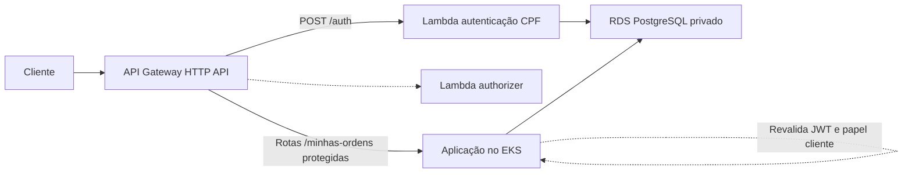

# Integração AWS da autenticação de clientes

**Data:** 2026-09-06

**Status:** aprovado para planejamento

**Referência:** `docs/requisitos/fase3/Phase3_Tech_Challenge.pdf`

## Objetivo

Completar o fluxo exigido pelo Tech Challenge no qual um cliente se autentica
por CPF em uma function serverless, recebe um JWT e usa esse token para consumir
rotas protegidas da aplicação no EKS.

A solução deve ser pequena, direta e compatível com as convenções atuais dos
quatro repositórios da entrega.

## Escopo

- Manter a Lambda como emissora exclusiva dos tokens de clientes.
- Manter o claim `papel="cliente"`.
- Permitir que a Lambda de autenticação consulte o RDS privado.
- Encaminhar rotas protegidas do API Gateway para a aplicação no EKS.
- Fazer a aplicação reconhecer o papel `cliente`.
- Expor listagem e detalhe das ordens pertencentes ao cliente autenticado.
- Remover o profile AWS fixo dos três providers Terraform.
- Manter a região fixa em `us-east-1`.
- Validar localmente antes do primeiro provisionamento real.
- Provisionar manualmente, com validação via AWS CLI após cada etapa.

## Fora do escopo

- Alterar os papéis ou privilégios dos usuários internos.
- Fazer a Lambda emitir `admin`, `atendente` ou `mecanico`.
- Substituir o JWT HS256 ou o segredo compartilhado.
- Transformar o acompanhamento público existente em rota autenticada.
- Criar novos fluxos de negócio ou telas.
- Criar VPC, NAT Gateway, Cognito, Secrets Manager ou recursos IAM.
- Automatizar criação ou destruição de recursos AWS sem autorização explícita.
- Refatorações não necessárias para cumprir o requisito da fase 3.

## Arquitetura

### Banco de dados

O repositório `postech-sw-arch-p3-infra-db` mantém o RDS PostgreSQL privado na
VPC default. O acesso à porta 5432 continua limitado à própria VPC.

### Kubernetes

O repositório `postech-sw-arch-p3-infra-k8s` mantém o EKS e o node group na VPC
default. A aplicação é publicada por um `Service` do tipo `LoadBalancer`, cujo
endereço será fornecido ao Terraform do Gateway após o deploy da aplicação.

### Lambda e API Gateway

O repositório `postech-sw-arch-p3-lambda` terá as seguintes responsabilidades:

- anexar apenas a Lambda de autenticação às subnets da VPC default;
- criar um security group com a saída necessária para o PostgreSQL;
- manter o authorizer fora da VPC, pois ele apenas valida o JWT;
- manter `POST /auth` integrado à Lambda de autenticação;
- remover a rota provisória `GET /auth/exemplo-protegido`;
- criar uma integração HTTP proxy com o Load Balancer da aplicação;
- proteger as rotas de cliente com o Lambda authorizer.

O endereço base da aplicação será uma variável obrigatória do Terraform da
Lambda. Não haverá dependência entre states Terraform dos repositórios.

### Aplicação

O repositório `postech-sw-arch-p3` adicionará `cliente` ao enum de papéis sem
conceder a ele permissões internas. Somente as novas rotas exigirão esse papel.
O endpoint interno `POST /api/v1/autenticacao/registrar` continuará aceitando
somente `admin`, `atendente` e `mecanico`; tentar registrar `cliente` retornará
`422`. Assim, a Lambda permanece como emissora exclusiva de tokens de clientes.

As operações de persistência consultarão por `cliente_id` no banco. Uma ordem
não será carregada sem filtro para ter sua propriedade comparada em memória.

## Contratos HTTP

### `GET /api/v1/minhas-ordens`

Lista somente as ordens cujo `cliente_id` corresponde ao `sub` do JWT.

- Resposta: `OrdemListaResponse` já existente.
- Parâmetros: `offset`, `limit` e `incluir_encerradas`.
- Paginação e filtro mantêm a semântica da listagem interna atual.
- Lista vazia retorna `200` com `items=[]`.

### `GET /api/v1/minhas-ordens/{ordem_id}`

Retorna uma ordem completa somente se ela pertencer ao cliente autenticado.

- Resposta: `OrdemDeServicoResponse` já existente.
- Ordem inexistente ou pertencente a outro cliente retorna o mesmo `404`.
- A resposta não revela a existência de ordens de outros clientes.

## Autenticação e autorização

1. O cliente envia o CPF para `POST /auth`.
2. A Lambda valida o formato, calcula o hash compatível e consulta o RDS.
3. Um cliente ativo recebe JWT com `sub=<cliente_id>` e `papel="cliente"`.
4. O API Gateway executa o authorizer antes de encaminhar as novas rotas.
5. O Gateway preserva o header `Authorization` no proxy para o EKS.
6. A aplicação revalida assinatura, expiração e tipo do token.
7. A aplicação exige `papel="cliente"` e converte `sub` para UUID.
8. O caso de uso e o repositório aplicam o filtro de propriedade.

Comportamentos de erro:

- CPF ou corpo malformado: `400`.
- Cliente inexistente ou inativo: `401`, com resposta indistinguível.
- Token ausente, inválido ou expirado: bloqueado na borda; acesso direto à
  aplicação também retorna `401`.
- Token válido com papel diferente de `cliente`: `403`.
- Claim `sub` ausente ou inválido: `401`.
- Ordem inexistente ou de outro cliente: `404`.
- Falha inesperada: resposta genérica, sem CPF, JWT, senha ou URL do banco nos
  logs.

## Credenciais AWS

Os providers dos repositórios de RDS, EKS e Lambda deixarão de declarar
`profile`. A variável `aws_profile` também será removida.

A resolução de credenciais seguirá a cadeia padrão do SDK da AWS:

- execução local: profile `default` já configurado;
- GitHub Actions: variáveis de ambiente configuradas pelo workflow.

A região continuará declarada como `us-east-1` nos providers.

## Estratégia de testes

O desenvolvimento seguirá os padrões e gates já existentes em cada repositório.

### Aplicação

- papel `cliente` reconhecido sem herdar permissões internas;
- cadastro interno rejeita o papel `cliente`;
- `sub` válido convertido para UUID;
- `sub` ausente ou inválido rejeitado;
- listagem contém somente ordens do cliente autenticado;
- paginação, total e `incluir_encerradas` respeitam o filtro do cliente;
- detalhe retorna a ordem própria;
- detalhe de ordem alheia retorna `404`;
- papel interno nas rotas de cliente retorna `403`;
- testes de persistência executados com PostgreSQL.

### Lambda e Terraform

- suíte atual da Lambda permanece verde;
- formatação e validação dos três projetos Terraform;
- plans sem criação antes da revisão;
- plan da Lambda confirma VPC somente na função de autenticação;
- plan do Gateway confirma integração com o app e authorizer nas duas rotas.

### Fluxo integrado

- validar localmente CPF → JWT → aplicação protegida;
- validar na AWS CPF → API Gateway → authorizer → EKS → RDS;
- testar ausência de token, token inválido e token válido;
- confirmar que um cliente não consulta ordem de outro cliente.

## Branches e commits

Cada repositório alterado usará a branch:

`feat/aws-client-auth-integration`

Os commits seguirão Conventional Commits, as convenções observadas nos
históricos dos repositórios e o limite máximo de 100 caracteres no cabeçalho.
As mudanças serão separadas por responsabilidade, sem commits abrangentes.

## Implantação e validação

A implantação manual seguirá esta ordem:

1. RDS;
2. EKS;
3. aplicação no EKS;
4. Lambda e API Gateway;
5. teste ponta a ponta.

Após cada etapa, a infraestrutura será validada por comandos somente leitura da
AWS CLI. O assistente não executará `terraform apply`, criação, alteração ou
destruição na AWS sem autorização explícita do usuário.

## Critérios de aceite

- Os gates locais dos quatro repositórios alterados estão verdes.
- Nenhum provider Terraform exige `--profile` ou profile nomeado.
- A Lambda de autenticação acessa o RDS privado na AWS.
- O authorizer rejeita token ausente, inválido ou expirado.
- O Gateway encaminha as duas rotas protegidas para o EKS.
- A aplicação aceita o JWT de cliente e continua revalidando-o.
- O cliente lista e consulta apenas as próprias ordens.
- Ordem alheia é indistinguível de ordem inexistente.
- Os recursos são demonstráveis em `us-east-1` na conta AWS Academy.
- Nenhum item fora do escopo é introduzido.
