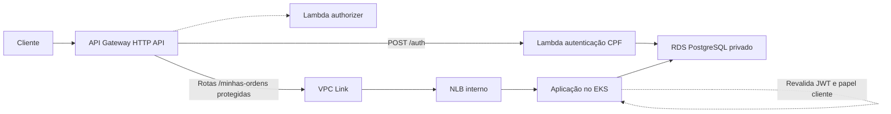

# Integração AWS da autenticação de clientes

> [↑ Raiz do projeto](../../../README.md)

**Data:** 2026-09-06

**Última revisão:** 2026-09-07

**Status:** aprovado para implementação

**Referência:** `docs/requisitos/fase3/Phase3_Tech_Challenge.pdf`

## Objetivo

Completar o fluxo exigido pelo Tech Challenge no qual um cliente se autentica
por CPF em uma function serverless, recebe um JWT e usa esse token para consumir
rotas protegidas da aplicação no EKS.

A solução deve ser pequena, direta e compatível com as convenções atuais dos
quatro repositórios da entrega.

## Escopo

- Manter a Lambda como emissora exclusiva dos tokens de clientes.
- Manter o claim `papel="cliente"`.
- Permitir que a Lambda de autenticação consulte o RDS privado.
- Encaminhar rotas protegidas do API Gateway para a aplicação no EKS.
- Manter o tráfego API Gateway → EKS privado por VPC Link e NLB interno.
- Criar duas subnets privadas na VPC default, sem NAT Gateway.
- Fazer a aplicação reconhecer o papel `cliente`.
- Expor listagem e detalhe das ordens pertencentes ao cliente autenticado.
- Remover o profile AWS fixo dos três providers Terraform.
- Manter a região fixa em `us-east-1`.
- Compartilhar o state entre execução local e GitHub Actions por backend S3.
- Validar localmente antes do primeiro provisionamento real.
- Provisionar manualmente, com validação via AWS CLI após cada etapa.

## Fora do escopo

- Alterar os papéis ou privilégios dos usuários internos.
- Fazer a Lambda emitir `admin`, `atendente` ou `mecanico`.
- Substituir o JWT HS256 ou o segredo compartilhado.
- Transformar o acompanhamento público existente em rota autenticada.
- Criar novos fluxos de negócio ou telas.
- Criar uma nova VPC, NAT Gateway, Cognito, Secrets Manager ou recursos IAM.
- Automatizar criação ou destruição de recursos AWS sem autorização explícita.
- Refatorações não necessárias para cumprir o requisito da fase 3.

## Arquitetura

### Banco de dados

O repositório `postech-sw-arch-p3-infra-db` mantém o RDS PostgreSQL privado na
VPC default. O acesso à porta 5432 continua limitado à própria VPC.

### Kubernetes

O repositório `postech-sw-arch-p3-infra-k8s` mantém o EKS e o node group nas
subnets públicas da VPC default. Ele também cria duas subnets privadas `/24`,
em `us-east-1a` e `us-east-1b`, com route table sem rota default e sem NAT:

- `172.31.240.0/24`;
- `172.31.241.0/24`.

Esses CIDRs foram escolhidos após inventário somente leitura da VPC default
`172.31.0.0/16`, que possui apenas seis subnets públicas entre
`172.31.0.0/20` e `172.31.80.0/20`. As novas subnets recebem as tags de
descoberta do Kubernetes para Load Balancer interno.

A aplicação é publicada por um `Service` do tipo `LoadBalancer` com três
annotations:

- `service.beta.kubernetes.io/aws-load-balancer-type: "nlb"`;
- `service.beta.kubernetes.io/aws-load-balancer-internal: "true"`;
- `service.beta.kubernetes.io/aws-load-balancer-cross-zone-load-balancing-enabled: "true"`.

Cross-zone load balancing permite que o NLB nas duas subnets alcance os nodes
distribuídos nas demais AZs. Essa estratégia usa o controlador já disponível
no EKS e não adiciona o AWS Load Balancer Controller. Após o deploy, o ARN do
listener TCP `8000` será fornecido ao Terraform do Gateway. Como o Learner Lab
nega `iam:GetRole`, o ARN da `LabRole` existente será montado com o account ID
retornado por STS, sem consultar ou criar IAM.

### Lambda e API Gateway

O repositório `postech-sw-arch-p3-lambda` terá as seguintes responsabilidades:

- anexar apenas a Lambda de autenticação às subnets da VPC default;
- criar um security group com a saída necessária para o PostgreSQL;
- montar o ARN da `LabRole` existente a partir do account ID, sem `iam:GetRole`;
- manter o authorizer fora da VPC, pois ele apenas valida o JWT;
- manter `POST /auth` integrado à Lambda de autenticação;
- remover a rota provisória `GET /auth/exemplo-protegido`;
- criar um VPC Link nas duas subnets privadas;
- descobrir essas subnets pelas tags na VPC default;
- limitar a saída do security group do VPC Link a TCP `8000` na VPC;
- criar uma integração HTTP proxy privada com o listener do NLB interno;
- reutilizar essa integração nas duas rotas `GET` de cliente;
- configurar `"overwrite:path" = "$request.path"` na integração;
- proteger as rotas de cliente com o Lambda authorizer.

O ARN do listener da aplicação será a variável obrigatória
`app_listener_arn` do Terraform da Lambda. Não haverá leitura ou dependência
entre states Terraform dos repositórios. O ARN será obtido depois do deploy do
app e repassado explicitamente no fluxo manual ou pelo secret do CD.

### State Terraform

Os três projetos Terraform usarão o bucket privado e versionado
`pytstop-terraform-state-924563550535`, criado uma única vez pelo usuário em
`us-east-1`. Cada repositório manterá um state independente:

- RDS: `rds/terraform.tfstate`;
- EKS: `eks/terraform.tfstate`;
- Lambda e API Gateway: `lambda/terraform.tfstate`.

O backend será declarado diretamente no código, pois o nome do bucket não é
segredo e a conta da entrega já está definida. O state será criptografado com
SSE-S3 e protegido por versionamento e bloqueio de acesso público no bucket.

O Terraform mínimo passará a ser `1.10`, permitindo o lock nativo do S3 com
`use_lockfile = true`. Não será criada tabela DynamoDB. Os workflows de CD de
cada repositório também serão serializados para evitar duas operações sobre o
mesmo state. O lock continua protegendo contra concorrência acidental entre uma
execução local e o GitHub Actions.

### Aplicação

O repositório `postech-sw-arch-p3` adicionará `cliente` ao enum de papéis sem
conceder a ele permissões internas. Somente as novas rotas exigirão esse papel.
O endpoint interno `POST /api/v1/autenticacao/registrar` continuará aceitando
somente `admin`, `atendente` e `mecanico`; tentar registrar `cliente` retornará
`422`. Assim, a Lambda permanece como emissora exclusiva de tokens de clientes.

As operações de persistência consultarão por `cliente_id` no banco. Uma ordem
não será carregada sem filtro para ter sua propriedade comparada em memória.

## Contratos HTTP

### `GET /api/v1/minhas-ordens`

Lista somente as ordens cujo `cliente_id` corresponde ao `sub` do JWT.

- Resposta: `OrdemListaResponse` já existente.
- Parâmetros: `offset`, `limit` e `incluir_encerradas`.
- Paginação e filtro mantêm a semântica da listagem interna atual.
- Lista vazia retorna `200` com `items=[]`.

### `GET /api/v1/minhas-ordens/{ordem_id}`

Retorna uma ordem completa somente se ela pertencer ao cliente autenticado.

- Resposta: `OrdemDeServicoResponse` já existente.
- Ordem inexistente ou pertencente a outro cliente retorna o mesmo `404`.
- A resposta não revela a existência de ordens de outros clientes.

## Autenticação e autorização

1. O cliente envia o CPF para `POST /auth`.
2. A Lambda valida o formato, calcula o hash compatível e consulta o RDS.
3. Um cliente ativo recebe JWT com `sub=<cliente_id>` e `papel="cliente"`.
4. O API Gateway executa o authorizer antes de encaminhar as novas rotas.
5. O Gateway preserva o header `Authorization` no proxy para o EKS.
6. A aplicação revalida assinatura, expiração e tipo do token.
7. A aplicação exige `papel="cliente"` e converte `sub` para UUID.
8. O caso de uso e o repositório aplicam o filtro de propriedade.

Comportamentos de erro:

- CPF ou corpo malformado: `400`.
- Cliente inexistente ou inativo: `401`, com resposta indistinguível.
- Token ausente, inválido ou expirado: bloqueado na borda; acesso direto à
  aplicação também retorna `401`.
- Token válido com papel diferente de `cliente`: `403`.
- Claim `sub` ausente ou inválido: `401`.
- Ordem inexistente ou de outro cliente: `404`.
- Falha inesperada: resposta genérica, sem CPF, JWT, senha ou URL do banco nos
  logs.

## Credenciais AWS

Os providers dos repositórios de RDS, EKS e Lambda deixarão de declarar
`profile`. A variável `aws_profile` também será removida.

A resolução de credenciais seguirá a cadeia padrão do SDK da AWS:

- execução local: profile `default` já configurado;
- GitHub Actions: variáveis de ambiente configuradas pelo workflow.

A região continuará declarada como `us-east-1` nos providers.

O backend S3 também usará a cadeia padrão de credenciais. A restrição do
Learner Lab que impede `s3:ListAllMyBuckets` não afeta o backend, que acessará o
bucket conhecido pelo nome e pela chave exata. A capacidade de criar o bucket e
de ler, gravar e remover o arquivo de lock será comprovada antes do primeiro
`plan` real.

O Learner Lab também nega `iam:GetRole`. Os Terraform de EKS e Lambda usarão
`aws_caller_identity` para obter o account ID por STS e formar o ARN da
`LabRole` já fornecida pelo laboratório. Nenhum recurso ou política IAM será
criado.

## Estratégia de testes

O desenvolvimento seguirá os padrões e gates já existentes em cada repositório.

### Aplicação

- papel `cliente` reconhecido sem herdar permissões internas;
- cadastro interno rejeita o papel `cliente`;
- `sub` válido convertido para UUID;
- `sub` ausente ou inválido rejeitado;
- listagem contém somente ordens do cliente autenticado;
- paginação, total e `incluir_encerradas` respeitam o filtro do cliente;
- detalhe retorna a ordem própria;
- detalhe de ordem alheia retorna `404`;
- papel interno nas rotas de cliente retorna `403`;
- testes de persistência executados com PostgreSQL.

### Lambda e Terraform

- suíte atual da Lambda permanece verde;
- formatação e validação dos três projetos Terraform;
- plans sem criação antes da revisão;
- backend S3, criptografia e lock nativo configurados nos três states;
- plan da Lambda confirma VPC somente na função de autenticação;
- plan do EKS confirma duas subnets privadas sem rota default ou NAT;
- render do overlay EKS confirma NLB interno;
- plan do Gateway confirma VPC Link, listener ARN e sobrescrita do path.

### Fluxo integrado

- validar localmente CPF → JWT → aplicação protegida;
- validar na AWS CPF → API Gateway → authorizer → EKS → RDS;
- testar ausência de token, token inválido e token válido;
- confirmar que um cliente não consulta ordem de outro cliente.

## Branches e commits

Cada repositório alterado usará a branch:

`feat/aws-client-auth-integration`

Os commits seguirão Conventional Commits, as convenções observadas nos
históricos dos repositórios e o limite máximo de 100 caracteres no cabeçalho.
Cada commit terá uma responsabilidade única.

## Implantação e validação

A implantação seguirá esta ordem:

1. criação manual e validação do bucket de state;
2. RDS provisionado manualmente;
3. EKS provisionado manualmente;
4. aplicação implantada no EKS pelo pipeline da branch `homolog`;
5. listener TCP `8000` do NLB interno identificado por AWS CLI;
6. Lambda, VPC Link e API Gateway provisionados manualmente;
7. teste ponta a ponta.

O merge da aplicação em `homolog` publicará a imagem e executará o job de
deploy no EKS. A promoção posterior de `homolog` para `main` será feita somente
após a validação do ambiente e aprovação do usuário.

Após cada etapa, a infraestrutura será validada por comandos somente leitura da
AWS CLI. O assistente não executará `terraform apply`, criação, alteração ou
destruição na AWS sem autorização explícita do usuário.

O desligamento respeitará a ordem inversa das dependências: Lambda/Gateway/VPC
Link, aplicação/NLB, EKS e RDS. O EKS, o NLB e o VPC Link não possuem modo de
pausa sem cobrança; por isso serão destruídos ao final da janela de gravação.
O RDS pode ser parado temporariamente, observado o reinício automático após o
limite do serviço, ou destruído depois da evidência final.

## Critérios de aceite

- Os gates locais dos quatro repositórios alterados estão verdes.
- Nenhum provider Terraform exige `--profile` ou profile nomeado.
- Local e GitHub Actions usam os mesmos três states remotos no S3.
- O bucket de state é privado, versionado e criptografado, com lock nativo.
- A Lambda de autenticação acessa o RDS privado na AWS.
- O authorizer rejeita token ausente, inválido ou expirado.
- O Gateway encaminha as duas rotas protegidas para o EKS.
- O app não possui Load Balancer público no overlay EKS.
- O Gateway alcança o app somente pelo VPC Link e NLB interno.
- Os stages `homolog` e `prod` preservam o caminho esperado pelo FastAPI.
- A aplicação aceita o JWT de cliente e continua revalidando-o.
- O cliente lista e consulta apenas as próprias ordens.
- Ordem alheia é indistinguível de ordem inexistente.
- Os recursos são demonstráveis em `us-east-1` na conta AWS Academy.
- Nenhum item fora do escopo é introduzido.

> [↑ Raiz do projeto](../../../README.md)
